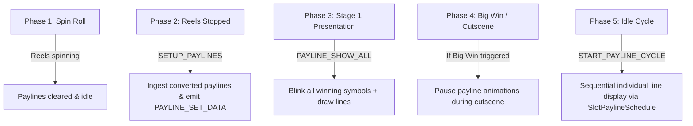

# 🌀 SlotTablePaylineModule Spin Phase Breakdown

<!-- convention-summary-start -->
### SlotTablePaylineModule Spin Phase Breakdown Summary

- **Core Architecture / Purpose**: Defines network protocol, socket packet lifecycle, state persistence, and error handling for SlotTablePaylineModule Spin Phase Breakdown.
- **Key Mechanisms & Design**: Handles WebSocket frame dispatch, acknowledgment confirmation, state resume, and resilient synchronization between client DataStore and Backend Gateway.
- **Domain Capabilities**: cc_slot_module, 02_game_flow
- **Scope & Code Paths**: `assets/cc-common/cc-slot-module/`
- **Related Docs**: [Master Index](../INDEX.md)
<!-- convention-summary-end -->

---

## 1. Payline Activity Across Spin Phases

---

## 2. Granular Behavior Breakdown

1. **Spin Start**:
   - `SlotTableModule` reclaims symbols and hides previous winning line artifacts.
   - Payline animations remain disabled while reels are in motion.
2. **Reel Stop & Payline Data Conversion**:
   - Once all reel columns reach standstill, Director executes `makeScriptShowPayline` step.
   - `SlotTablePaylineModule` receives `SETUP_PAYLINES`.
   - `SlotTablePaylineData` normalizes server arrays (`normalGamePayLines`, `freeGamePayLines`, `respinGamePayLines`, `rightPayLines`) into visual lines containing target `winSymbols` coordinates.
3. **Stage 1 (Show All Lines)**:
   - `payLineEmitter.emit(PAYLINE_SET_DATA)` informs child modules of the winning data.
   - All hit lines display simultaneously, giving the player instant feedback on total win lines.
4. **Stage 2 (Sequential Cycling)**:
   - `SlotPaylineSchedule` triggers recurring timer ticks every `TIMELINE_CONFIG` seconds.
   - Sequentially isolates Line 1, Line 2, etc., playing specific sound cues and showing payline multipliers.
