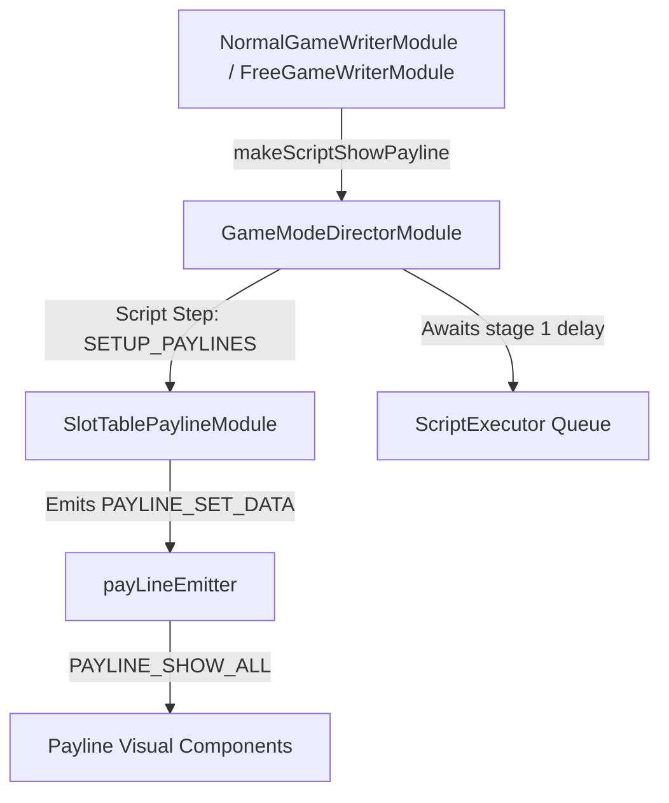

# 🎼 SlotTablePaylineModule Pipeline Orchestration

<!-- convention-summary-start -->
### SlotTablePaylineModule Pipeline Orchestration Summary

- **Core Architecture / Purpose**: Technical reference, API contract, and integration guide for SlotTablePaylineModule Pipeline Orchestration.
- **Key Mechanisms & Design**: Encapsulates core algorithms, event hooks, and performance optimizations within the slot framework runtime.
- **Domain Capabilities**: cc_slot_module, 03_director_writer_integration
- **Scope & Code Paths**: `assets/cc-common/cc-slot-module/`
- **Related Docs**: [Master Index](../INDEX.md)
<!-- convention-summary-end -->

---

## 1. 3-Tier Execution Pipeline

---

## 2. Writer Command Synthesis

1. **`makeScriptShowPayline`**:
   - Synthesizes the step queue triggering `SETUP_PAYLINES`.
   - Binds delay corresponding to `paylineTime` config.
2. **`makeScriptClearPayline`**:
   - Dispatches reset command before next spin begins, ensuring all winning highlights and line vectors vanish cleanly.
