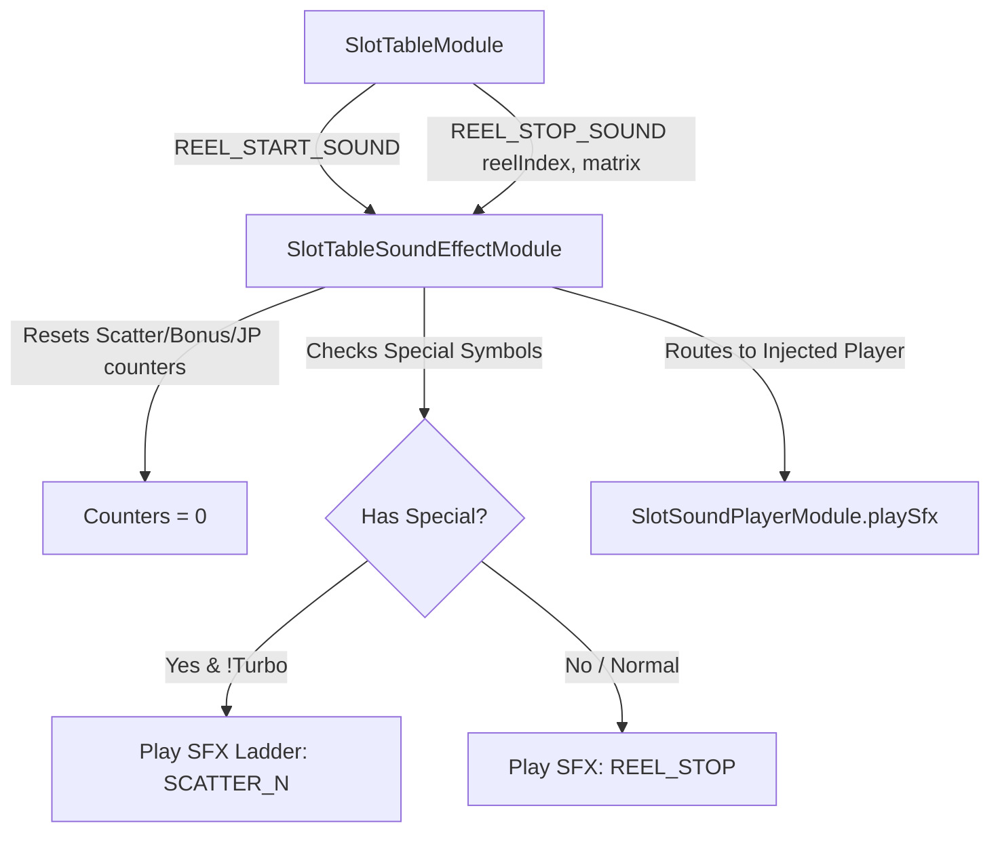

# 🎵 SlotTableSoundEffectModule Architecture & Role

<!-- convention-summary-start -->
### SlotTableSoundEffectModule Architecture & Role Summary

- **Core Architecture / Purpose**: Technical reference, API contract, and integration guide for SlotTableSoundEffectModule Architecture & Role.
- **Key Mechanisms & Design**: Encapsulates core algorithms, event hooks, and performance optimizations within the slot framework runtime.
- **Domain Capabilities**: cc_slot_module, 01_overview
- **Scope & Code Paths**: `assets/cc-common/cc-slot-module/BaseModule/Table/SlotTable/scripts/SlotTableSoundEffectModule.ts`
- **Related Docs**: [Master Index](../INDEX.md)
<!-- convention-summary-end -->

---

## 1. Architectural Purpose

`SlotTableSoundEffectModule` (`assets/cc-common/cc-slot-module/BaseModule/Table/SlotTable/scripts/SlotTableSoundEffectModule.ts`) manages table-level audio choreography during the spin lifecycle.

It acts as the intelligent sound trigger layer for:
- Standard reel stop sound effects (`REEL_STOP`).
- Escalating special symbol landing audio ladders (`SCATTER_1` .. `SCATTER_5`, `BONUS_1` .. `BONUS_5`, `JACKPOT_1` .. `JACKPOT_5`).
- Fast-To-Result (FTR) and Turbo mode audio compression (only playing reel stop on the final column).

---

## 2. Core Responsibilities

1. **Reel Start Audio Reset**: Resets Scatter, Bonus, and Jackpot appearance counters upon `REEL_START_SOUND`.
2. **Matrix Symbol Parsing**: Inspects landing symbols on stopped reel columns against `TableModuleConfig`.
3. **Escalating Sound Ladders**: Plays ascending musical pitches/tensions as subsequent Scatter/Bonus symbols land across reels.
4. **Turbo / FTR Suppression**: Compresses reel stop sounds to avoid cacophony during high-speed auto spins.
