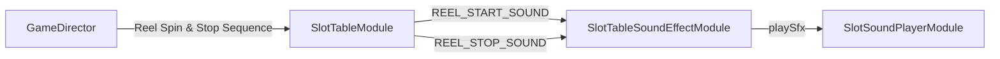

# 🎼 SlotTableSoundEffectModule Pipeline Orchestration

<!-- convention-summary-start -->
### SlotTableSoundEffectModule Pipeline Orchestration Summary

- **Core Architecture / Purpose**: Technical reference, API contract, and integration guide for SlotTableSoundEffectModule Pipeline Orchestration.
- **Key Mechanisms & Design**: Encapsulates core algorithms, event hooks, and performance optimizations within the slot framework runtime.
- **Domain Capabilities**: cc_slot_module, 03_director_writer_integration
- **Scope & Code Paths**: `assets/cc-common/cc-slot-module/`
- **Related Docs**: [Master Index](../INDEX.md)
<!-- convention-summary-end -->

---

## 1. Interaction Pipeline

---

## 2. Writer Command Coordination

1. **`makeScriptSpinTable`**: As reels start spinning, `SlotTableModule` emits `REEL_START_SOUND`.
2. **`makeScriptStopTable`**: As each reel finishes its stopping bounce, `SlotTableModule` emits `REEL_STOP_SOUND` containing the stopped column index and matrix symbols.
