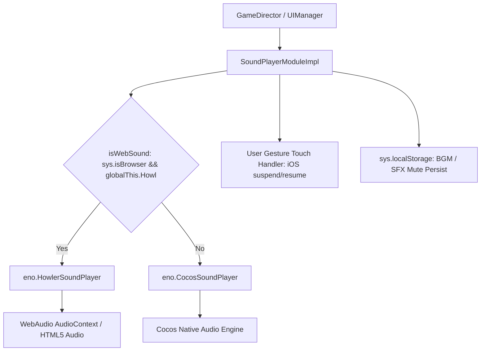

# 🏛️ SoundPlayerModuleImpl Architectural Role & Dual Audio Driver Engine

<!-- convention-summary-start -->
### SoundPlayerModuleImpl Architectural Role & Dual Audio Driver Engine Summary

- **Core Architecture / Purpose**: Technical reference, API contract, and integration guide for SoundPlayerModuleImpl Architectural Role & Dual Audio Driver Engine.
- **Key Mechanisms & Design**: Encapsulates core algorithms, event hooks, and performance optimizations within the slot framework runtime.
- **Domain Capabilities**: cc_slot_module, 01_overview
- **Scope & Code Paths**: `assets/cc-common/cc-slot-module/`
- **Related Docs**: [Master Index](../INDEX.md)
<!-- convention-summary-end -->

---

## 1. Architectural Mission

`SoundPlayerModuleImpl` is the **Master Concrete Audio Driver Implementation** in the Cocos Common Slot Framework. It acts as the bridge between game sound commands (`playMusic`, `playSfx`, `fadeMusicTo`) and the underlying platform sound driver:
1. **Web / Mobile Browser Driver (`eno.HowlerSoundPlayer`)**: Uses WebAudio API via Howler.js for zero-latency polyphonic playback, with automatic iOS / Mobile user gesture unlocking (`_waitForUserGesture`, `_resumeContextGesture`).
2. **Native / Runtime Driver (`eno.CocosSoundPlayer`)**: Falls back to Cocos Creator's native audio engine for iOS/Android native app packaging.

---

## 2. Key Responsibilities

1. **Dual Audio Backend Selection**:
   - Automatically switches between Howler and Cocos audio drivers based on platform capabilities.
2. **Mobile Web AudioContext Unlock**:
   - Creates a transparent touch interceptor node on mobile browsers to unlock WebAudio `AudioContext` upon first touch.
3. **Dynamic Sound Bank Loading**:
   - Listens to `SET_UP_AUDIO_DATABASE` events to load feature-specific audio bundles dynamically and releases raw assets to preserve memory.
4. **App Visibility Lifecycle Sync**:
   - Automatically hooks `cc.game.EVENT_HIDE` and `cc.game.EVENT_SHOW` to mute and resume BGM and SFX when the user switches browser tabs or minimizes the app.
