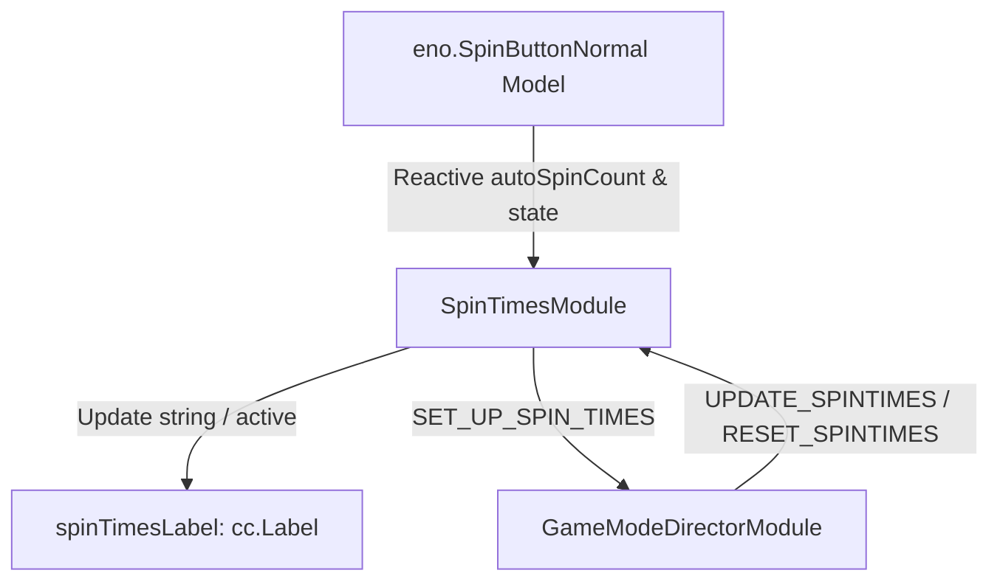

# 🏛️ SpinTimesModule Architectural Role & Remaining Spin Counter Badge

<!-- convention-summary-start -->
### SpinTimesModule Architectural Role & Remaining Spin Counter Badge Summary

- **Core Architecture / Purpose**: Technical reference, API contract, and integration guide for SpinTimesModule Architectural Role & Remaining Spin Counter Badge.
- **Key Mechanisms & Design**: Encapsulates core algorithms, event hooks, and performance optimizations within the slot framework runtime.
- **Domain Capabilities**: cc_slot_module, 01_overview
- **Scope & Code Paths**: `assets/cc-common/cc-slot-module/`
- **Related Docs**: [Master Index](../INDEX.md)
<!-- convention-summary-end -->

---

## 1. Architectural Mission

`SpinTimesModule` renders the numeric remaining round countdown badge overlay attached to spin buttons (`normalSpinTimes` under Base Game Auto Spins, `freeSpinTimes` under Free Spins). It listens to `UPDATE_SPINTIMES` / `RESET_SPINTIMES`, observes reactive `SpinButtonNormal.autoSpinCount`, and formats infinite round quantities (`> 100000` $\rightarrow$ `'∞'`).

---

## 2. Key Responsibilities

1. **Auto Spin Countdown (`autoSpinCount`)**:
   - Decrements and renders the remaining auto-spin count on the base game spin button.
2. **Infinite Spin Symbolization (`> 100000` $\rightarrow$ `'∞'`)**:
   - Converts unbounded free spins or large test auto-spin counts to the infinity glyph (`'∞'`).
3. **State-Driven Reset (`updateState`)**:
   - Automatically hides and clears the badge when the spin button state returns to `BUTTON_STATE_ENUM.NORMAL`.
