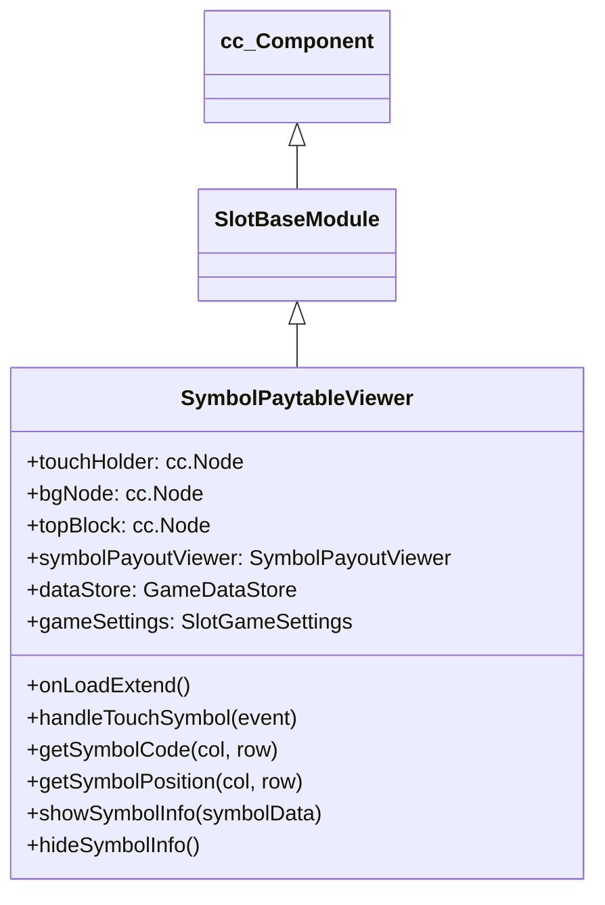

# 🏛️ SymbolPaytableViewer Architecture & Role

<!-- convention-summary-start -->
### SymbolPaytableViewer Architecture & Role Summary

- **Core Architecture / Purpose**: Technical reference, API contract, and integration guide for SymbolPaytableViewer Architecture & Role.
- **Key Mechanisms & Design**: Encapsulates core algorithms, event hooks, and performance optimizations within the slot framework runtime.
- **Domain Capabilities**: cc_slot_module, 01_overview
- **Scope & Code Paths**: `assets/cc-common/cc-slot-module/`
- **Related Docs**: [Master Index](../INDEX.md)
<!-- convention-summary-end -->

`SymbolPaytableViewer` is the interactive symbol touch inspector component in the `cc-common` Slot Framework SDK. Mounted on the Table root node, it intercepts touch events on active reel symbols during the `GAME_STATE_ENUM.IDLE` state, converts screen touch coordinates into 2D grid matrix indices (`colIndex`, `rowIndex`), and presents a floating payout callout bubble (`SymbolPayoutViewer`).

---

## 1. Architectural Role

- **Touch-to-Matrix Coordinate Mapping**: Translates world touch coordinates via `convertToNodeSpaceAR` and calculates column/row intersections against `TABLE_FORMAT`, `SYMBOL_WIDTH`, and `SYMBOL_HEIGHT`.
- **Dynamic Payout Callout**: Renders `SymbolPayoutViewer` with directional alignment (left-to-right or right-to-left based on column position relative to table center).
- **Matrix / Node Fallback**: Retrieves symbol codes from either `SlotTableData.getResumeMatrix()` or live `SlotTableModule.getSymbolByColRow()`.

---

## 2. Inheritance Diagram

