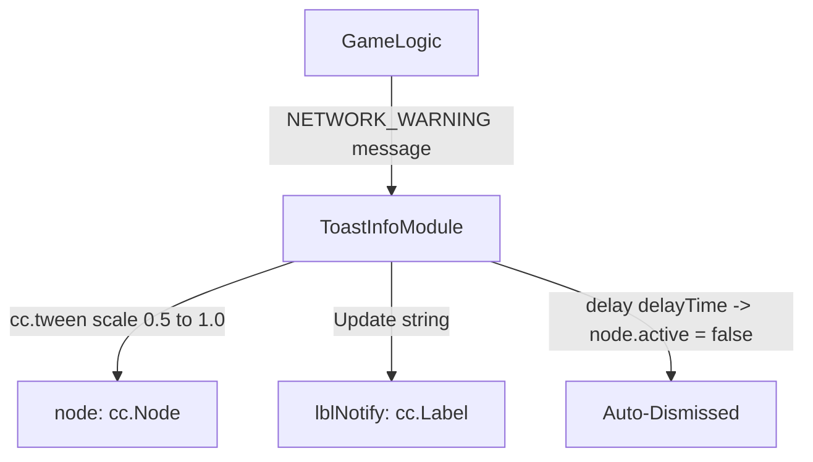

# 🏛️ ToastInfoModule Architectural Role & Global Toast Notification HUD

<!-- convention-summary-start -->
### ToastInfoModule Architectural Role & Global Toast Notification HUD Summary

- **Core Architecture / Purpose**: Technical reference, API contract, and integration guide for ToastInfoModule Architectural Role & Global Toast Notification HUD.
- **Key Mechanisms & Design**: Encapsulates core algorithms, event hooks, and performance optimizations within the slot framework runtime.
- **Domain Capabilities**: cc_slot_module, 01_overview
- **Scope & Code Paths**: `assets/cc-common/cc-slot-module/`
- **Related Docs**: [Master Index](../INDEX.md)
<!-- convention-summary-end -->

---

## 1. Architectural Mission

`ToastInfoModule` provides transient on-screen notification popups mounted at `Canvas/Director/Toast`. It listens to system warning events (`NETWORK_WARNING` on `GameLogic`), displaying scaling popups with `cc.tween` scale-in ($0.2\text{s}$), a configurable dwell duration (`delayTime = 1.5s`), and automatic dismissals.

---

## 2. Key Responsibilities

1. **Transient Notification Rendering (`showMessage`)**:
   - Updates `lblNotify.string`, sets opacity to 255, and triggers scale-in animation.
2. **Safe Multi-Message Interruption**:
   - Automatically cancels running `_tweenToast` handles if a new warning message arrives while an existing toast is displaying.
