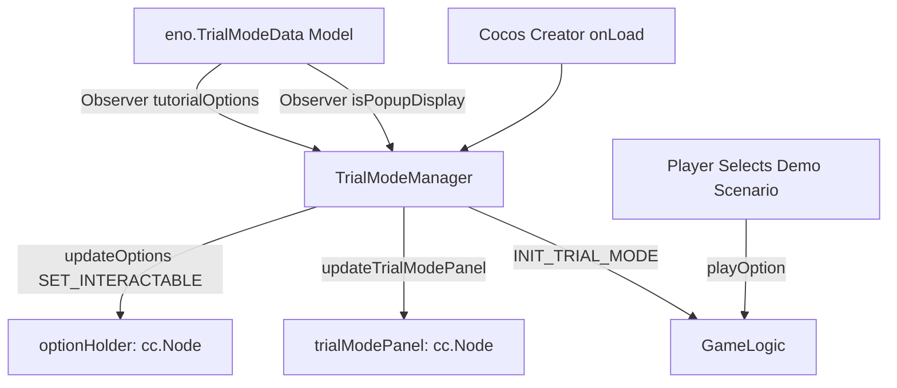

# 🏛️ TrialModeManager Architectural Role & Demo Mode Controller

<!-- convention-summary-start -->
### TrialModeManager Architectural Role & Demo Mode Controller Summary

- **Core Architecture / Purpose**: Technical reference, API contract, and integration guide for TrialModeManager Architectural Role & Demo Mode Controller.
- **Key Mechanisms & Design**: Encapsulates core algorithms, event hooks, and performance optimizations within the slot framework runtime.
- **Domain Capabilities**: cc_slot_module, 01_overview
- **Scope & Code Paths**: `assets/cc-common/cc-slot-module/`
- **Related Docs**: [Master Index](../INDEX.md)
<!-- convention-summary-end -->

---

## 1. Architectural Mission

`TrialModeManager` coordinates demo / practice gameplay experiences mounted at `Canvas/Director/TrialMode`. It emits `INIT_TRIAL_MODE` on startup, manages the optional scenario selection popup (`trialModePanel` / `optionHolder`) allowing players to test specific game features (e.g. Free Spins, Bonus Games, Big Wins), observes `eno.TrialModeData` and `eno.UIManagerData`, and validates currency compatibility with `verifyTrialModeData()`.

---

## 2. Key Responsibilities

1. **Scenario Selection Panel (`updateTrialModePanel`)**:
   - Manages interactive modal UI where players can trigger pre-recorded feature spins.
2. **Option Interactivity Masking (`updateOptions`)**:
   - Disables completed or locked demo scenarios by emitting `SET_INTERACTABLE` to child option nodes.
3. **Currency Data Verification (`safeCheckTrialMode`)**:
   - Validates that `trialModeData` contains betting increments configured for the active player currency.
