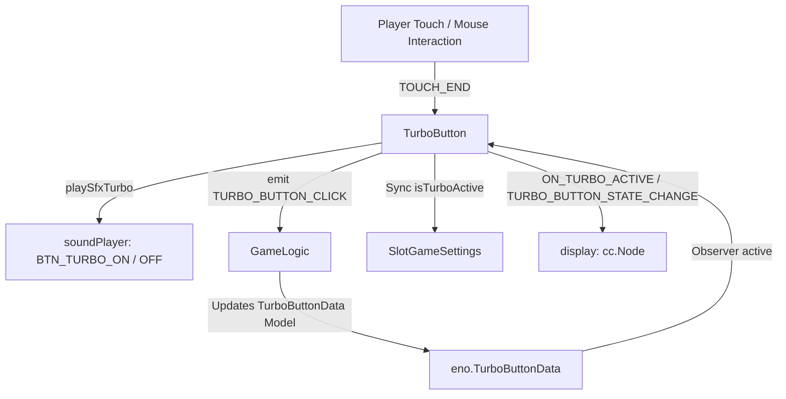

# 🏛️ TurboButton Architectural Role & Fast-Spin Acceleration Toggle

<!-- convention-summary-start -->
### TurboButton Architectural Role & Fast-Spin Acceleration Toggle Summary

- **Core Architecture / Purpose**: Technical reference, API contract, and integration guide for TurboButton Architectural Role & Fast-Spin Acceleration Toggle.
- **Key Mechanisms & Design**: Encapsulates core algorithms, event hooks, and performance optimizations within the slot framework runtime.
- **Domain Capabilities**: cc_slot_module, 01_overview
- **Scope & Code Paths**: `assets/cc-common/cc-slot-module/`
- **Related Docs**: [Master Index](../INDEX.md)
<!-- convention-summary-end -->

---

## 1. Architectural Mission

`TurboButton` manages the Turbo / Quick-spin mode toggle button mounted under `Canvas/Director/UIManager/TurboButton`. It synchronizes player speed preferences with `SlotGameSettings.isTurboActive`, observes `eno.TurboButtonData` reactive model (`active`, `interactable`, `state`), dispatches pointer interaction events to `GameLogic` (`GameLogicUIEvents.TURBO_BUTTON_CLICK`), emits state changes to its `display` visual node, and plays toggle sound effects (`BTN_TURBO_ON` / `BTN_TURBO_OFF`).

---

## 2. Key Responsibilities

1. **Speed Mode Synchronization (`isTurboActive`)**:
   - Toggles fast-spin reel stopping curves and skips slow reel deceleration in `SlotTableDirector`.
2. **Visual Presentation Delegation (`display.emit`)**:
   - Pushes `ON_TURBO_ACTIVE` and `TURBO_BUTTON_STATE_CHANGE` to child visual decorators (Spine flame halos or sprite toggles).
3. **Session Cache Recovery (`LOAD_CACHE_TURBO`)**:
   - Rehydrates player Turbo preference from local storage or cloud profile on startup.
