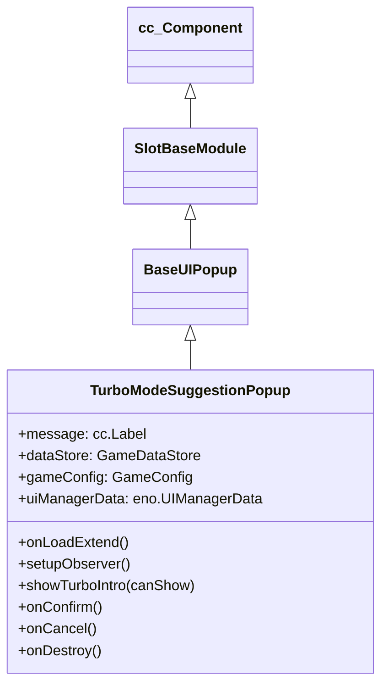

# 🏛️ TurboModeSuggestionPopup Architecture & Role

<!-- convention-summary-start -->
### TurboModeSuggestionPopup Architecture & Role Summary

- **Core Architecture / Purpose**: Technical reference, API contract, and integration guide for TurboModeSuggestionPopup Architecture & Role.
- **Key Mechanisms & Design**: Encapsulates core algorithms, event hooks, and performance optimizations within the slot framework runtime.
- **Domain Capabilities**: cc_slot_module, 01_overview
- **Scope & Code Paths**: `assets/cc-common/cc-slot-module/`
- **Related Docs**: [Master Index](../INDEX.md)
<!-- convention-summary-end -->

`TurboModeSuggestionPopup` is the intelligent player retention modal in the `cc-common` Slot Framework SDK. Mounted under `Canvas/Director/Popup/TurboSuggestion`, it prompts players to activate Turbo / Fast-Play mode after consecutive standard spins, automatically localizing suggestion dialogue and routing confirmation events.

---

## 1. Architectural Role

- **Smart Retention Prompt**: Dispatches `CHECK_TURBO_MODE_SUGGESTION_POPUP` on load and observes `UIManagerData.canShowTurboIntro`.
- **User Preference Activation**: Emits `ON_ACTIVE_FROM_TURBO_INTRO` upon confirmation to activate Turbo Mode.
- **Suppression State**: Invokes `uiManagerData.setCanShowTurboIntro(false)` to prevent repetitive dialog displays during the same session.

---

## 2. Inheritance Diagram

