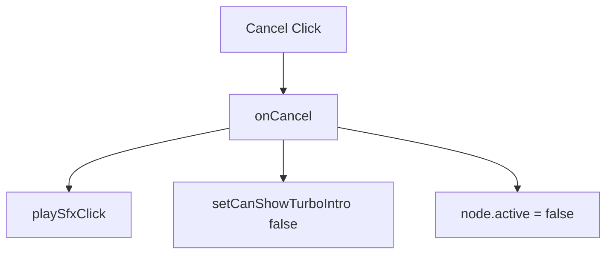

# 📖 `TurboModeSuggestionPopup.onCancel()`

<!-- convention-summary-start -->
### TurboModeSuggestionPopup.onCancel Method Summary

- **Core Architecture / Purpose**: Technical reference, API contract, and integration guide for TurboModeSuggestionPopup.onCancel Method.
- **Key Mechanisms & Design**: Encapsulates core algorithms, event hooks, and performance optimizations within the slot framework runtime.
- **Domain Capabilities**: cc_slot_module, 05_methods
- **Scope & Code Paths**: `assets/cc-common/cc-slot-module/`
- **Related Docs**: [Master Index](../INDEX.md)
<!-- convention-summary-end -->


---

## 1. Method Overview & Signature

Dismisses Turbo mode suggestion and suppresses future popups for the current session.

```typescript
public onCancel(): void
```

---

## 2. Trigger Source & Execution Lifecycle

- **Trigger**: Player taps "Cancel" / "X" button.

---

## 3. Detailed Algorithmic Breakdown

1. Plays click SFX via `this.playSfxClick()`.
2. Suppresses further popups: `this.uiManagerData.setCanShowTurboIntro(false)`.
3. Hides modal: `this.node.active = false`.

---

## 4. Caller & Callee Execution Graph



---

## 5. Parameters & Return Value Specification

| Parameter | Type | Description |
| :--- | :--- | :--- |
| None | `void` | Button handler. |

---

## 6. Complete Source Code Implementation

```typescript
onCancel(): void {
	this.playSfxClick();
	this.uiManagerData.setCanShowTurboIntro(false);
	this.node.active = false;
}
```
