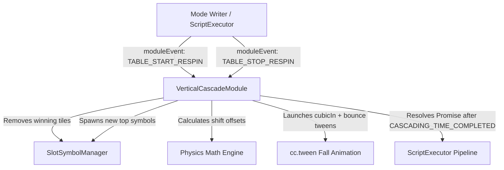

# 🏛️ VerticalCascadeModule Architectural Role & Physics Engine

<!-- convention-summary-start -->
### VerticalCascadeModule Architectural Role & Physics Engine Summary

- **Core Architecture / Purpose**: Technical reference, API contract, and integration guide for VerticalCascadeModule Architectural Role & Physics Engine.
- **Key Mechanisms & Design**: Encapsulates core algorithms, event hooks, and performance optimizations within the slot framework runtime.
- **Domain Capabilities**: cc_slot_module, 01_overview
- **Scope & Code Paths**: `assets/cc-common/cc-slot-module/`
- **Related Docs**: [Master Index](../INDEX.md)
<!-- convention-summary-end -->

---

## 1. Architectural Mission

`VerticalCascadeModule` is the master controller for the Cascade / Avalanche gameplay loop. It manages the removal of eliminated winning tiles, computes gravity fall trajectories for surviving symbols, spawns fresh top incoming symbols, and drives physics-based `cc.tween` drops with bounce easing and turbo awareness.

---

## 2. Key Responsibilities & Subsystem Interactions

1. **Shared Node Pool with `SlotSymbolManager` (`SymbolOwnerType.CASCADE_SYMBOL`)**:
   - Borrows and recycles symbol nodes zero-allocation. Fetches by existing index (`getSymbolByIndex(index, CASCADE_SYMBOL)`) or retrieves available pool node (`getSymbolByIndex(UNUSED, CASCADE_SYMBOL)`).
2. **Direct Coordination with `SlotSymbolModule`**:
   - Invokes `SlotSymbolModule.getModuleComponent(symbol)` to configure `init(code, Vec2(1, size))`, `changeToSymbol(code)`, and emits `SHOW_STATIC` / `PLAY_ANIMATION_APPEAR`.
3. **Global Coordinate Re-Indexing (`setIndex`)**:
   - When surviving symbols drop to lower rows, mandatory invocation of `symbolComp.setIndex(this.getSymbolIndex(col, currentIndex))` ensures downstream win evaluations (`SlotTablePaylineModule`, `PaylineWinFrameModule`) identify winning coordinates accurately.
4. **Display Ownership Handover with Table (`SlotTableModule`)**:
   - `SlotTableModule` renders base rolling and initial spin stop ➔ `VerticalCascadeModule` assumes exclusive control over tumble animations inside `this.container` ➔ Safely restores state on interruption via `resetAllEffectAndTasks()`.
5. **Turbo / Fast-to-Result Scaling**:
   - Dynamically scales falling durations and bounce easing ($+10\text{px}$) according to `gameSettings.isTurboActive`.
