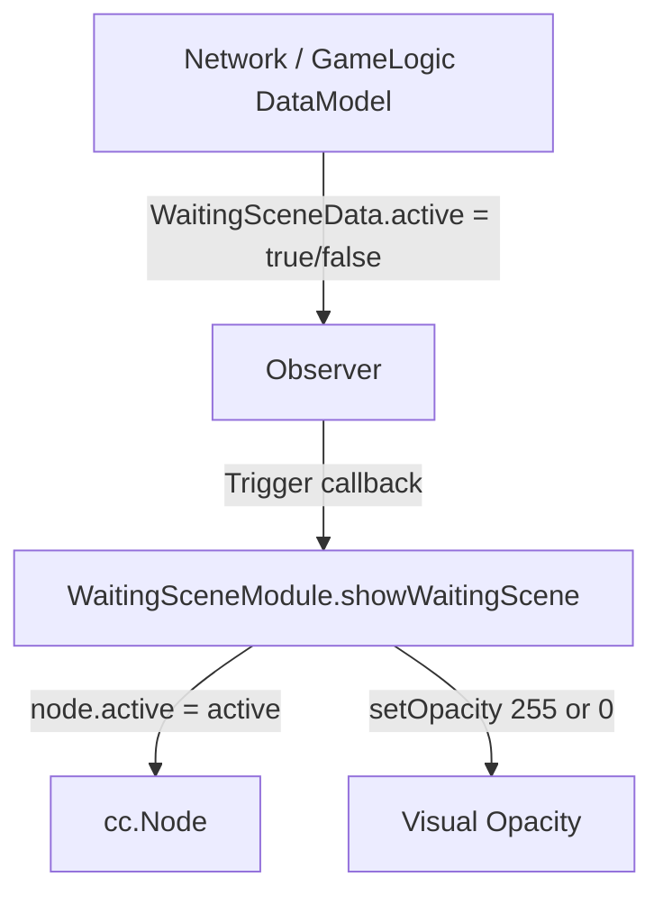

# 🏛️ WaitingSceneModule Architectural Role & Reconnect Spinner Overlay

<!-- convention-summary-start -->
### WaitingSceneModule Architectural Role & Reconnect Spinner Overlay Summary

- **Core Architecture / Purpose**: Technical reference, API contract, and integration guide for WaitingSceneModule Architectural Role & Reconnect Spinner Overlay.
- **Key Mechanisms & Design**: Encapsulates core algorithms, event hooks, and performance optimizations within the slot framework runtime.
- **Domain Capabilities**: cc_slot_module, 01_overview
- **Scope & Code Paths**: `assets/cc-common/cc-slot-module/`
- **Related Docs**: [Master Index](../INDEX.md)
<!-- convention-summary-end -->

---

## 1. Architectural Mission

`WaitingSceneModule` is the **network latency and reconnect waiting spinner overlay** mounted at `Canvas/Director/waitingScene`. Inheriting from `SlotBaseModule`, it observes the reactive data store field `WaitingSceneData.active` via `this.observer.watch()`, toggling `this.node.active` and opacity between 255 (visible) and 0 (hidden).

