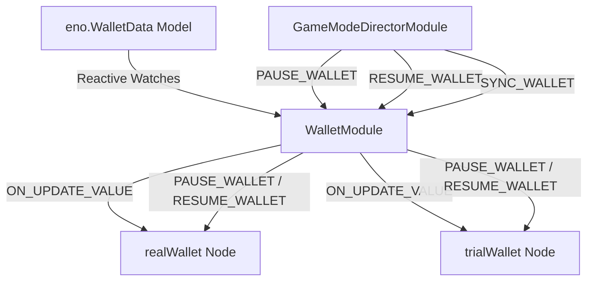

# 🏛️ WalletModule Architectural Role & Dual Currency Wallet Orchestration

<!-- convention-summary-start -->
### WalletModule Architectural Role & Dual Currency Wallet Orchestration Summary

- **Core Architecture / Purpose**: Technical reference, API contract, and integration guide for WalletModule Architectural Role & Dual Currency Wallet Orchestration.
- **Key Mechanisms & Design**: Encapsulates core algorithms, event hooks, and performance optimizations within the slot framework runtime.
- **Domain Capabilities**: cc_slot_module, 01_overview
- **Scope & Code Paths**: `assets/cc-common/cc-slot-module/`
- **Related Docs**: [Master Index](../INDEX.md)
<!-- convention-summary-end -->


---

## 1. Architectural Mission

`WalletModule` manages player cash balances mounted under `Canvas/Director/UIManager/Wallet`. It orchestrates dual currency environments (**Real Wallet** vs **Trial Wallet**), synchronizes reactive balance data from `eno.WalletData` (`wallets.NORMAL` / `wallets.TRIAL`), manages tween pauses during win presentations (`PAUSE_WALLET` / `RESUME_WALLET`), and handles seamless switching between demo and real money play.



---

## 2. Key Responsibilities

1. **Dual Currency Isolation (`realWallet` $\leftrightarrow$ `trialWallet`)**:
   - Routes balance events and displays to the active currency container based on `gameSettings.isTrialMode`.
2. **Rolling Number Coordination (`pauseWallet` / `resumeWallet`)**:
   - Freezes wallet balance count-ups while celebratory win cutscenes are rolling money, then synchronizes exact backend balance when win animation completes.
3. **Session Hydration & Mode Gating**:
   - Restricts wallet balance updates during Free Spins (`currentGameMode !== NORMAL_GAME`) to maintain base spin state integrity until free rounds terminate.

---

## 3. Financial Ecosystem Integration with `BetModule`

`WalletModule` and `BetModule` form the financial backbone of the slot machine user interface:

```
┌─────────────────────────────────────────────────────────────────────────────┐
│                           Canvas/Director/UIManager                         │
│                                                                             │
│  ┌───────────────────────────────┐     ┌─────────────────────────────────┐  │
│  │           BetModule           │     │          WalletModule           │  │
│  │   Manages Total Bet Wager     │     │    Manages Available Balance    │  │
│  │   (eno.BetData)               │     │    (eno.WalletData)             │  │
│  └───────────────┬───────────────┘     └─────────────────▲───────────────┘  │
└──────────────────┼───────────────────────────────────────┼──────────────────┘
                   │                                       │
                   ▼                                       │
┌──────────────────────────────────────────────────────────┴──────────────────┐
│                         Spin Cycle Financial Flow                           │
│                                                                             │
│  1. Bet Selection: Player adjusts bet -> GameLogic verifies Balance >= Bet │
│  2. Spin Start: Director deducts totalBet -> Emits PAUSE_WALLET            │
│  3. Settlement: WinAmountModule rolls wins -> Emits RESUME_WALLET           │
└─────────────────────────────────────────────────────────────────────────────┘
```

1. **Wager Affordability**: `BetModule` stepper buttons (`increaseBet`, `decreaseBet`) reflect balance limits calculated against `WalletData.balance`.
2. **Spin Execution**: Upon spin command dispatch, the wager amount is deducted from `WalletData.wallets.NORMAL`, and `GameModeDirectorModule` emits `PAUSE_WALLET` to freeze rolling visual artifacts during reel motion.
3. **Round Settlement**: After `WinAmountModule` completes win count-ups, `RESUME_WALLET` unfreezes the wallet to display the final credited balance.
