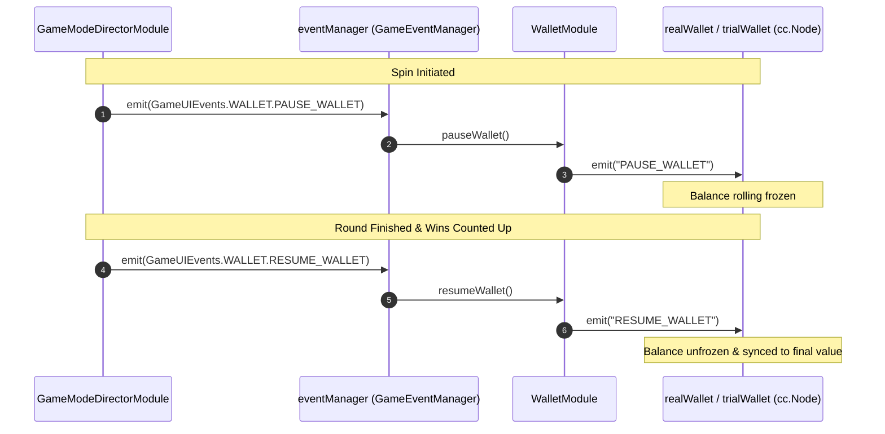

# 🌐 WalletModule Global Event Bus Specification

<!-- convention-summary-start -->
### WalletModule Global Event Bus (GameEventManager) Deep Specification Summary

- **Core Architecture / Purpose**: Technical reference, API contract, and integration guide for WalletModule Global Event Bus (GameEventManager) Deep Specification.
- **Key Mechanisms & Design**: Encapsulates core algorithms, event hooks, and performance optimizations within the slot framework runtime.
- **Domain Capabilities**: cc_slot_module, 06_events
- **Scope & Code Paths**: `assets/cc-common/cc-slot-module/`
- **Related Docs**: [Master Index](../INDEX.md)
<!-- convention-summary-end -->


---

## 1. Global Event Subscriptions Roster

`WalletModule` subscribes to the framework-level global event bus (`this.eventManager`) inside `onLoadExtend()`:

```typescript
onLoadExtend(): void {
    this.eventManager.on(GameUIEvents.WALLET.PAUSE_WALLET, this.pauseWallet, this);
    this.eventManager.on(GameUIEvents.WALLET.RESUME_WALLET, this.resumeWallet, this);
    this.eventManager.on(GameUIEvents.WALLET.SYNC_WALLET, this.syncWallet, this);
}
```

---

## 2. Event Specification & Execution Lifecycle

| Event Constant | Channel | Dispatched By | Payload | Handled By | Engine & UI Behavior |
| :--- | :--- | :--- | :--- | :--- | :--- |
| `GameUIEvents.WALLET.PAUSE_WALLET` | `this.eventManager` | `GameModeDirectorModule` | None | `this.pauseWallet()` | Emits `"PAUSE_WALLET"` to active wallet node (`realWallet` or `trialWallet`) to freeze balance incrementing during spin / big win presentations. |
| `GameUIEvents.WALLET.RESUME_WALLET` | `this.eventManager` | `GameModeDirectorModule` | `isForce?: boolean` | `this.resumeWallet()` | Verifies `currentGameMode === NORMAL_GAME` (unless forced) and emits `"RESUME_WALLET"` to unfreeze and synchronize credited round win balance. |
| `GameUIEvents.WALLET.SYNC_WALLET` | `this.eventManager` | `GameModeDirectorModule` / `GameLogic` | None | `this.syncWallet()` | Proxies directly to `this.resumeWallet()` to re-render the latest balance from `WalletData` upon session restoration or network reconnect. |

---

## 3. Sequence Flow: Balance Lock during Spin & Celebration



---

## 4. Teardown & Context Disposal

To prevent memory leaks and dangling callback executions, `WalletModule.onDestroy()` unbinds reactive observers:
```typescript
onDestroy(): void {
    if (this.eventManager) {
        this.eventManager.targetOff(this);
    }
    if (this.observer) {
        this.observer.releaseAll(this.walletModel, this);
        this.observer.releaseAll(this.uiManagerData, this);
    }
    super.onDestroy && super.onDestroy();
}
```
