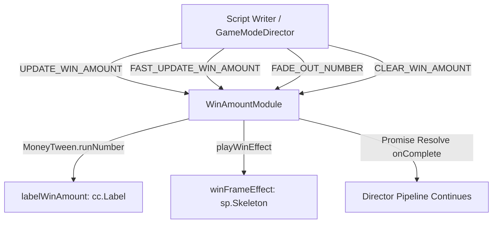

# 🏛️ WinAmountModule Architectural Role & Central Win Display HUD

<!-- convention-summary-start -->
### WinAmountModule Architectural Role & Central Win Display HUD Summary

- **Core Architecture / Purpose**: Technical reference, API contract, and integration guide for WinAmountModule Architectural Role & Central Win Display HUD.
- **Key Mechanisms & Design**: Encapsulates core algorithms, event hooks, and performance optimizations within the slot framework runtime.
- **Domain Capabilities**: cc_slot_module, 01_overview
- **Scope & Code Paths**: `assets/cc-common/cc-slot-module/`
- **Related Docs**: [Master Index](../INDEX.md)
<!-- convention-summary-end -->

---

## 1. Architectural Mission

`WinAmountModule` is the primary on-screen win scoreboard mounted under `Canvas/Director/UIManager/WinAmount`. It renders rolling currency count-ups via `eno.MoneyTween`, manages async Promise lifecycles for scripted win sequences (`UPDATE_WIN_AMOUNT`), handles touch-to-skip fast forwarding (`FAST_UPDATE_WIN_AMOUNT`), and controls celebratory win frame effects (`sp.Skeleton` / particles).

---

## 2. Key Responsibilities

1. **Async Promise Choreography (`updateWinAmount`)**:
   - Returns a Promise resolving upon the completion of the rolling count-up tween.
2. **Fast Forwarding Acceleration (`fastUpdateWinAmount`)**:
   - Rapidly jumps or accelerates the counter to the target score when player skips celebration.
3. **Smooth Fade-Out & Clearing (`fadeOutNumber` / `clearWinAmount`)**:
   - Fades out the score label opacity before transitioning to the next spin cycle.
4. **Session Reconnection Hydration (`syncWinAmount`)**:
   - Instantly recovers the last known win value from `dataStore.getWinAmountPS()`.
