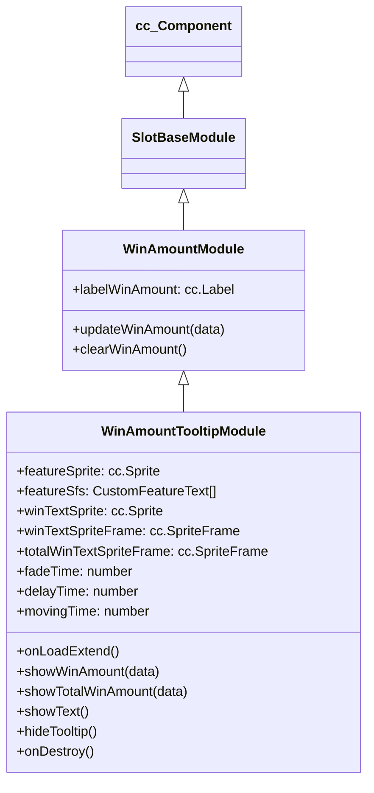

# 🏛️ WinAmountTooltipModule Architecture & Role

<!-- convention-summary-start -->
### WinAmountTooltipModule Architecture & Role Summary

- **Core Architecture / Purpose**: Technical reference, API contract, and integration guide for WinAmountTooltipModule Architecture & Role.
- **Key Mechanisms & Design**: Encapsulates core algorithms, event hooks, and performance optimizations within the slot framework runtime.
- **Domain Capabilities**: cc_slot_module, 01_overview
- **Scope & Code Paths**: `assets/cc-common/cc-slot-module/`
- **Related Docs**: [Master Index](../INDEX.md)
<!-- convention-summary-end -->

`WinAmountTooltipModule` is the dual-purpose floating status ticker and win amount presentation component in portrait slot layouts. Inheriting from `WinAmountModule`, it cycles between rolling promotional feature banners (`featureSfs` with horizontal sliding tweens) and active spin win amount rolling count-ups.

---

## 1. Architectural Role

- **Dual Mode FSM**: Alternates between `TOOL_TIP_TYPE.TEXT` (feature tip ticker) and `TOOL_TIP_TYPE.WIN_AMOUNT` (rolling cash payout).
- **Infinite Carousel Ticker**: Animates promotional feature hints horizontally across `movingTime: 5s` with smooth opacity fades.
- **Reconnection Hydration**: Listens to `JOIN_GAME_SUCCESS` to instantly display unsettled win amounts if recovering from session reconnects.

---

## 2. Inheritance Diagram

