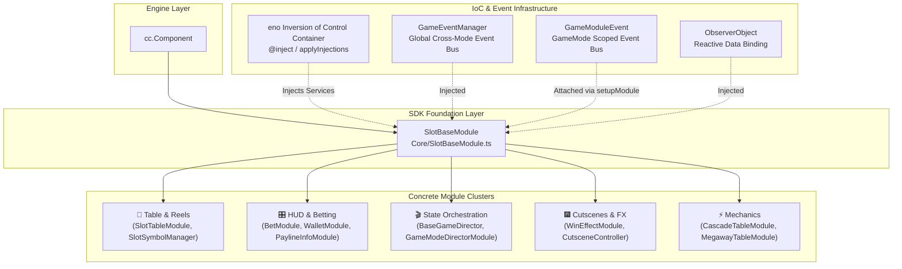

# 🏛️ Module Architecture & Core Philosophy in `cc-common` Slot SDK

<!-- convention-summary-start -->
### Module Architecture & Philosophy in cc-common Slot SDK Summary

- **Core Architecture / Purpose**: Technical reference, API contract, and integration guide for Module Architecture & Philosophy in cc-common Slot SDK.
- **Key Mechanisms & Design**: Encapsulates core algorithms, event hooks, and performance optimizations within the slot framework runtime.
- **Domain Capabilities**: cc_slot_module, over_view
- **Scope & Code Paths**: `SlotTableModule.ts`, `SlotTableData.ts`, `TableModuleConfig.ts`
- **Related Docs**: [Master Index](../INDEX.md)
<!-- convention-summary-end -->


## 1. Executive Summary & Architectural Definition

In the **Cocos Common (`cc-common`) Slot Framework SDK (Cocos Creator 2.4.x)**, a **Module** is the fundamental, self-contained unit of gameplay logic, visual rendering, data management, or user interface presentation.

Every gameplay component across all slot titles (such as the Reel Table, Symbol Pool, Win Display, Bet Control, Wallet, Turbo Switch, or Cutscenes) is built as a **Module** inheriting directly or indirectly from **`SlotBaseModule`** (`cc.Component`).



---

## 2. Core Architectural Principles

The Module architecture in `cc-common` is engineered around four core software design principles:

### 1. Inversion of Control (IoC) & Dependency Injection
Modules **never** instantiate global services directly via singletons (`Singleton.getInstance()`). Instead, all core dependencies (`gameLogic`, `eventManager`, `observer`, `soundPlayer`) are declared using `@inject(Token)` and automatically resolved at runtime by the framework on Frame 0 (`applyInjections(this, gameId)`).

### 2. Dual-Bus Event Isolation
To guarantee complete isolation between game modes (Normal Game, Free Game, Bonus Game):
* **Global Bus (`this.eventManager`)**: Dispatches cross-system events (wallet changes, network notifications, popup triggers, auth).
* **Scoped Bus (`this.moduleEvent`)**: Isolated to the active `GameMode`. Events like `START_SPIN`, `TABLE_STOPPED`, or `SHOW_BEAUTY_MATRIX` emitted in Free Game will never pollute or trigger Normal Game modules.

### 3. Separation of Concerns (The 4-Pillar Subsystem Pattern)
A fully functional feature in `cc-common` is decomposed into four specialized companion classes:
1. 🎮 **Visual Controller (`SlotBaseModule`)**: Handles nodes, spine animations, and tween sequences (e.g. `SlotTableModule.ts`).
2. 💾 **Data Model (`BaseDataModule`)**: Normalizes server payloads and maintains reactive state (e.g. `SlotTableData.ts`).
3. ⚙️ **Configuration (`BaseConfig`)**: Stores timing, dimensions, and easing constants (e.g. `TableModuleConfig.ts`).
4. 🎬 **Script Queue Writer (`GameModeWriterModule`)**: Translates game logic into declarative command queues executed by `ScriptExecutor`.

### 4. Template Method Lifecycle Hooks
Subclasses never override engine lifecycle methods like `onLoad()` directly. Instead, `SlotBaseModule` encapsulates the injection pipeline and exposes standard extension hooks (`onLoadExtend()`, `registerEvents()`, `resetAllEffectAndTasks()`).

---

## 3. Anatomy of `SlotBaseModule` Source Code

Below is the complete, annotated core contract of `SlotBaseModule` (`assets/cc-common/cc-slot-module/Core/SlotBaseModule.ts`):

```typescript
const { _decorator, Component, error } = cc;
import { GameEventManager } from "./GameEventManager";
import { GameModuleEvent } from "../GameMode/GameModuleEvent";
import { SlotSoundPlayerModule } from "./SlotSound/SlotSoundPlayerModule";
const { inject, applyInjections, ObserverObject, NodeUtils } = eno;
const { ccclass } = _decorator;

/**
 * @description Base module for the game, game logic, event manager, 
 * observer, sound player, module event, game mode
 */
@ccclass
export class SlotBaseModule extends Component {
    /**
     * Core Game Logic Controller
     * Provides access to Data Models, Network APIs, and UI Model events.
     */
    @inject(eno.Game) gameLogic: any;

    /**
     * Global Event Bus for cross-mode and engine-wide asynchronous communication.
     */
    @inject(GameEventManager) eventManager: GameEventManager;

    /**
     * Reactive Observer Object to watch property mutations on Data Models.
     */
    @inject(ObserverObject) observer: any;

    /**
     * Sound Player Module for BGM, SFX, and pitch-shifted win sound loops.
     */
    @inject(SlotSoundPlayerModule) soundPlayer: SlotSoundPlayerModule;

    /**
     * Scoped Event Bus shared exclusively among modules of the same GameMode.
     */
    moduleEvent: GameModuleEvent = null;
    
    /**
     * The active GameMode identifier (e.g. NORMAL_GAME, FREE_GAME, BONUS_GAME).
     */
    gameMode = null;

    onLoad(): void {
        const gameId = NodeUtils.getGameIdFromNode(this.node);
        // Step 1: Resolve and inject all @inject dependencies based on gameId scope
        applyInjections(this, gameId);

        // Step 2: Bind global reset event
        if (this.gameLogic) {
            this.gameLogic.on("RESET_ALL_EFFECT_AND_TASKS", this.resetAllEffectAndTasks, this);
        }
        
        // Step 3: Subclass safe initialization hook (dependencies guaranteed non-null)
        this.onLoadExtend();

        // Step 4: Event binding hook
        this.registerEvents();
    }

    /**
     * Extension point for subclasses to execute initialization logic.
     * Invoked immediately after applyInjections finishes.
     */
    onLoadExtend(): void { }

    /**
     * Invoked by GameModeDirectorModule during setupModules() to attach the scoped event bus.
     */
    setupModule(moduleEvent: GameModuleEvent, gameMode): void {
        if (this.moduleEvent !== null) {
            error(`[ModuleRegistry] Module ${this.node.name} is registered to multiple GameMode. Please clone module or use GameEventManager to control event.`);
        }
        this.moduleEvent = moduleEvent;
        this.gameMode = gameMode;
    }

    protected registerEvents(): void {
        // Override in subclass to bind this.eventManager or this.moduleEvent listeners
    }

    protected unregisterEvents(): void {
        // Override in subclass to remove listeners
    }

    protected resetAllEffectAndTasks(): void {
        // Override in subclass to stop active tweens, clear particles, reset animations
    }
}
```
