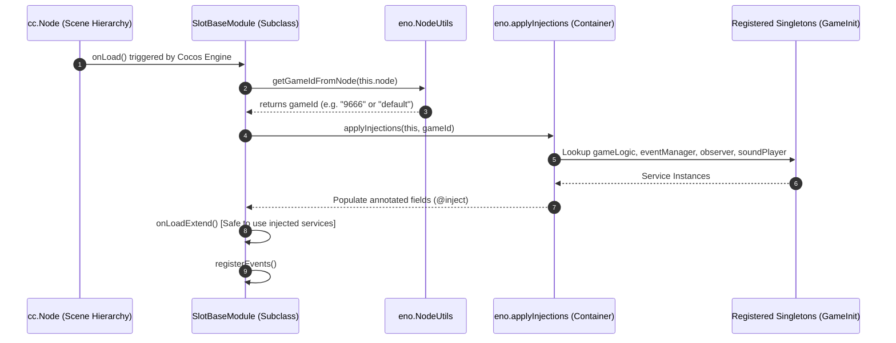

# 💉 Dependency Injection & Inversion of Control (IoC) in `SlotBaseModule`

<!-- convention-summary-start -->
### Dependency Injection & IoC Container in Slot Modules Summary

- **Core Architecture / Purpose**: Technical reference, API contract, and integration guide for Dependency Injection & IoC Container in Slot Modules.
- **Key Mechanisms & Design**: Encapsulates core algorithms, event hooks, and performance optimizations within the slot framework runtime.
- **Domain Capabilities**: cc_slot_module, over_view
- **Scope & Code Paths**: `GameInit.ts`
- **Related Docs**: [Master Index](../INDEX.md)
<!-- convention-summary-end -->


## 1. Overview of the IoC Mechanism

In `cc-common`, components do not manually locate services through global singletons (`window.GameManager` or `SoundController.getInstance()`). Such anti-patterns cause severe memory leaks when reloading scenes and prevent running multiple slot game instances side-by-side.

Instead, the framework implements an **Inversion of Control (IoC)** system via `eno.inject` and `eno.applyInjections`:



---

## 2. The 4 Injected Core Services

Every class inheriting from `SlotBaseModule` automatically receives access to 4 foundational services:

| Injected Property | Type Token | Lifetime & Scope | Purpose & Primary API Methods |
| :--- | :--- | :--- | :--- |
| **`this.gameLogic`** | `@inject(eno.Game)` | Session Lifetime | Master logic coordinator. Manages network packets, player state, and UI panel models.<br/>• `this.gameLogic.emit(GameLogicUIEvents.OPEN_SETTING_PANEL)`<br/>• `this.gameLogic.getDataModel().BetData`<br/>• `this.gameLogic.getGameText("TOTAL_WIN")` |
| **`this.eventManager`** | `@inject(GameEventManager)` | Scene Lifetime | Asynchronous global event bus for engine-wide topics.<br/>• `this.eventManager.on(EventName, callback, this)`<br/>• `await this.eventManager.emit(EventName, data)`<br/>• `this.eventManager.targetOff(this)` |
| **`this.observer`** | `@inject(ObserverObject)` | Scene Lifetime | Reactive data-binding watcher. Triggers UI re-renders on model field mutations.<br/>• `this.observer.watch(targetObj, 'fieldName', (val) => {})`<br/>• `this.observer.unwatch(targetObj, 'fieldName')` |
| **`this.soundPlayer`** | `@inject(SlotSoundPlayerModule)` | Scene Lifetime | Dedicated audio controller for slot games.<br/>• `this.soundPlayer.playSFX(soundName)`<br/>• `this.soundPlayer.playMainBGM(gameMode)`<br/>• `this.soundPlayer.playWinLoopSound(duration, winLevel)` |

---

## 3. How `gameId` Resolution Works

When multi-game hubs or sub-games are embedded, dependencies are scoped by `gameId`.

1. During `onLoad()`, `SlotBaseModule` calls:
   ```typescript
   const gameId = NodeUtils.getGameIdFromNode(this.node);
   ```
2. `NodeUtils.getGameIdFromNode` traverses upwards through parent nodes until it discovers the root container node bearing the active `gameId` tag.
3. `applyInjections(this, gameId)` looks up the service container registered specifically for that `gameId` by `GameInit.ts`.

---

## 4. The Golden Rule: Why `onLoadExtend()` is Mandatory

Because `@inject` fields are populated inside `SlotBaseModule.onLoad()`, **subclasses MUST NOT override `onLoad()` directly**.

### ❌ Incorrect Pattern (Direct `onLoad` Override):
```typescript
@ccclass
export default class CustomTableModule extends SlotBaseModule {
    onLoad(): void {
        // BUG: this.eventManager is NULL here!
        // Overriding onLoad without calling super.onLoad() drops all DI injections!
        this.eventManager.on("SPIN", this.onSpin, this); // Crash: Cannot read property 'on' of null
    }
}
```

### ✅ Correct Pattern (Template Method `onLoadExtend`):
```typescript
@ccclass
export default class CustomTableModule extends SlotBaseModule {
    onLoadExtend(): void {
        // Injections are guaranteed to be fully resolved and non-null here
        console.log("GameLogic initialized:", this.gameLogic);
    }

    protected registerEvents(): void {
        // Safe to bind events here
        this.eventManager.on("UPDATE_WALLET", this.onUpdateWallet, this);
    }

    onDestroy(): void {
        if (this.eventManager) {
            this.eventManager.targetOff(this);
        }
    }
}
```
