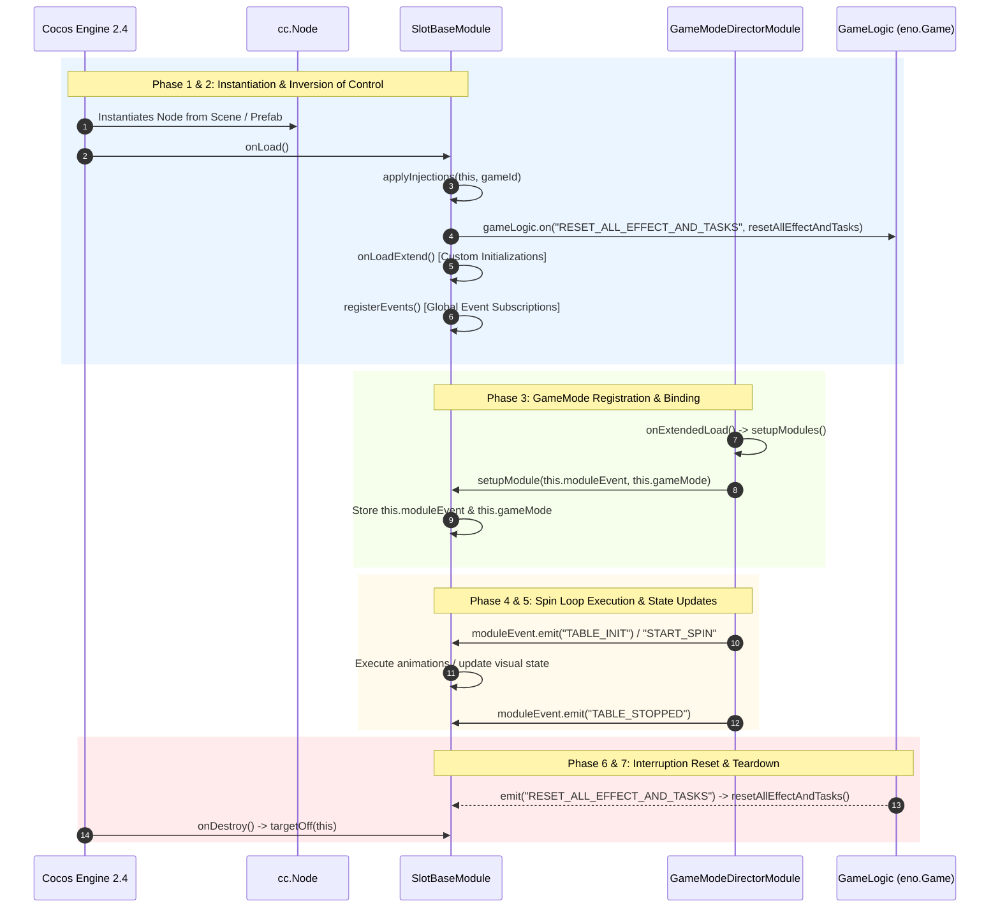

# 🔄 Module Lifecycle & GameMode Registration Pipeline

<!-- convention-summary-start -->
### Module Lifecycle & GameMode Registration Pipeline Summary

- **Core Architecture / Purpose**: Technical reference, API contract, and integration guide for Module Lifecycle & GameMode Registration Pipeline.
- **Key Mechanisms & Design**: Encapsulates core algorithms, event hooks, and performance optimizations within the slot framework runtime.
- **Domain Capabilities**: cc_slot_module, over_view
- **Scope & Code Paths**: `assets/cc-common/cc-slot-module/`
- **Related Docs**: [Master Index](../INDEX.md)
<!-- convention-summary-end -->


## 1. End-to-End Module Lifecycle Flowchart

The lifecycle of a `SlotBaseModule` component progresses through 7 distinct deterministic phases:



---

## 2. Phase-by-Phase Lifecycle Breakdown

### Phase 1: Engine Mounting (`onLoad`)
* **Trigger**: Cocos Creator Engine activates the node in the scene.
* **Internal Action**:
  1. Finds the scoped `gameId` via `NodeUtils.getGameIdFromNode(this.node)`.
  2. Resolves `@inject` decorators with `applyInjections(this, gameId)`.
  3. Binds the global `RESET_ALL_EFFECT_AND_TASKS` listener.

### Phase 2: Post-Injection Hook (`onLoadExtend`)
* **Trigger**: Called immediately at the end of `SlotBaseModule.onLoad()`.
* **Developer Responsibility**: Subclasses instantiate sub-components, initialize internal state variables, or build custom node pools. Injected services (`this.gameLogic`, `this.eventManager`, `this.soundPlayer`) are guaranteed to be populated.

### Phase 3: Registration via Director (`setupModule`)
* **Trigger**: Invoked when `GameModeDirectorModule` initializes its `moduleList`.
* **Internal Logic**:
  ```typescript
  setupModule(moduleEvent: GameModuleEvent, gameMode): void {
      if (this.moduleEvent !== null) {
          error(`[ModuleRegistry] Module ${this.node.name} is registered to multiple GameMode. Please clone module or use GameEventManager to control event.`);
      }
      this.moduleEvent = moduleEvent;
      this.gameMode = gameMode;
  }
  ```

> [!IMPORTANT]
> **Single GameMode Registration Guard**: A single `cc.Node` instance of `SlotBaseModule` **cannot** be registered to multiple GameModes. If Normal Game and Free Game require identical table modules, either clone the prefab node in the scene hierarchy or use `this.eventManager` for cross-mode event orchestration.

### Phase 4: Event Subscription (`registerEvents`)
* **Trigger**: Called right after `onLoadExtend()`.
* **Developer Responsibility**: Bind listeners to `this.eventManager` and `this.moduleEvent`.

### Phase 5: Fast-Play & Disconnect Reset (`resetAllEffectAndTasks`)
* **Trigger**: Dispatched by `this.gameLogic` when:
  1. Player triggers Fast Play (FTR / Turbo skip).
  2. Network connection drops or resynchronization occurs.
  3. Player exits a feature abruptly.
* **Developer Responsibility**: Subclasses must stop active `cc.tween` instances, stop symbol spine animations, clear particle systems, and return pooled nodes.

### Phase 6: Destruction & Teardown (`onDestroy`)
* **Trigger**: Node removed from scene or scene unloads.
* **Developer Responsibility**: Subclasses must unbind all event listeners via `this.eventManager.targetOff(this)` to avoid engine memory leaks.
