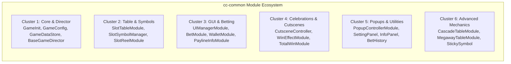
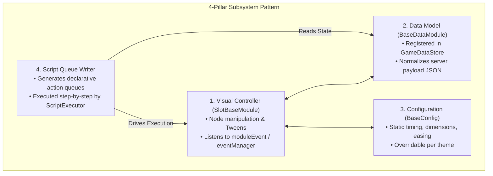

# 🌐 Module Ecosystem Taxonomy & Classification in `cc-common`

<!-- convention-summary-start -->
### Module Ecosystem Taxonomy & Classification Summary

- **Core Architecture / Purpose**: Technical reference, API contract, and integration guide for Module Ecosystem Taxonomy & Classification.
- **Key Mechanisms & Design**: Encapsulates core algorithms, event hooks, and performance optimizations within the slot framework runtime.
- **Domain Capabilities**: cc_slot_module, over_view
- **Scope & Code Paths**: `GameConfig.ts`, `BaseDataModule.ts`, `ScriptExecutor.ts`
- **Related Docs**: [Master Index](../INDEX.md)
<!-- convention-summary-end -->

## 1. Architectural Taxonomy Overview

All modules in `cc-common` are organized into 6 functional clusters. Every cluster adheres to the `SlotBaseModule` inheritance contract and coordinates through the Director-Writer execution pipeline.

---

## 2. Comprehensive Master Module Taxonomy

| Cluster | Module Name | Canonical Scene Node Path | Primary Responsibility | Companion Quad |
| :--- | :--- | :--- | :--- | :--- |
| **1. Core & Director** | `GameInit` | `Canvas/Director` | Bootstrap, IoC container population, network auth. | `GameConfig.ts` |
| | `GameDataStore` | `Canvas/Director` | Central reactive store (`playSession`, `wallet`, `bet`). | `BaseDataModule.ts` |
| | `BaseGameDirector` | `Canvas/Director` | Master state machine loop orchestrator. | `ScriptExecutor.ts` |
| | `GameModeDirectorModule` | `Canvas/Director/GameMode` | Director dispatcher managing Normal, Free, and Bonus modes. | `GameModuleEvent.ts` |
| **2. Table & Reels** | `SlotTableModule` | `Canvas/Director/GameMode/BoardG/Table` | Matrix orchestrator, reel instantiation, column stopping delays. | `SlotTableData.ts`, `TableModuleConfig.ts` |
| | `SlotSymbolManager` | `Canvas/Director/GameMode/BoardG/Table/SymbolManager` | Object pooling (`cc.NodePool`), spine lifecycle caching. | `SlotSymbolModule.ts` |
| | `SlotTableNearWinModule` | Child of Table | Near-win anticipation VFX overlays (2+ Scatters). | `SlotTableSoundEffectModule.ts` |
| **3. GUI & Betting** | `UIManagerModule` | `Canvas/Director/UIManager` | HUD orchestrator coordinating control panel components. | `UIManagerData.ts` |
| | `BetModule` | `Canvas/Director/UIManager/BetModule` | Bet selector, bet multiplier stepper, max bet toggle. | `BetData.ts` |
| | `WalletModule` | `Canvas/Director/UIManager/WalletModule` | Balance display, credit animation rolling tweens. | `WalletData.ts` |
| | `PaylineInfoModule` | `Canvas/Director/UIManager/PaylineInfo` | Win amount label, bitmap font animation, celebration triggers. | `MoneyFormatter.ts` |
| | `SlotButtonNormal` | `Canvas/Director/UIManager/SlotButtonNormal` | Spin / Fast Stop / AutoPlay trigger button. | `SlotButtonData.ts` |
| | `TurboButton` | `Canvas/Director/UIManager/TurboButton` | Fast-play mode toggle switch. | `SlotGameSettings.ts` |
| **4. Celebrations** | `CutsceneController` | `Canvas/Director/CutsceneControl` | Modal queue dispatcher for celebration overlays. | `CutsceneData.ts` |
| | `WinEffectModule` | `Canvas/Director/CutsceneControl/WinEffect` | Big Win, Mega Win, Super Win coin showers & Spine FX. | `WinEffectConfig.ts` |
| | `IntroFreeGameModule` | Modal Overlay | Feature trigger banner and awarded free spin dialog. | `FreeGameDirectorModule.ts` |
| | `TotalWinModule` | Modal Overlay | Summary celebration displaying total feature payout. | `TotalWinConfig.ts` |
| **5. Popups & Menus** | `PopupControllerModule`| `Canvas/Director/PopupControl` | Modal popup lifecycle and transition manager. | `PopupConfig.ts` |
| | `SettingPanel` | `Canvas/Director/PopupControl/SettingPanel` | Sound toggles, speed sliders, language selector. | `SlotGameSettings.ts` |
| | `InfoPanel` | `Canvas/Director/PopupControl/InfoPanel` | Paytable rules, symbol payouts, feature guides. | `InfoData.ts` |
| | `BetHistoryModule` | `Canvas/Director/PopupControl/BetHistory` | Player round history and spin replay records. | `BetHistoryData.ts` |
| **6. Mechanics** | `CascadeTableModule` | Table Node | Avalanche symbol destruction and gravity drop. | `CascadeData.ts` |
| | `MegawayTableModule` | Table Node | Variable symbol heights per reel column (2 to 7 symbols). | `MegawayConfig.ts` |
| | `StickySymbolModule` | Overlay on Table | Locked wild/multiplier symbols persisting across spins. | `StickySymbolData.ts` |
| | `BuyFeatureModule` | `Canvas/Director/UIManager/BuyFeature` | Buy Free Spins / Feature modal and wager validation. | `BuyFeatureConfig.ts` |

---

## 3. The 4-Pillar Subsystem Architecture Pattern

For every gameplay mechanic, `cc-common` enforces decomposition into 4 tightly cohesive classes:

