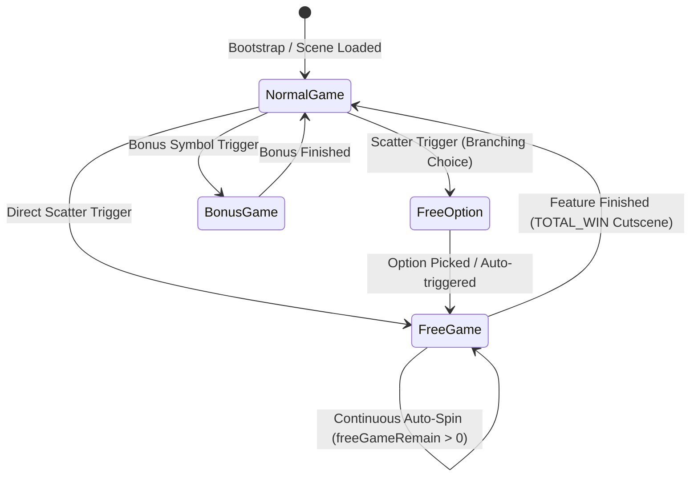
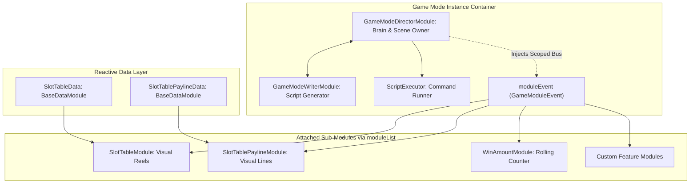
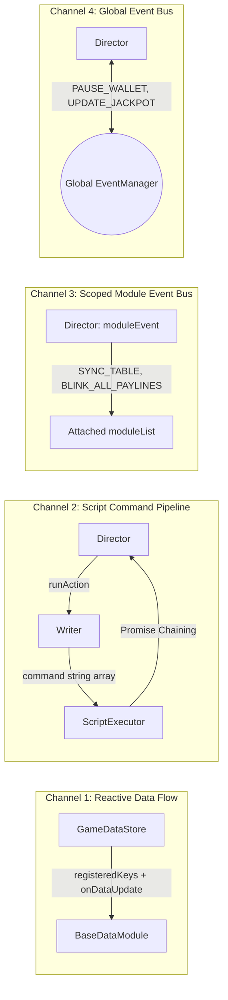

# 🎮 Game Mode Architecture, Subsystem Composition & Inter-Module Communication

<!-- convention-summary-start -->
### Game Mode Architecture, Subsystem Composition & Inter-Module Communication Summary

- **Core Architecture / Purpose**: Technical reference, API contract, and integration guide for Game Mode Architecture, Subsystem Composition & Inter-Module Communication.
- **Key Mechanisms & Design**: Encapsulates core algorithms, event hooks, and performance optimizations within the slot framework runtime.
- **Domain Capabilities**: cc_slot_module, over_view
- **Scope & Code Paths**: `assets/cc-common/cc-slot-module/`
- **Related Docs**: [Master Index](../INDEX.md)
<!-- convention-summary-end -->


---

## 1. Definition & Purpose of Game Modes

In the Cocos Creator Slot SDK architecture (`cc-slot-module`), a **Game Mode** is an **Autonomous Subsystem / State** representing an independent phase or gameplay state within the slot game lifecycle.

Each Game Mode manages:
1. **Reels & Layout**: Dedicated reel table, background assets, and theme-specific visual effects.
2. **Script Pipeline**: Distinct orchestration for spin, re-spin, cascade, bonus rounds, and win presentation programmed by the `WriterModule`.
3. **Audio Profile**: Mode-specific BGM, ambient tracks, and dedicated sound effects.
4. **Interaction Loop**: Continuous automated spins (Free Game), player-initiated single spins (Normal Game), or interactive branching pick timers (Free Option).



### Standard Game Modes in the SDK:
* **`NORMAL_GAME` (Mode 1)**: Base Game mode. Receives spin commands from Spin / AutoSpin / Turbo buttons, deducts wager from wallet, displays standard line wins, and triggers cutscene transitions into special features.
* **`FREE_GAME` (Mode 2)**: Free Spins mode. Continuously auto-spins without deducting player balance, utilizes dedicated bonus paytables/reels, decrements `freeSpinTimes`, accumulates total feature payout (`winAmountPS`), and displays the summary `TOTAL_WIN` modal.
* **`FREE_OPTION` (Mode 3)**: Interactive volatility selector allowing players to choose their bonus configuration (e.g., 20 Free Spins with 2x Multiplier vs 10 Free Spins with 5x Multiplier vs Mystery). Includes a 15-second timeout with auto-selection.
* **`BONUS_GAME` (Mode 4)**: Secondary mini-games (Pick-and-Win, Wheel of Fortune, Chest selection, etc.).
* **`CASCADE_GAME` / `RESPIN_GAME`**: Avalanche/Tumble mechanics or Hold & Win / Lock & Respin features.

---

## 2. Game Mode Anatomy & Component Composition

In `cc-slot-module`, a Game Mode is not a monolithic component, but a cohesive **Component Cluster** operating in concert:

```text
Canvas/Director/GameMode/NormalGameDirector (Hosts GameModeDirectorModule)
├── NormalGameDirectorModule (State Orchestrator / Scene Owner)
├── NormalGameWriterModule (Declarative Script Generator)
├── ScriptExecutor (Asynchronous Promise Command Runner)
└── moduleList (Attached visual and data components)
    ├── Table (SlotTableModule, SlotReelModule, SlotSymbolManager)
    ├── TableData (SlotTableData - Reactive matrix receiver)
    ├── Payline (SlotTablePaylineModule - Visual payline overlays)
    ├── PaylineData (SlotTablePaylineData - Receives payLines, winAmount)
    ├── WinAmount (WinAmountModule - Rolling win number counter)
    └── SlotButton (SlotButtonModule - Spin & betting controls)
```



### The 3 Core Components of a Game Mode:
1. **`GameModeDirectorModule` (The Orchestrator)**:
   - Manages the lifecycle of the mode (`init`, `enter`, `onDestroy`).
   - Implements execution methods (`_startSpinningTable`, `_stopSpinningTable`, `_showWinPayline`, `_gameExit`, etc.).
   - Instantiates the scoped event bus `this.moduleEvent = new GameModuleEvent()` and injects it into all child modules within `moduleList`.
2. **`GameModeWriterModule` (The Planner)**:
   - Reads state from `dataStore.playSession` and produces an ordered declarative command queue (`string[]`).
   - Completely decoupled from UI and tween logic (no Node or Animation dependencies), making unit testing straightforward.
3. **`BaseDataModule` Subclasses (The Data Observers)**:
   - Co-located on nodes with corresponding presentation components (e.g., `SlotTableData` co-located with `SlotTableModule`).
   - Registers for specific state slices from `GameDataStore` via `registeredKeys` (`matrix`, `payLines`, `winAmount`).

---

## 3. The 4 Inter-Module Communication Channels

To ensure complete decoupling, testability, and reusability across game themes, `cc-slot-module` implements **4 distinct communication channels**:



### Channel 1: Reactive Data Flow (`GameDataStore` ➔ `BaseDataModule`)
- **Mechanism**: Zero-event-overhead unidirectional data binding.
- **Workflow**:
  1. When a server spin response arrives, the Director calls `dataStore.parseDataPS(data)` and `dataStore.updateDataModules()`.
  2. `GameDataStore` iterates over registered `_dataModules`: if a key in `module.registeredKeys` exists in the active session, it automatically invokes `module.onDataUpdate(key, deepClonedValue)`.
  3. All values are **Deep Cloned** (`JSON.parse(JSON.stringify(value))`) to guarantee state immutability and prevent UI components from mutating source state.

### Channel 2: Command Script Pipeline (`Director` ➔ `Writer` ➔ `ScriptExecutor`)
- **Mechanism**: Command Pattern combined with Asynchronous Promise Chaining.
- **Workflow**:
  1. The Director calls `this.runAction("ActionName")` (e.g., `runAction("SpinTrigger")`).
  2. The Writer evaluates `playSession` state (e.g., Big Win, Jackpot, Free Spins remaining) and returns an ordered command list:
     ```typescript
     ["_beforeSpinStart", "_syncPlaySessionData", "_resetOnSpin", "_startSpinningTable"]
     ```
  3. `ScriptExecutor` sequentially executes each command string by looking up matching methods on the Director (`await director._method()`). The next step executes only after the current Promise resolves.

### Channel 3: Scoped Module Event Bus (`this.moduleEvent: GameModuleEvent`)
- **Mechanism**: Intra-mode isolated publish-subscribe event bus.
- **Workflow**:
  - Upon initialization, `GameModeDirectorModule` creates a `new GameModuleEvent()` and calls `setupModule(this.moduleEvent)` on each module in `this.moduleList`.
  - Reel and table events remain strictly scoped to the active mode: `SYNC_TABLE`, `TABLE_START_SPIN`, `TABLE_STOP_SPIN`, `BLINK_ALL_PAYLINES`, `SHOW_ALL_PAYLINES`, `CLEAR_PAYLINES`.
  - **Advantage**: Normal Game and Free Game can share table components or run distinct tables without event cross-contamination.

### Channel 4: Global Event Bus (`this.eventManager: EventManager`)
- **Mechanism**: Engine-wide asynchronous pub-sub bus.
- **Workflow**:
  - Coordinates cross-system events outside the scope of an individual Game Mode:
    - **Wallet**: `GameUIEvents.WALLET.PAUSE_WALLET`, `GameUIEvents.WALLET.RESUME_WALLET`.
    - **Jackpot**: `GameUIEvents.JACKPOT.UPDATE_JACKPOT_VALUE`, `GameUIEvents.JACKPOT.PAUSE_JACKPOT`.
    - **Cutscenes & Modals**: `GameUIEvents.CUTSCENES.PLAY_CUTSCENE`, `GameUIEvents.CUTSCENES.CLOSE_CUTSCENE`.
    - **Mode Switching**: `GameUIEvents.GAME_MODE.SWITCH_GAME_MODE`, `GameUIEvents.GAME_MODE.EXIT_GAME_MODE`.

---

## 4. Communication Channels Comparison Matrix

| Channel | Execution Mechanism | Scope | Payload | Primary Use Case |
| :--- | :--- | :--- | :--- | :--- |
| **1. Reactive Data** | Direct invocation (<0.1ms), Deep-clone | All Registered Data Modules | Data slices (`matrix`, `payLines`) | Ingesting server payloads into data stores. |
| **2. Command Script**| Sequential Async Promise Chaining | Director & Writer internal | Method names + Context objects | Choreographing spin animation workflows. |
| **3. Scoped `moduleEvent`**| Intra-mode Event Emitter | Mode-level (`moduleList`) | Event payloads | Controlling local Table, Paylines, and HUD. |
| **4. Global `eventManager`**| Global Event Emitter | Global Scene Graph | System payloads | Mode transitions, Wallet, Jackpot, and Modals. |
