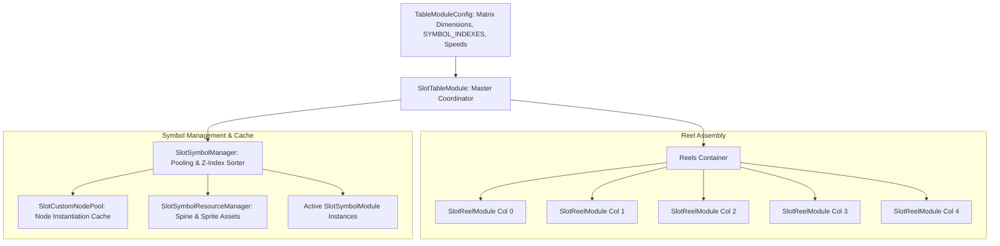
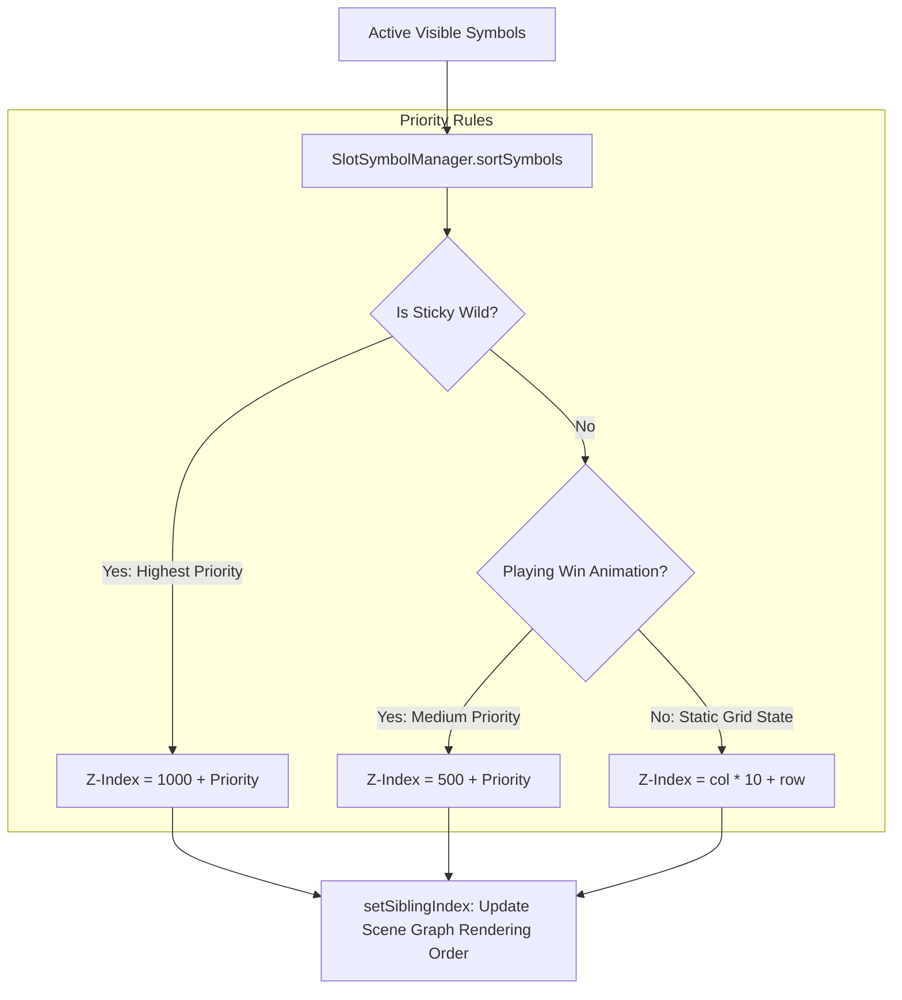

# 🎰 Table, Reels & Symbol Rendering Engine Architecture

<!-- convention-summary-start -->
### Table, Reels & Symbol Rendering Engine Architecture Summary

- **Core Architecture / Purpose**: Technical reference, API contract, and integration guide for Table, Reels & Symbol Rendering Engine Architecture.
- **Key Mechanisms & Design**: Encapsulates core algorithms, event hooks, and performance optimizations within the slot framework runtime.
- **Domain Capabilities**: cc_slot_module, over_view
- **Scope & Code Paths**: `assets/cc-common/cc-slot-module/`
- **Related Docs**: [Master Index](../INDEX.md)
<!-- convention-summary-end -->


---

## 1. Table Engine Overview

The **Table Engine** is the visual and mechanical centerpiece of slot games within `cc-slot-module`. It manages the entire symbol matrix rendering pipeline, orchestrates infinite motion blur reel spins, applies physical bounce-back deceleration easing, resolves Z-Index layer ordering, and supports advanced mechanics such as Mega Symbols (Gigablox) and cascading avalanches.



---

## 2. The 7 Core Components of the Table Engine

| Component | Class / Script | Architectural Responsibility |
| :--- | :--- | :--- |
| **1. Table Controller** | `SlotTableModule` | Manages the collection of reels (`reelList`), handles `TABLE_START_SPIN`, `TABLE_STOP_SPIN`, and `SYNC_TABLE` events, and synchronizes column stop sequences. |
| **2. Geometric Config** | `TableModuleConfig` | Defines row/column dimensions (`TABLE_FORMAT`), cell index mappings (`SYMBOL_INDEXES`), and reel spin speed profiles (`MODES.NORMAL`, `MODES.TURBO`). |
| **3. Reel Controller** | `SlotReelModule` | Executes continuous vertical infinite scrolling, spawns motion-blur symbols during spin phases, and applies bounce-back stopping easing (`BOUNCE_EASING`). |
| **4. Symbol Lifecycle Manager** | `SlotSymbolManager` | Allocates (`getSymbolByIndex`), recycles (`returnSymbol`), sorts visual hierarchy (`sortSymbols`), and manages overlay elements (Sticky Wilds). |
| **5. Symbol Entity** | `SlotSymbolModule` | Represents an individual symbol cell: encapsulates static Sprites, Spine animations, blur representations, and state transitions (`changeToSymbol()`, `playAnimation()`). |
| **6. Node Pool Allocator** | `SlotCustomNodePool` | Manages node pools per symbol type, preventing Garbage Collection spikes during high-frequency auto-spins on mobile devices. |
| **7. Resource Cache** | `SlotSymbolResourceManager`| Preloads and caches Spine SkeletonData assets and SpriteAtlases across all theme symbol sets. |

---

## 3. Matrix Geometry & Hidden Buffer Rows

### 3.1. Standard Matrix Coordinate System: `[col][row]`
In `cc-slot-module`, matrices are consistently structured as 2D arrays using column-major order:
```typescript
matrix[col][row]
```
- `col`: Column index from left to right (`0` to `COLS - 1`).
- `row`: Row index within the column (typically `0` is the bottom row, `ROWS - 1` is the top visible row).

```text
       Col 0      Col 1      Col 2      Col 3      Col 4
Row 2: [0][2]     [1][2]     [2][2]     [3][2]     [4][2]   <-- Top visible row
Row 1: [0][1]     [1][1]     [2][1]     [3][1]     [4][1]   <-- Middle visible row
Row 0: [0][0]     [1][0]     [2][0]     [3][0]     [4][0]   <-- Bottom visible row
```

### 3.2. Hidden Buffer Rows (`topBuffer` & `bottomBuffer`)
To ensure symbols transition seamlessly in and out of the Reel Viewport without sudden visual pop-in or clipping artifacts:
- `topBuffer`: Hidden symbol rows positioned above the top edge of each column. During a spin, top-buffer symbols smoothly scroll into the visible viewport.
- `bottomBuffer`: Hidden symbol rows located below the bottom edge. Symbols that scroll past the bottom enter this buffer before being recycled into the node pool.

```text
+---------------------------------------------------+
|               TOP BUFFER (Hidden off-screen)       |
+===================================================+
|           REEL VIEWPORT (Visible Player Area)     |
|                                                   |
|   [Col 0]     [Col 1]     [Col 2]     [Col 3]     |
|                                                   |
+===================================================+
|             BOTTOM BUFFER (Hidden off-screen)     |
+---------------------------------------------------+
```

---

## 4. Z-Index Layer Priority Sorting

When symbols trigger win animations or expansive spine visual effects, proper layer sorting is essential to prevent adjacent reel cells from improperly overlapping or clipping active celebration animations.

`SlotSymbolManager.sortSymbols()` dynamically resolves rendering depth based on a structured **Layer Priority Hierarchy**:



---

## 5. Mega Symbols & Irregular Grids (Gigablox / Large Symbols)

For games featuring multi-cell symbols (e.g., 2x2, 3x3 Wilds or 1x3 vertical banners):
1. **Anchor Reel Attachment**: Mega symbols are attached to an anchor column (typically the bottom-left origin cell).
2. **Buffer Expansion**: `TableModuleConfig` dynamically expands `topBuffer` dimensions to prevent visual clipping along the top viewport boundary during reel entrance.
3. **Multi-Index Coordinate Projection**: When evaluating paylines, `SlotTablePaylineModule` automatically projects the mega symbol's single code across all underlying `[col][row]` cells covered by its dimensions.
