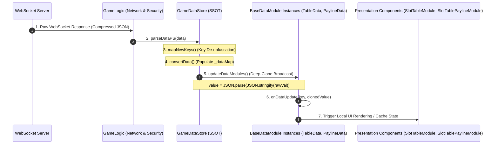
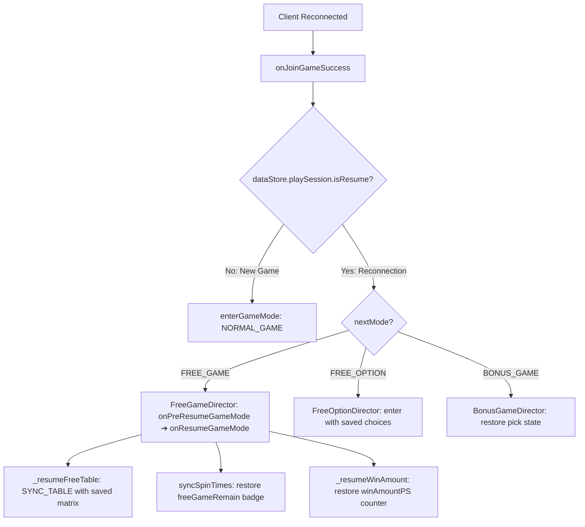

# 🔄 Reactive Data Flow, State Immutability & Reconnection Architecture

<!-- convention-summary-start -->
### Reactive Data Flow, State Immutability & Reconnection Architecture Summary

- **Core Architecture / Purpose**: Technical reference, API contract, and integration guide for Reactive Data Flow, State Immutability & Reconnection Architecture.
- **Key Mechanisms & Design**: Encapsulates core algorithms, event hooks, and performance optimizations within the slot framework runtime.
- **Domain Capabilities**: cc_slot_module, over_view
- **Scope & Code Paths**: `assets/cc-common/cc-slot-module/`
- **Related Docs**: [Master Index](../INDEX.md)
<!-- convention-summary-end -->


---

## 1. End-to-End Server Data Ingestion Pipeline

The entire data management pipeline in `cc-slot-module` adheres to the **Single Source of Truth (SSOT)** principle combined with **Unidirectional Reactive Data Flow**.

Below is the complete sequence from the arrival of compressed network packets to presentation updates on screen:



---

## 2. State Immutability via Deep-Clone Memory Isolation

In real-time slot games, multiple distinct modules frequently observe identical data structures simultaneously (e.g., `SlotTableData`, `SlotTablePaylineData`, and `CascadeModuleData` all ingest the active `matrix`).

If mutable object references were distributed directly:
- An in-place array modification by `SlotTableModule` during cascade animations would inadvertently corrupt the reference held by `SlotTablePaylineModule`.

`GameDataStore.updateDataModules()` completely eliminates reference contamination through **Deep-Clone Memory Isolation**:
```typescript
updateDataModules(): void {
    this.convertData(this.playSession);
    this.gameModeData.set(this.currentGameMode, this.playSession);
    this._dataModules.forEach((module) => {
        for (const key of module.registeredKeys) {
            if (this._dataMap.has(key)) {
                let value = this._dataMap.get(key);
                if (Array.isArray(value) || (typeof value === 'object' && value !== null)) {
                    value = JSON.parse(JSON.stringify(value)); // <-- MEMORY ISOLATION
                }
                module.onDataUpdate(key, value);
            } else {
                module.clearDataWithKey(key);
            }
        }
    });
}
```

---

## 3. Mobile Network Key De-obfuscation (`mapNewKeys`)

To minimize payload bandwidth across mobile network connections, slot backends typically compress property identifiers into abbreviated 2–4 character strings (e.g., `cna`, `pMul`, `mulF`, `fgr`).

Within `GameDataStore`, developers override `mapDataPS()` to translate these compressed keys into standard framework property names:

```typescript
@ccclass
export class GameDataStore9666 extends GameDataStore {
    override parseDataPS(data: any): void {
        super.parseDataPS(data);
        this.playSession = this.mapDataPS(this.playSession);
    }

    mapDataPS(data: any): any {
        return this.mapNewKeys(data, {
            "cna": "currentNormalGameWinAmount",
            "cfa": "currentFreeGameWinAmount",
            "pMul": "previousMultiplier",
            "mulF": "freeGameMultiplier",
            "fgr": "freeGameRemain"
        });
    }
}
```

---

## 4. Reconnection State Hydration Architecture (`isResume`)

When a player experiences a network disconnection or refreshes their browser mid-feature (e.g., at spin 3 of 10 Free Spins, or on the Free Option selection dialog):



### Standard State Hydration Workflow:
1. **Matrix Restoration (`_resumeNormalTable` / `_resumeFreeTable`)**: Restores the exact symbol grid configuration from the server snapshot via `SYNC_TABLE`.
2. **Remaining Spins Synchronization (`syncSpinTimes`)**: Reads `freeGameRemain` to update HUD badges with the accurate remaining spin count (avoiding an incorrect reset to default values).
3. **Accumulated Win Hydration (`_resumeWinAmount`)**: Populates `winAmountPS` onto the win counter to accurately reflect winnings accumulated prior to disconnection.
4. **Resumption of Auto-Spin Loop**: Automatically re-engages the feature loop, restoring gameplay continuity without requiring manual player re-initialization.
