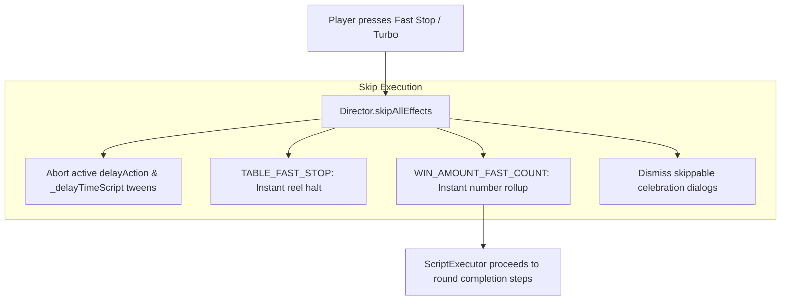

# 📜 Script Execution Engine, Writer Command Synthesis & Async Pipeline

<!-- convention-summary-start -->
### Script Execution Engine, Writer Command Synthesis & Async Pipeline Summary

- **Core Architecture / Purpose**: Technical reference, API contract, and integration guide for Script Execution Engine, Writer Command Synthesis & Async Pipeline.
- **Key Mechanisms & Design**: Encapsulates core algorithms, event hooks, and performance optimizations within the slot framework runtime.
- **Domain Capabilities**: cc_slot_module, over_view
- **Scope & Code Paths**: `assets/cc-common/cc-slot-module/`
- **Related Docs**: [Master Index](../INDEX.md)
<!-- convention-summary-end -->


---

## 1. The Scripting Triad

In traditional slot game architectures, deeply nested asynchronous callbacks (`setTimeout`, callback chains, nested `tween.call()`) often create unmaintainable code prone to race conditions and timing anomalies.

`cc-slot-module` resolves this through a robust **Command Pattern combined with Sequential Async Promise Chaining** implemented via **The Scripting Triad**:

```mermaid
graph LR
    subgraph 1. The Director (Scene Owner)
        Dir[GameModeDirectorModule]
        Dir -->|1. runAction 'SpinTrigger'| Wrt
        Dir <---|4. Executes method Promises| Exec
    end

    subgraph 2. The Writer (Script Planner)
        Wrt[GameModeWriterModule]
        Wrt -->|2. Returns string command array| Exec
    end

    subgraph 3. The Executor (Queue Runner)
        Exec[ScriptExecutor]
        Exec -->|3. Iterates commands sequentially| Dir
    end
```

---

## 2. Command Pipeline Evaluation Workflow

### Step 1: Director Triggers an Action
```typescript
// Inside GameModeDirectorModule
onBeforeSpinStart(): Promise<void> {
    return this.runAction("SpinTrigger");
}
```

### Step 2: Writer Analyzes State and Synthesizes the Command Array
The `Writer` evaluates `this.dataStore.playSession` to compose the optimal command sequence:
```typescript
// Inside GameModeWriterModule
makeScriptSpinTrigger(): Array<string | object> {
    return [
        "_beforeSpinStart",
        "_syncPlaySessionData",
        "_resetOnSpin",
        "_startSpinningTable"
    ];
}
```

### Step 3: ScriptExecutor Sequentially Iterates Through the Queue
`ScriptExecutor` relies on Promise chaining to invoke corresponding methods declared on the `Director`:
```typescript
// Core implementation pattern of ScriptExecutor
async runScript(commands: Array<string | object>, targetDirector: any): Promise<void> {
    for (const cmd of commands) {
        if (typeof cmd === "string") {
            const method = targetDirector[cmd];
            if (typeof method === "function") {
                await method.call(targetDirector); // Awaits resolution before proceeding
            }
        } else if (typeof cmd === "object") {
            // Supports dynamic payload injection: { command: "_showCutscene", data: cutscenePayload }
            const { command, data } = cmd as any;
            await targetDirector[command].call(targetDirector, data);
        }
    }
}
```

---

## 3. Interruption & Fast-Forward Mechanics (Turbo Mode & Skip All Effects)

When a player activates **Turbo Mode** or presses the **Fast Stop** button during an active round:



### Key Advantages of the Scripting Architecture:
1. **Decoupled Business Logic**: Game rules live inside pure TypeScript classes (`WriterModule`) with zero dependencies on Cocos Creator scene nodes.
2. **Deterministic Choreography**: Every animation sequence executes sequentially without race conditions or timer leaks.
3. **Effortless Fast-Forwarding**: Turbo mode seamlessly adjusts speed constants without modifying the core script structure.
