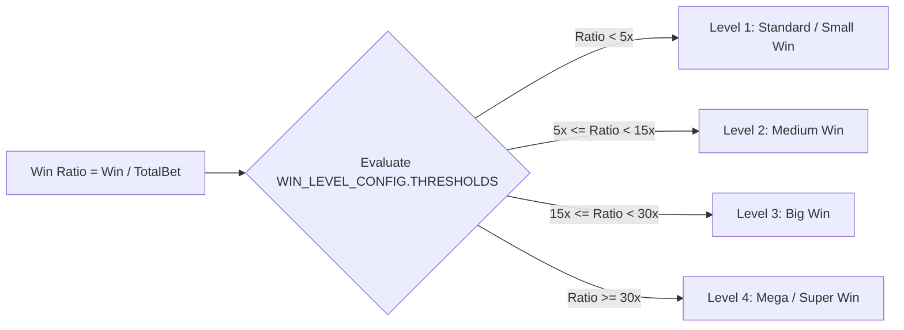
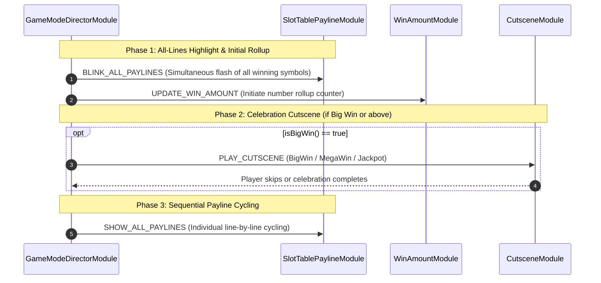

# 🏆 Win Evaluation, Payline Presentation & Celebration Hierarchy

<!-- convention-summary-start -->
### Win Evaluation, Payline Presentation & Celebration Hierarchy Summary

- **Core Architecture / Purpose**: Technical reference, API contract, and integration guide for Win Evaluation, Payline Presentation & Celebration Hierarchy.
- **Key Mechanisms & Design**: Encapsulates core algorithms, event hooks, and performance optimizations within the slot framework runtime.
- **Domain Capabilities**: cc_slot_module, over_view
- **Scope & Code Paths**: `assets/cc-common/cc-slot-module/`
- **Related Docs**: [Master Index](../INDEX.md)
<!-- convention-summary-end -->

---

## 1. Win Level Classification & Evaluation

The win evaluation system in `cc-slot-module` categorizes winning rounds into distinct tiers based on the **Payout Multiplier Ratio**:

$$\text{Win Ratio} = \frac{\text{Win Amount}}{\text{Total Bet}}$$

### Standard Configuration Matrix (`WIN_LEVEL_CONFIG`):
| Tier (Win Level) | Multiplier Threshold | Number Counter Duration (`COUNT_MONEY_TIME`) | Payline Presentation Duration (`WIN_LINE_TIME`) | Cutscene Modal |
| :--- | :--- | :--- | :--- | :--- |
| **Level 1 (Small Win)** | $< 5\times$ | 0.5s | 1.0s | None (Line flash only) |
| **Level 2 (Medium Win)**| $5\times - 15\times$ | 2.0s | 2.0s | None (Fast rollup) |
| **Level 3 (Big Win)** | $15\times - 30\times$ | 4.0s | 4.0s | Shows `BIG_WIN` dialog |
| **Level 4 (Mega / Super)** | $> 30\times$ | 6.0s – 10.0s | 6.0s – 8.0s | Shows `MEGA_WIN` / `SUPER_WIN` dialog |

---

## 2. Win Presentation Pipeline

When a spin produces winning paylines, the presentation pipeline executes across 3 synchronized phases:

### The 3 Presentation Phases in Detail:
1. **Consolidated Overview (`BLINK_ALL_PAYLINES`)**:
   - All symbols participating in any winning combination simultaneously play their Spine win animation.
   - Provides immediate visual feedback to the player on the scope of their win across the entire grid.
2. **Peak Celebration (`Cutscene & Rolling Money`)**:
   - `WinAmountModule` rolls up numbers from zero to the final win amount accompanied by pitch-shifted coin audio (`Coin Roll SFX`).
   - For Big Win or Jackpot tiers: Triggers a fullscreen modal celebration with particle showers and hero character animations.
3. **Sequential Line Cycling (`SHOW_ALL_PAYLINES`)**:
   - After the rollup counter finishes, the game enters an idle payline cycling state, illuminating individual payline tracks one by one while dimming non-participating symbols to allow players to inspect individual paytable rewards.
