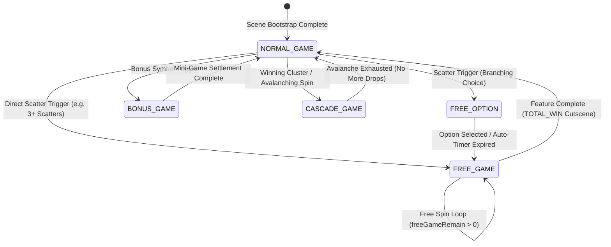
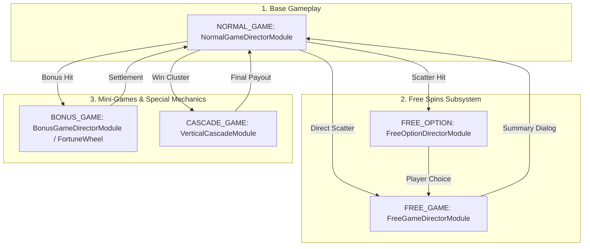

# 🎮 Game Mode Concepts & Standard Types

<!-- convention-summary-start -->
### Game Mode Concepts & Standard Types Summary

- **Core Architecture / Purpose**: Technical reference, API contract, and integration guide for Game Mode Concepts & Standard Types.
- **Key Mechanisms & Design**: Encapsulates core algorithms, event hooks, and performance optimizations within the slot framework runtime.
- **Domain Capabilities**: cc_slot_module, 01_game_mode_system
- **Scope & Code Paths**: `assets/cc-common/cc-slot-module/`
- **Related Docs**: [Master Index](../INDEX.md)
<!-- convention-summary-end -->

---

## 1. Architectural Role: Finite State Machine (FSM)

In the `cc-common` Slot Framework architecture, a **Game Mode** is an autonomous state node within a hierarchical **Finite State Machine (FSM)**.

Each Game Mode operates as a self-contained, decoupled subsystem managing:
* **Visual Presentation & Scene Subtree**: Dedicated background art, reels/grids, particle systems, and mode transitions.
* **Math & Rule Engines**: Payout matrices, multiplier progressions, paylines, and scatter evaluation.
* **Execution Scripting Pipeline**: Mode-specific command queues orchestrating spin start, pre-stop tension, deceleration, payline highlight, and settlement.
* **Audio Choreography**: Dedicated BGM tracks, spin loops, win roll escalating SFX, and transition stingers.

---

## 2. The 5 Standard Game Mode Types

### 2.1. `NORMAL_GAME` (Base Game Mode)
* **Enum Constant**: `GAME_MODE_ENUM.NORMAL_GAME` (Value: `1`).
* **Core Controller**: `NormalGameDirectorModule` paired with `NormalGameWriterModule`.
* **Flow & Behavioral Mechanics**:
  1. Default entry mode loaded upon scene bootstrap.
  2. Receives direct player inputs via GUI buttons (Spin, Auto Spin, Turbo Toggle, Bet Adjustments).
  3. Deducts active bet amount from player wallet (`WalletModule`) at spin start.
  4. Evaluates server packet for feature triggers (Scatters, Bonus symbols, Jackpots).

### 2.2. `FREE_GAME` (Free Spins Feature Mode)
* **Enum Constant**: `GAME_MODE_ENUM.FREE_GAME` (Value: `2`).
* **Core Controller**: `FreeGameDirectorModule` paired with `FreeGameWriterModule`.
* **Flow & Behavioral Mechanics**:
  1. Automated, looping spin execution without bet deduction from player balance.
  2. Tracks remaining free spins (`freeGameRemain` / `freeSpinTimes`) and updates HUD countdown badge (`SpinTimesModule`).
  3. Accumulates cumulative bonus session winnings (`winAmountPS`) across consecutive spins.
  4. Supports feature retriggers (`_reTriggerFreeGame`) and concludes with a fullscreen unskippable `TOTAL_WIN` cutscene.

### 2.3. `FREE_OPTION` (Player Volatility Selection Mode)
* **Enum Constant**: `GAME_MODE_ENUM.FREE_OPTION` (Value: `3`).
* **Core Controller**: `FreeOptionDirectorModule`.
* **Flow & Behavioral Mechanics**:
  1. Interactive selection panel offering multiple volatility options (e.g., 20 Free Spins with 2x–5x Wilds vs. 10 Free Spins with 5x–10x Wilds vs. Mystery Card).
  2. Runs an automated countdown timer (e.g. 15s via `startCountDown()`). Upon expiry, triggers `_runAutoTrigger()` to randomly pick an option.
  3. Emits `SEND_FREE_OPTION_REQUEST` to backend socket and transitions into `FREE_GAME` upon response.

### 2.4. `BONUS_GAME` (Pick & Win / Mini-Game Mode)
* **Enum Constant**: `GAME_MODE_ENUM.BONUS_GAME` (Value: `4`).
* **Core Controller**: `BonusGameDirectorModule`, `FortuneWheelGameDirector`.
* **Flow & Behavioral Mechanics**:
  1. Interactive mini-game screen (e.g., Chest Picking, Wheel of Fortune, Card Match).
  2. Utilizes custom child grids (`BonusGameTableModule`) and clickable items (`BonusGameItemModule`, `FortuneWheelModule`).
  3. Emits `SEND_BONUS_GAME_REQUEST` with user choice index, reveals multiplier rewards, and executes settlement sequence.

### 2.5. `CASCADE_GAME` (Avalanche / Tumble Mode)
* **Core Controller**: `VerticalCascadeModule` coordinating `CascadeModuleData` and `CascadeModuleConfig`.
* **Flow & Behavioral Mechanics**:
  1. Winning symbol combinations explode and dissolve (`_clearWinningSymbols`).
  2. Non-winning floating symbols drop down to fill empty gaps (`_dropRemainingSymbols`).
  3. New random refill symbols cascade from top buffer rows (`_dropRefillSymbols`).
  4. Cascades repeat iteratively until no new winning combinations appear on the table matrix.
