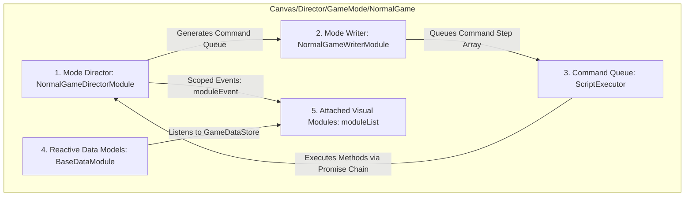
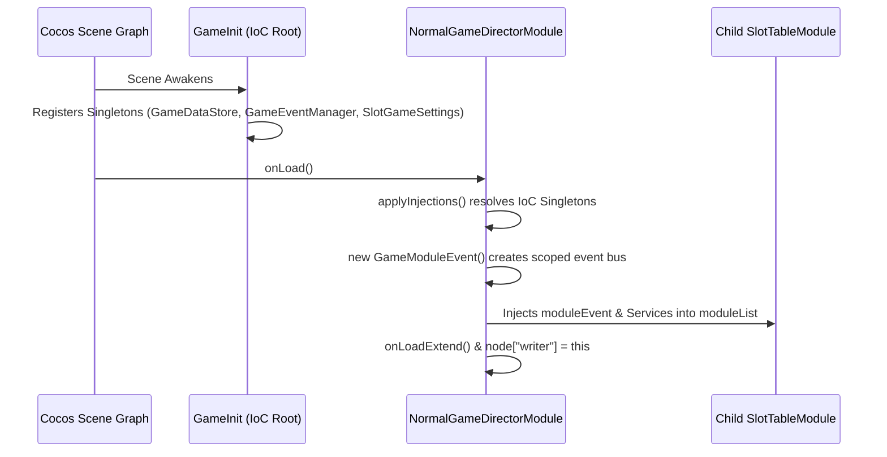

# 🏗️ Game Mode Anatomy & Component Composition

<!-- convention-summary-start -->
### Game Mode Anatomy & Component Composition Summary

- **Core Architecture / Purpose**: Technical reference, API contract, and integration guide for Game Mode Anatomy & Component Composition.
- **Key Mechanisms & Design**: Encapsulates core algorithms, event hooks, and performance optimizations within the slot framework runtime.
- **Domain Capabilities**: cc_slot_module, 01_game_mode_system
- **Scope & Code Paths**: `assets/cc-common/cc-slot-module/`
- **Related Docs**: [Master Index](../INDEX.md)
<!-- convention-summary-end -->


---

## 1. The 5-Part Architectural Anatomy

Every standard Game Mode in the `cc-common` Slot SDK is composed of 5 symbiotic layers operating within a single container node:



### 1.1. Visual Director (`GameModeDirectorModule`)
* Extends `BaseGameDirector` (which extends `SlotBaseModule`).
* Coordinates local scene nodes, mounts child visual components, binds scoped events, and handles state mutations.
* Exposes execution hook targets (`_startSpinningTable`, `_stopSpinningTable`, `_showResultEntry`, `_setUpPaylines`).

### 1.2. Script Writer (`GameModeWriterModule`)
* Extends `SlotBaseModule` and mounts onto `this.node["writer"]`.
* Defines pure, declarative command queues as structured JSON arrays:
  ```typescript
  [{ command: "_stopSpinningTable" }, { command: "_setUpPaylines" }]
  ```
* Decouples the decision of *what* happens sequentially from *how* visual tweens are rendered.

### 1.3. Execution Engine (`ScriptExecutor`)
* Lightweight asynchronous pipeline processor instantiated inside the Director.
* Iterates through the Writer's command array sequentially, converting method names into invocations on the Director (`this.target[command](data)`), awaiting returned `Promise` resolutions before advancing to the next step.

### 1.4. Data Adapters (`BaseDataModule`)
* Specialized observers subscribing to discrete data slices in `GameDataStore` via `registeredKeys` (e.g. `['matrix']`, `['payLines']`, `['winAmount']`).
* Automatically converts raw server payloads into renderable coordinate matrices and win structs.

### 1.5. Visual Subsystem Array (`moduleList: SlotBaseModule[]`)
* Array of child components attached to the mode container (e.g., `SlotTableModule`, `SlotTablePaylineModule`, `SlotTableNearWinModule`).
* Receives injected scoped `moduleEvent` instances and IoC services from the Director during `onLoad`.

---

## 2. Canonical Scene Hierarchy & Inter-Module Linkage

In the Cocos Creator template scene graph (`g9000L.fire`), game mode containers are hosted under `Canvas/Director/GameMode`:

```text
Canvas
└── Canvas/Director (GameDirector.ts, GameInit.ts, GameDataStore.ts)
    └── Canvas/Director/GameMode (GameModeDirectorModule.ts)
        ├── NormalGame (NormalGameDirectorModule.ts, NormalGameWriterModule.ts)
        │   ├── BG_NormalGame (Sprite / Spine Background)
        │   ├── Table (SlotTableModule.ts, SlotSymbolManager.ts)
        │   ├── Payline (SlotTablePaylineModule.ts)
        │   └── Sound (SlotTableSoundEffectModule.ts)
        │
        ├── FreeGame (FreeGameDirectorModule.ts, FreeGameWriterModule.ts)
        │   ├── BG_FreeGame
        │   ├── Table (Free Game SlotTableModule)
        │   └── MultiplierBanner (Spine / Multiplier Label)
        │
        └── BonusGame (BonusGameDirectorModule.ts, BonusGameWriterModule.ts)
            └── Table (BonusGameTableModule.ts, BonusGameItemModule.ts)
```

---

## 3. Co-location & Dependency Injection Workflow


