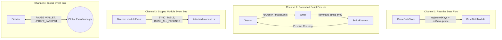
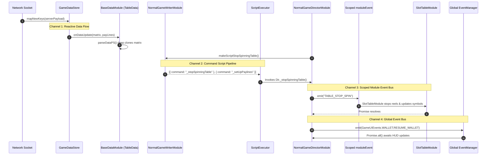

# 📡 Inter-Module Communication: 4 Channels Architecture

<!-- convention-summary-start -->
### Inter-Module Communication: 4 Channels Architecture Summary

- **Core Architecture / Purpose**: Technical reference, API contract, and integration guide for Inter-Module Communication: 4 Channels Architecture.
- **Key Mechanisms & Design**: Encapsulates core algorithms, event hooks, and performance optimizations within the slot framework runtime.
- **Domain Capabilities**: cc_slot_module, 01_game_mode_system
- **Scope & Code Paths**: `assets/cc-common/cc-slot-module/`
- **Related Docs**: [Master Index](../INDEX.md)
<!-- convention-summary-end -->


---

## 1. Multi-Tier Communication Architecture Overview

To achieve high cohesion, low coupling, and zero race conditions, the `cc-common` Slot Framework segregates all runtime data and message flows into **4 specialized communication channels**:



---

## 2. Granular Breakdown of the 4 Channels



### 🔹 Channel 1: Reactive Data Flow (`GameDataStore` ➔ `BaseDataModule`)
* **Mechanism**: Direct observer pattern invoking `onDataUpdate(data)` on all registered `BaseDataModule` instances. Zero string parsing overhead.
* **Payload Isolation**: Emits **Deep-Cloned** slices (`JSON.parse(JSON.stringify(val))`), preventing mutations in UI models from polluting the central reactive state.
* **Purpose**: Synchronizes domain state (matrices, winnings, active bet, free spin counters) across UI components.

### 🔹 Channel 2: Command Script Pipeline (`Director` ➔ `Writer` ➔ `ScriptExecutor`)
* **Mechanism**: Command Pattern paired with Sequential Asynchronous Promise Chaining.
* **Payload Structure**: Plain JSON arrays specifying method execution names and optional parameters:
  ```typescript
  [
      { command: "_syncJackpot" },
      { command: "_playSureWinEffect" },
      { command: "_playPreStopSpinningEffect" }
  ]
  ```
* **Purpose**: Completely decouples **choreography flow logic (Writer)** from **visual animation rendering (Director)**, enabling unit testing of script flows in headless Node.js environments without loading Cocos scenes.

### 🔹 Channel 3: Scoped Module Event Bus (`this.moduleEvent: GameModuleEvent`)
* **Mechanism**: Local pub/sub event instance created via `new GameModuleEvent()` inside each `GameModeDirectorModule` and propagated to all child nodes in `this.moduleList`.
* **Standard Topics**: `SYNC_TABLE`, `TABLE_START_SPIN`, `TABLE_STOP_SPIN`, `BLINK_ALL_PAYLINES`, `SHOW_ALL_PAYLINES`, `CLEAR_PAYLINES`.
* **Purpose**: Strict memory and event isolation between game modes. Events dispatched in `FreeGameDirectorModule` will never collide with or trigger listeners in `NormalGameDirectorModule`.

### 🔹 Channel 4: Global Event Bus (`this.eventManager: EventManager` & `this.gameLogic`)
* **Mechanism**: Application-wide asynchronous event dispatcher where `emit()` returns `Promise.all()` over all registered asynchronous listeners.
* **Standard Topics**:
  - `GameUIEvents.WALLET.PAUSE_WALLET`, `RESUME_WALLET`
  - `GameUIEvents.JACKPOT.UPDATE_JACKPOT_VALUE`, `PAUSE_JACKPOT`
  - `GameUIEvents.CUTSCENES.SHOW_CUTSCENE`, `CLOSE_CUTSCENE`
  - `SlotCustomEvent.CHANGE_GAME_MODE`, `EXIT_GAME_MODE`
* **Purpose**: Coordinates top-level subsystems operating outside individual game modes (e.g. Player Balance HUD, Progressive Jackpot Banners, Dialog Popups, Fullscreen Win Cutscenes).

---

## 3. Comprehensive Comparison Matrix

| Metric | Channel 1: Reactive Data | Channel 2: Command Script | Channel 3: Scoped Bus | Channel 4: Global Bus |
| :--- | :--- | :--- | :--- | :--- |
| **Sender** | `GameDataStore` | `GameModeDirectorModule` | `GameModeDirectorModule` | Any Component / Subsystem |
| **Receiver** | `BaseDataModule` instances | `ScriptExecutor` | Attached `moduleList` nodes | Entire Scene Subsystems |
| **Dispatch Latency** | Instantaneous (<0.05ms) | Asynchronous Sequential | Instantaneous (<0.05ms) | Asynchronous `Promise.all()` |
| **Memory Isolation** | High (Deep-Cloned Slices) | High (Command Strings) | High (Instance-scoped Bus) | Global (Application-wide) |
| **Primary Scope** | Domain State Layer | Execution Orchestration | Intra-GameMode Boundaries | Cross-Subsystem Coordination |
| **Failure Impact** | Desynced UI display data | Broken execution progression | Local visual glitch in mode | System-wide freeze or missing cutscene |
