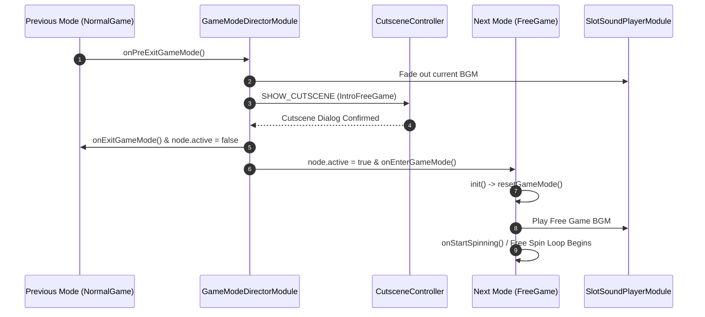

# 🔄 Game Mode Transitions & Stack Lifecycle

<!-- convention-summary-start -->
### Game Mode Transitions & Stack Lifecycle Summary

- **Core Architecture / Purpose**: Technical reference, API contract, and integration guide for Game Mode Transitions & Stack Lifecycle.
- **Key Mechanisms & Design**: Encapsulates core algorithms, event hooks, and performance optimizations within the slot framework runtime.
- **Domain Capabilities**: cc_slot_module, 01_game_mode_system
- **Scope & Code Paths**: `assets/cc-common/cc-slot-module/`
- **Related Docs**: [Master Index](../INDEX.md)
<!-- convention-summary-end -->

---

## 1. Mode Transition Flow Sequence

When a slot game switches from one mode to another (e.g. `NORMAL_GAME` ➔ `FREE_GAME` or `FREE_GAME` ➔ `NORMAL_GAME`), the transition follows an atomic 5-step lifecycle orchestrated by `GameModeDirectorModule`:

---

## 2. Granular Transition Phases

### Phase 1: Pre-Exit Teardown (`onPreExitGameMode`)
* **Trigger**: Current mode finishes its settlement step (e.g. 3 Scatters evaluated on table).
* **Actions**:
  1. Blocks UI input controls on `UIManagerModule`.
  2. Freezes current payline animations (`CLEAR_PAYLINES`).
  3. Prepares transition payload in `GameDataStore`.

### Phase 2: Audio & Cutscene Transition Handoff
* **Actions**:
  1. `SlotSoundPlayerModule` crossfades out the active background music.
  2. Dispatches `GameUIEvents.CUTSCENES.SHOW_CUTSCENE` via `eventManager` to display modal dialogue (e.g., "Congratulations! You Won 10 Free Spins").
  3. Awaits user confirmation click or automatic cutscene dismiss timer.

### Phase 3: Mode Exit & Deactivation (`onExitGameMode`)
* **Actions**:
  1. Invokes `resetAllEffectAndTasks()` to abort lingering tweens and Spine skeleton tracks.
  2. Unregisters mode-specific event listeners (`this.moduleEvent.targetOff(this)`).
  3. Sets `this.node.active = false` to remove visual rendering overhead.

### Phase 4: Mode Enter & Activation (`onEnterGameMode`)
* **Actions**:
  1. Sets target mode container `this.node.active = true`.
  2. Calls `init()` followed by `resetGameMode()` to clear previous visual leftovers.
  3. Ingests fresh state from `GameDataStore` (e.g., initial free spin count, base multiplier).

### Phase 5: Mode Spin Loop Startup (`startSpinLoop`)
* **Actions**:
  1. Plays new mode background music (`playGameModeBGM()`).
  2. If entering `FREE_GAME`, automatically starts the automated spin loop without requiring player click.

---

## 3. Lifecycle Invariant Checklist

| Lifecycle Step | Required Guardrail | Risk If Violated |
| :--- | :--- | :--- |
| **Node Deactivation** | Must call `resetAllEffectAndTasks()` before `node.active = false`. | Orphaned tweens resume unexpectedly on re-entry. |
| **Event Cleanup** | Must unbind scoped listeners or rely on `moduleEvent` scoped isolation. | Duplicate event callbacks trigger double payouts. |
| **State Hydration** | Must check `playSession.isResume` during `onEnterGameMode`. | Broken table matrix display upon network reconnection. |
| **BGM Management** | Must invoke `playGameModeBGM()` on enter. | Silent game session or overlapping background audio tracks. |
