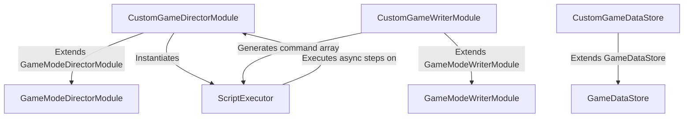

# 🛠️ Custom Game Mode Subsystem Creation & Extension Guide

<!-- convention-summary-start -->
### Custom Game Mode Subsystem Creation & Extension Guide Summary

- **Core Architecture / Purpose**: Technical reference, API contract, and integration guide for Custom Game Mode Subsystem Creation & Extension Guide.
- **Key Mechanisms & Design**: Encapsulates core algorithms, event hooks, and performance optimizations within the slot framework runtime.
- **Domain Capabilities**: cc_slot_module, 01_game_mode_system
- **Scope & Code Paths**: `CustomGameWriterModule.ts`, `CustomGameDirectorModule.ts`, `assets/game-name/prefabs/CustomGamePrefab.prefab`
- **Related Docs**: [Master Index](../INDEX.md)
<!-- convention-summary-end -->


---

## 1. Architectural Strategy for Custom Game Modes

Every custom game mode in FWCC (such as Hold & Win, Lock & Respin, Free Spins with Sticky Wilds, or Volatility Selectors) is built by creating a cohesive **Triad of Components**:



---

## 2. Step 1: Implement the Custom Mode Writer (`CustomGameWriterModule.ts`)

The Writer plans the sequential execution script for every spin in this game mode:

```typescript
const { _decorator } = cc;
import { GameModeWriterModule } from '../../BaseModule/GameModeWriterModule';
const { ccclass } = _decorator;

@ccclass
export class CustomGameWriterModule extends GameModeWriterModule {
    makeScriptSpin(): Array<string | { command: string; data?: any }> {
        const script: Array<string | { command: string; data?: any }> = [];
        const roundResult = this.dataStore.getRoundResult();

        // 1. Start Spin: Roll reels
        script.push("_spinReels");

        // 2. Stop Spin: Land symbols
        script.push({
            command: "_stopReels",
            data: { matrix: roundResult.matrix }
        });

        // 3. Highlight Special Feature Overlays
        if (roundResult.hasBonusTrigger) {
            script.push({
                command: "SHOW_BONUS_TRIGGER_ANIMATION",
                data: { triggerIndices: roundResult.bonusIndices }
            });
        }

        // 4. Payline Presentation
        if (roundResult.winAmount > 0) {
            script.push("SETUP_PAYLINES");
        }

        // 5. Celebration Cutscenes
        if (roundResult.isBigWin) {
            script.push({
                command: "SHOW_WIN_EFFECT",
                data: { winAmount: roundResult.winAmount, totalBet: roundResult.totalBet }
            });
        }

        // 6. Round Settlement & Mode Handover
        script.push("_finishSpin");
        return script;
    }
}
```

---

## 3. Step 2: Implement the Custom Mode Director (`CustomGameDirectorModule.ts`)

The Director controls scene nodes, manages cameras and Spine overlays, and implements custom commands dispatched by the Writer:

```typescript
const { _decorator } = cc;
import { GameModeDirectorModule } from '../../BaseModule/GameModeDirectorModule';
import { CustomGameWriterModule } from './CustomGameWriterModule';
const { ccclass, property } = _decorator;

@ccclass
export class CustomGameDirectorModule extends GameModeDirectorModule {
    @property(CustomGameWriterModule)
    customWriter: CustomGameWriterModule = null;

    @property(cc.Node)
    featureOverlayNode: cc.Node = null;

    initDirector(): void {
        super.initDirector();
        this.writer = this.customWriter || this.getComponent(CustomGameWriterModule);
    }

    // Custom Command Handler
    SHOW_BONUS_TRIGGER_ANIMATION(data: any, callback: Function): void {
        if (this.featureOverlayNode) {
            this.featureOverlayNode.active = true;
            // Play dramatic animation then resolve:
            this.scheduleOnce(() => {
                this.featureOverlayNode.active = false;
                callback();
            }, 1.5);
        } else {
            callback();
        }
    }
}
```

---

## 4. Step 3: Prefab Assembly in Cocos Creator

1. Create a root `Node` named `CustomGamePrefab`.
2. Attach `CustomGameDirectorModule` and `CustomGameWriterModule`.
3. Drag the Writer into the `customWriter` inspector field.
4. Mount necessary UI components (`SlotTableModule`, `SlotTablePaylineModule`, `CutsceneController`).
5. Save as a prefab in `assets/game-name/prefabs/CustomGamePrefab.prefab`.
6. Register the prefab inside `Canvas/Director/OnAddGameMode` to allow dynamic mode transitions via `CHANGE_GAME_MODE`.
