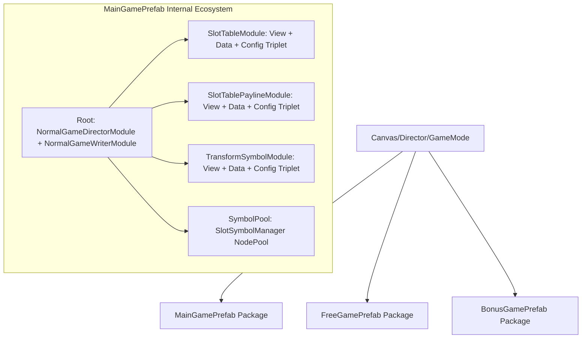

# 📦 Game Mode Prefabs: Anatomy, Wiring & Game Setup Guide

<!-- convention-summary-start -->
### Game Mode Prefabs: Anatomy, Wiring & Game Setup Guide Summary

- **Core Architecture / Purpose**: Technical reference, API contract, and integration guide for Game Mode Prefabs: Anatomy, Wiring & Game Setup Guide.
- **Key Mechanisms & Design**: Encapsulates core algorithms, event hooks, and performance optimizations within the slot framework runtime.
- **Domain Capabilities**: cc_slot_module, 01_game_mode_system
- **Scope & Code Paths**: `MainGamePrefab.prefab`, `FreeGamePrefab.prefab`, `BonusGamePrefab.prefab`
- **Related Docs**: [Master Index](../INDEX.md)
<!-- convention-summary-end -->


---

## 1. Executive Concept: The Self-Contained Mode Package

In `cc-slot-module`, a **Game Mode Prefab** (`MainGamePrefab.prefab`, `FreeGamePrefab.prefab`, `BonusGamePrefab.prefab`) is designed as a **Self-Contained Sub-Scene Package**.

Rather than scattering game logic across loose canvas nodes, each mode prefab bundles its own:
1. **Director & Writer Orchestration layer** (Root node).
2. **Matrix Table Engine** (`SlotTableModule`, `SlotTableData`, `TableModuleConfig`).
3. **Payline & Highlight System** (`SlotTablePaylineModule`, `SlotTablePaylineData`, `PaylineConfig`).
4. **Transforming Wilds / Modifiers** (`TransformSymbolModule`).
5. **Dedicated Node Pools** (`SlotSymbolManager`).



---

## 2. Granular Prefab Node Anatomy

Below is the verified node tree hierarchy inside `MainGamePrefab.prefab` and `FreeGamePrefab.prefab`:

```text
MainGamePrefab (Root)
│   ├── [Component] BaseGameMode (Mode state tracker)
│   ├── [Component] NormalGameDirectorModule (Master spin orchestrator)
│   ├── [Component] NormalGameWriterModule (Action queue generator)
│   ├── [Component] GameLogicEventHandler (Network bridge)
│   └── [Component] OnAddSlotModule (Lifecycle auto-injection)
│
├── SlotTableModule (Node)
│   ├── [Component] SlotTableModule (Presentation coordinator)
│   ├── [Component] TableModuleConfig (TABLE_FORMAT, cell dimensions, easing)
│   ├── [Component] SlotTableData (Reactive 1D -> 2D matrix converter)
│   ├── [Component] SlotTableNearWinModule (Scatter/Bonus anticipation VFX)
│   ├── [Component] SlotModuleEditorTag (Editor gizmo marker)
│   │
│   ├── SymbolPool (Node: SlotSymbolManager - Local pool for reel scrolling)
│   ├── Table (Node: cc.Mask - Viewport container holding dynamic Reel columns)
│   └── VFX_NearWin (Node: sp.Skeleton - Anticipation lightning/border spine)
│
├── SlotTablePaylineModule (Node)
│   ├── [Component] SlotTablePaylineModule (Payline blink coordinator)
│   ├── [Component] PaylineConfig (Blink timing, cycle schedule)
│   ├── [Component] SlotTablePaylineData (Server payline parser)
│   │
│   ├── PaylineSymbolModule (Node: Payline highlight layer -> PaylineContainer)
│   └── SymbolPool (Node: SlotSymbolManager - Pool for static win spine overlays)
│
├── TransformSymbolModule (Node)
│   ├── [Component] TransformSymbolModule (Expanding/sticky wild manager)
│   ├── [Component] TransformSymbolConfig (VFX animation durations)
│   ├── [Component] TransformSymbolData (Wild overlay coordinates)
│   ├── VfxPool (Node)
│   └── VfxLayer (Node)
│
└── SymbolManger (Node: SlotSymbolManager - Shared fallback pool)
```

---

## 3. Component Wiring Matrix (Inspector Property Bindings)

When setting up or inspecting the prefab in Cocos Creator Editor, configure the following property bindings:

| Source Component | Property Name | Target Type | Target Value / Node Reference |
| :--- | :--- | :--- | :--- |
| **`NormalGameDirectorModule`** | `table` | `SlotTableModule` | Co-located child node `SlotTableModule` |
| **`NormalGameDirectorModule`** | `payline` | `SlotTablePaylineModule` | Co-located child node `SlotTablePaylineModule` |
| **`SlotTableModule`** | `table` | `cc.Node` | Child node `Table` (Must have `cc.Mask` component) |
| **`SlotTableModule`** | `reelPrefab` | `cc.Prefab` | Project `ReelPrefab.prefab` asset |
| **`SlotTableModule`** | `symbolManager` | `SlotSymbolManager` | Child node `SymbolPool` |
| **`SlotTablePaylineModule`** | `symbolManager` | `SlotSymbolManager` | Child node `SymbolPool` |

---

## 4. Lifecycle & Instantiation Strategy

### Option A: Scene Pre-Mounting (Standard Production Pattern)
* **How it works**: `MainGamePrefab` and `FreeGamePrefab` are dragged directly into `Canvas/Director/GameMode/` in the scene file (`g9000L.fire`).
* **Runtime behavior**: On game start, both prefabs are loaded. `GameModeDirectorModule` toggles `node.active = true` on `MainGamePrefab` and `node.active = false` on `FreeGamePrefab`. When entering Free Spins, it swaps the active state.
* **Pros**: **Zero transition delay (0ms)** and seamless audio/visual continuity without runtime instantiation hiccups.

### Option B: Dynamic Instantiation (`cc.instantiate`)
* **How it works**: For heavy mini-games (e.g. `BonusGamePrefab`, `FortuneWheelPrefab`), prefabs are kept as asset references in `GameModeDirectorModule.bonusPrefab`.
* **Runtime behavior**:
  ```typescript
  const bonusNode = cc.instantiate(this.bonusGamePrefab);
  this.node.addChild(bonusNode);
  // On exit:
  bonusNode.destroy();
  ```
* **Pros**: Saves ~40MB of GPU VRAM on memory-constrained mobile devices by destroying unused Spine skeleton caches when not in the bonus round.

---

## 5. Step-by-Step Game Creation Setup Guide

Follow this standard checklist to create a new slot game (`g9666L`):

### 🛠️ Step 1: Duplicate Base Prefabs
1. Copy `assets/cc-common/cc-slot-module/GameMode/NormalGame/MainGamePrefab.prefab` into `assets/cc-release-slot/cc1-red-cliff/prefabs/MainGamePrefab9666.prefab`.
2. Copy `assets/cc-common/cc-slot-module/GameMode/FreeGame/FreeGamePrefab.prefab` into `assets/cc-release-slot/cc1-red-cliff/prefabs/FreeGamePrefab9666.prefab`.

### 🎨 Step 2: Customize Visual Themes & Layout
1. Open `MainGamePrefab9666.prefab` in Cocos Creator.
2. Select child node `SlotTableModule`:
   - Set `SYMBOL_WIDTH` (e.g. `180`) and `SYMBOL_HEIGHT` (e.g. `160`) in `TableModuleConfig`.
   - Update `TABLE_FORMAT` array (e.g. `[3, 3, 3, 3, 3]`).
   - Adjust `Table` (with `cc.Mask`) size to match $\text{width} = 5 \times 180 = 900$, $\text{height} = 3 \times 160 = 480$.

### 💻 Step 3: Attach Game Subclasses
1. Create `NormalGameDirectorModule9666.ts` extending `NormalGameDirectorModule`.
2. Create `NormalGameWriterModule9666.ts` extending `NormalGameWriterModule`.
3. Replace components on the root `MainGamePrefab9666` node with the new subclasses.

### 🔌 Step 4: Mount into Master Scene
1. Open `g9666L.fire` scene.
2. Drag `MainGamePrefab9666` and `FreeGamePrefab9666` under `Canvas/Director/GameMode`.
3. In `GameModeDirectorModule`, link references:
   - `mainGameNode` ➔ `MainGamePrefab9666`
   - `freeGameNode` ➔ `FreeGamePrefab9666`
4. Run simulator and verify spin loop!
