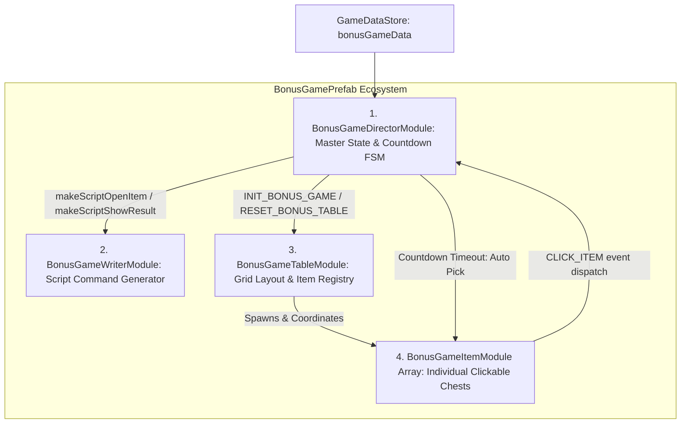
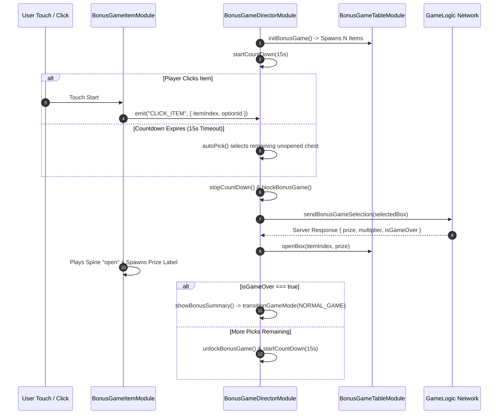

# 🎁 Bonus Game Subsystem: Pick-and-Click Architecture & Lifecycle

<!-- convention-summary-start -->
### Bonus Game Subsystem: Pick-and-Click Architecture & Lifecycle Summary

- **Core Architecture / Purpose**: Technical reference, API contract, and integration guide for Bonus Game Subsystem: Pick-and-Click Architecture & Lifecycle.
- **Key Mechanisms & Design**: Encapsulates core algorithms, event hooks, and performance optimizations within the slot framework runtime.
- **Domain Capabilities**: cc_slot_module, 01_game_mode_system
- **Scope & Code Paths**: `assets/cc-common/cc-slot-module/`
- **Related Docs**: [Master Index](../INDEX.md)
<!-- convention-summary-end -->

---

## 1. Subsystem Architecture Map

The **Bonus Game Subsystem** (`assets/cc-common/cc-slot-module/GameMode/BonusGame/`) is an interactive mini-game framework designed for Pick-and-Click rounds (e.g. Chest Opening, Treasure Vault, Wheel Selection):

---

## 2. The 4-Component Bonus Quad

### 1. `BonusGameDirectorModule` (State & Countdown FSM)
* **Role**: Inherits from `GameModeDirectorModule`. Manages the round lifecycle, countdown timer (`labelCountDown`, `defaultCountDown = 15s`), and automatic random selection on timeout (`autoPick()`).
* **Session Hydration**: Reads `this.dataStore.playSession.isResume` and `openedBoxes: number[]` to restore previously picked items upon browser refresh.

### 2. `BonusGameWriterModule` (Action Script Generator)
* **Role**: Generates asynchronous action queues for `ScriptExecutor`:
  - `makeScriptOpenItem(data)`: Plays chest opening animation ➔ reveal prize label ➔ rolling balance update.
  - `makeScriptShowResultFinal(data)`: Summary overlay and win celebration before returning to Normal Game.

### 3. `BonusGameTableModule` (Item Grid Manager)
* **Role**: Manages the grid layout of interactive items (`BonusGameItemModule` instances). Handles node distribution, item shuffling animations, and collective reset/lock operations.

### 4. `BonusGameItemModule` (Clickable Entity)
* **Role**: Attached to each individual chest/box node. Handles hover effects, click event dispatching (`CLICK_ITEM`), Spine opening animations (`open`, `opened`), and prize display labels.

---

## 3. Pick-and-Click Interactive Lifecycle

---

## 4. Reconnection & Hydration Invariants

When a player disconnects midway through a multi-pick bonus game (`isResume = true`):
1. `BonusGameDirectorModule.startBonusGame()` reads `this.dataStore.playSession.bonusData`.
2. It loops through `openedBoxes` and immediately sets those items to their `opened` visual state without playing full introductory animations.
3. Resumes the countdown timer for the remaining picks.
