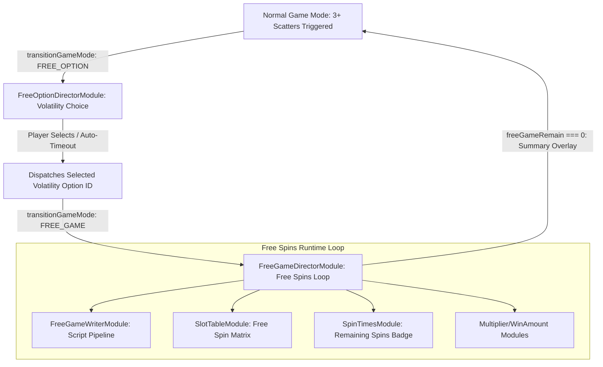

# 🎰 Free Game & Volatility Option Subsystem Architecture

<!-- convention-summary-start -->
### Free Game & Volatility Option Subsystem Architecture Summary

- **Core Architecture / Purpose**: Technical reference, API contract, and integration guide for Free Game & Volatility Option Subsystem Architecture.
- **Key Mechanisms & Design**: Encapsulates core algorithms, event hooks, and performance optimizations within the slot framework runtime.
- **Domain Capabilities**: cc_slot_module, 01_game_mode_system
- **Scope & Code Paths**: `assets/cc-common/cc-slot-module/`
- **Related Docs**: [Master Index](../INDEX.md)
<!-- convention-summary-end -->


---

## 1. Subsystem Architecture Map

The **Free Game & Free Option Subsystem** (`assets/cc-common/cc-slot-module/GameMode/FreeGame/` & `GameMode/FreeOption/`) coordinates the complete Free Spins lifecycle, from player volatility selection to progressive multiplier cascades and re-triggers:



---

## 2. Volatility Option Selection (`FreeOptionDirectorModule`)

### 1. `SlotCustomFreeGameOption` Structure
Before Free Spins begin, players are presented with volatility options (e.g. 20 Free Spins with $2\times$ Multiplier vs 5 Free Spins with $10\times$ Multiplier):

```typescript
@ccclass("SlotCustomFreeGameOption")
export class SlotCustomFreeGameOption {
    @property({ type: cc.Node })
    optionNode: cc.Node = null; // Clickable button card
    @property()
    optionId: string = '';      // Option identifier e.g. "OPTION_1", "OPTION_2"
}
```

### 2. Auto-Select Countdown Guard
* `countDownText`: Displays countdown label (`defaultCountdownTime = 15s`).
* If the player does not click an option within 15 seconds, `FreeOptionDirectorModule` automatically selects a default option to prevent game stalling.

---

## 3. Free Game Spin Loop & Retrigger Mechanics

### 1. Counter Synchronization (`SpinTimesModule`)
* On each spin execution, `FreeGameDirectorModule` decrements `freeGameRemain--` and updates the HUD badge.
* In Free Spins, Bet Steppers and Turbo buttons are locked in read-only state.

### 2. Scatter Retriggers (`+N Free Spins`)
* When 3+ Scatters land during Free Spins:
  1. `FreeGameWriterModule` injects `makeScriptShowRetriggerVFX()`.
  2. Increments `freeGameRemain += extraSpins`.
  3. Plays celebratory audio stinger and continues current spin loop.

---

## 4. Reconnection & Session Hydration (`isResume`)

If the player refreshes the browser during Free Spins:
1. `GameDataStore` ingests `freeGameRemain` and `winAmountPS` from session packet.
2. `GameModeDirectorModule` detects `currentGameState === "FREE_GAME"` and directly transitions to `FreeGameDirectorModule`.
3. `FreeGameDirectorModule.onResumeGameMode()` restores:
   - Remaining spin count on `SpinTimesModule`.
   - Accumulated win amount on `WinAmountModule`.
   - Active multiplier badge state.
