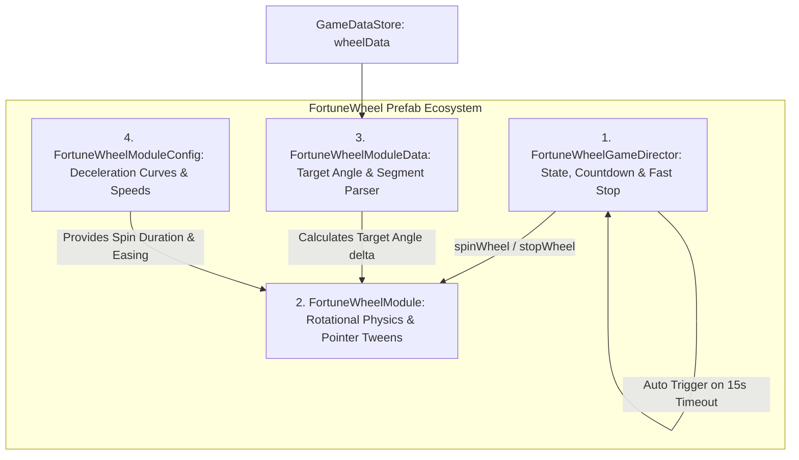
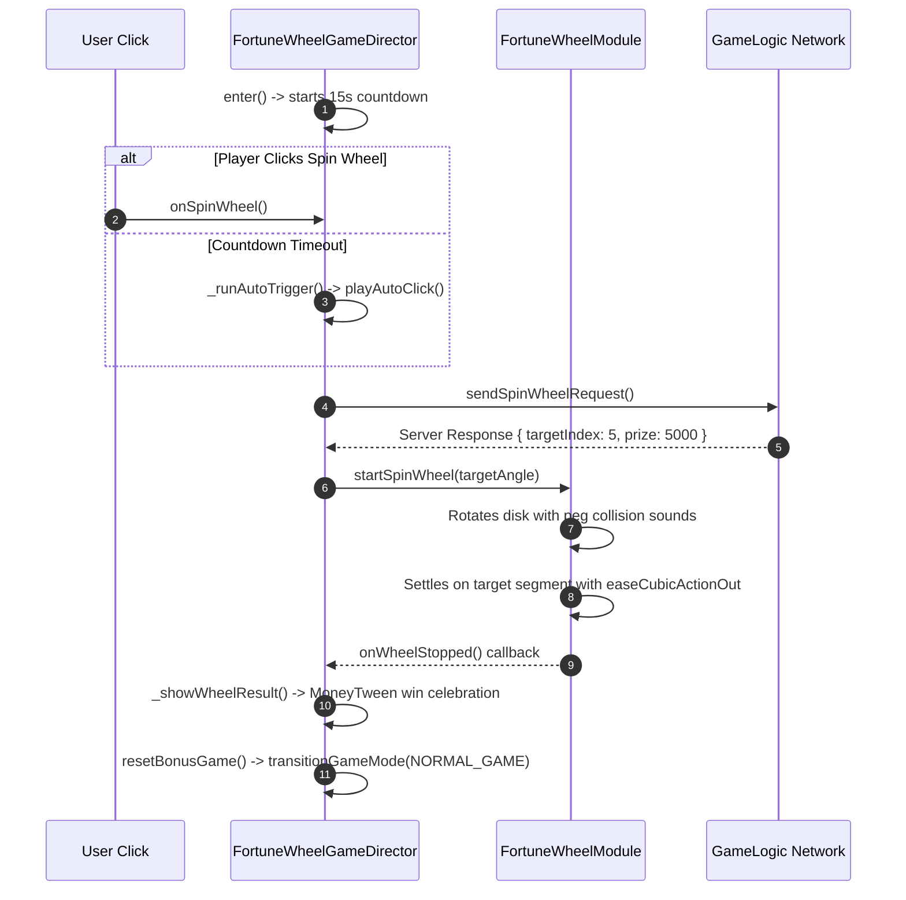

# 🎡 Fortune Wheel Mini-Game: Angular Physics & Director Subsystem

<!-- convention-summary-start -->
### Fortune Wheel Mini-Game: Angular Physics & Director Subsystem Summary

- **Core Architecture / Purpose**: Technical reference, API contract, and integration guide for Fortune Wheel Mini-Game: Angular Physics & Director Subsystem.
- **Key Mechanisms & Design**: Encapsulates core algorithms, event hooks, and performance optimizations within the slot framework runtime.
- **Domain Capabilities**: cc_slot_module, 01_game_mode_system
- **Scope & Code Paths**: `assets/cc-common/cc-slot-module/`
- **Related Docs**: [Master Index](../INDEX.md)
<!-- convention-summary-end -->

---

## 1. Subsystem Architecture Map

The **Fortune Wheel Mini-Game Subsystem** (`assets/cc-common/cc-slot-module/GameMode/FortuneWheelGame/`) coordinates circular prize wheel physics, target segment settling, countdown timers, and win presentation:

---

## 2. Granular Responsibilities by Component

### 1. `FortuneWheelGameDirector` (Master Mini-Game Orchestrator)
* **Role**: Inherits from `GameModeDirectorModule`.
* **Key Features**:
  - Countdown timer with auto-click fallback (`_runAutoTrigger()`, `playAutoClick()`).
  - Fast-stop handling (`_fastStopWheel()`).
  - Win presentation and transition back to primary game mode (`_showWheelResult()`, `resetBonusGame()`).

### 2. `FortuneWheelModule` (Rotational Physics Controller)
* **Role**: Visual controller rotating the wheel disk node and animating the flapper/pointer peg deflection.
* **Physics Equation**:
  $$\theta_{\text{final}} = 360^\circ \times N_{\text{spins}} + \theta_{\text{target\_segment}} + \theta_{\text{jitter}}$$

### 3. `FortuneWheelModuleData` (Target Angle & Prize Parser)
* **Role**: Ingests server prize index and calculates target rotational angle based on segment count ($N_{\text{segments}}$).

### 4. `FortuneWheelModuleConfig` (Deceleration Curves)
* **Role**: Defines rotation speeds, spin duration (e.g. $4.5\text{s}$ normal, $1.2\text{s}$ fast), and easing curves (`easeCubicActionOut`).

---

## 3. Wheel Spin & Settling Lifecycle

