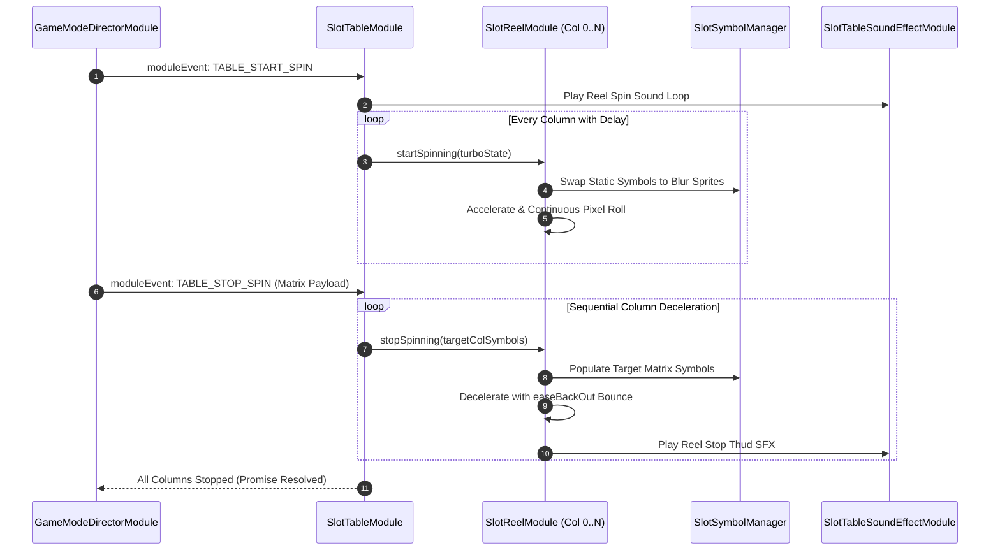

# ⚙️ The 7 Core Components of the Table Engine

<!-- convention-summary-start -->
### The 7 Core Components of the Table Engine Summary

- **Core Architecture / Purpose**: Technical reference, API contract, and integration guide for The 7 Core Components of the Table Engine.
- **Key Mechanisms & Design**: Encapsulates core algorithms, event hooks, and performance optimizations within the slot framework runtime.
- **Domain Capabilities**: cc_slot_module, 02_table_reel_symbol_engine
- **Scope & Code Paths**: `assets/cc-common/cc-slot-module/`
- **Related Docs**: [Master Index](../INDEX.md)
<!-- convention-summary-end -->


---

## 1. Subsystem Architecture Map

The Table Engine is organized around the **Co-Located Table Triplet** (`SlotTableModule` + `SlotTableData` + `TableModuleConfig`) and supporting rendering services:

```mermaid
graph TD
    subgraph Table Node Co-location: Canvas/Director/GameMode/BoardG/Table
        STM[1. SlotTableModule: Master Visual Orchestrator]
        STD[2. SlotTableData: Reactive Matrix Data Parser]
        TMC[3. TableModuleConfig: Timing & Physics Config]
    end

    subgraph Symbol & Rendering Subsystem
        SRM[4. SlotReelModule: Column Scrolling Controller]
        SSM[5. SlotSymbolManager: Node Pooling & Sorting]
        SYM[6. SlotSymbolModule: Visual Symbol Entity]
        RES[7. SlotSymbolResourceManager: Spine & Texture Cache]
        SND[8. SlotTableSoundEffectModule: Audio FX Bridge]
    end

    GDS[GameDataStore] -->|Auto-Ingestion via registeredKeys| STD
    STD -->|getMatrix: 2D Matrix [col][row]| STM
    TMC -->|TABLE_FORMAT, Speed & Timing| STD & STM & SRM
    STM -->|Instantiates & Triggers Spin| SRM
    STM -->|Coordinates Pool & Sorting| SSM
    SRM -->|Renders & Recycles| SYM
    SSM -->|Fetches Skeletons & Sprites| RES
    STM -->|Dispatches Spin Audio Events| SND
```

---

## 2. Granular Component Breakdown & Inter-Module Linkage

### 1. `SlotTableModule` (Master Visual Orchestrator)
* **Role**: Root presentation controller mounted on `Canvas/Director/GameMode/BoardG/Table`.
* **Linkage**: In `onLoadExtend()`, resolves peer `SlotTableData` and `TableModuleConfig`. Calls `tableData.getMatrix()` when stopping reels and instructs `SlotReelModule` columns to render target symbols.

### 2. `SlotTableData` (Reactive Matrix Data Model)
* **Role**: Data parser extending `BaseDataModule` mounted on the same `Table` node.
* **Linkage**: Declares `registeredKeys = ["matrix0", "matrix", "normalGameMatrix", "freeGameMatrix"]`. Ingests flat 1D server packet arrays and converts them into structured 2D `[col][row]` matrices using `TableModuleConfig.TABLE_FORMAT`.

### 3. `TableModuleConfig` (Timing & Geometry Configuration)
* **Role**: Configuration component defining grid dimensions (`SYMBOL_WIDTH`, `SYMBOL_HEIGHT`, `TABLE_FORMAT`), scroll velocities, easing curves (`easeBackOut`), and stop delays.
* **Linkage**: Injected into `SlotTableData` (to shape matrix dimensions) and `SlotTableModule`/`SlotReelModule` (to calculate pixel translation offsets).

### 3. `SlotReelModule` (Column Scrolling Engine)
* **Role**: Visual controller attached to each individual column (`Reel_0` through `Reel_N`).
* **Linkage**: Manages vertical pixel translation of child symbols, wrapping symbols from bottom to top buffer during continuous spinning, and calculating bounce-landing tweens upon stopping.

### 4. `SlotSymbolManager` (Node Pooling & Z-Index Sorting)
* **Role**: Centralized symbol manager responsible for dynamic node allocation, Spine skeleton playback, and layer sorting.
* **Linkage**: Controls `cc.NodePool` for static and blur symbol instances, recycling off-screen nodes to prevent memory spikes.

### 5. `SlotSymbolModule` (Visual Symbol Entity)
* **Role**: Component attached to every individual symbol node on the grid.
* **Linkage**: Switches visual display modes between **Static Sprite** (idle), **Blur Sprite** (high-speed scroll), and **Spine Skeleton** (winning celebration).

### 6. `SlotSymbolResourceManager` (Asset & Prefab Cache)
* **Role**: Asset cache provider preloading Spine skeleton data, SpriteAtlases, and texture frames.
* **Linkage**: Queried by `SlotSymbolManager` during scene initialization to instantly instantiate symbol visual assets without runtime disk I/O.

### 7. `SlotTableSoundEffectModule` (Audio Synchronization Bridge)
* **Role**: Audio coordinator bridging reel movement to sound playback.
* **Linkage**: Listens to reel stop events to trigger reel stop clicks, scatter anticipation tension tracks, and near-win siren sound effects.

---

## 3. End-to-End Spin Flow Diagram


