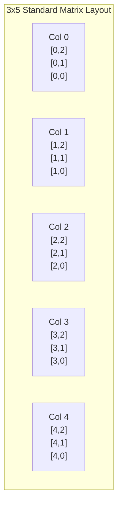
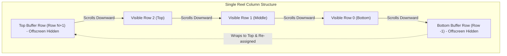

# 📐 Matrix Geometry, Coordinates & Buffer Rows

<!-- convention-summary-start -->
### Matrix Geometry, Coordinates & Buffer Rows Summary

- **Core Architecture / Purpose**: Technical reference, API contract, and integration guide for Matrix Geometry, Coordinates & Buffer Rows.
- **Key Mechanisms & Design**: Encapsulates core algorithms, event hooks, and performance optimizations within the slot framework runtime.
- **Domain Capabilities**: cc_slot_module, 02_table_reel_symbol_engine
- **Scope & Code Paths**: `assets/cc-common/cc-slot-module/`
- **Related Docs**: [Master Index](../INDEX.md)
<!-- convention-summary-end -->

---

## 1. 2D Matrix Indexing Standard

In the `cc-common` Slot Framework, table grids use a canonical **Column-Major 2D Array format**:

$$\text{Matrix}[\text{col}][\text{row}]$$

Where:
* **`col`** ranges from $0$ to $\text{NUMBER\_COL} - 1$ (Left to Right: Col 0 is leftmost).
* **`row`** ranges from $0$ to $\text{NUMBER\_ROW} - 1$ (Bottom to Top: Row 0 is bottommost in visual coordinates, or Top to Bottom depending on game-specific `TABLE_FORMAT`).

---

## 2. Offscreen Buffer Rows Architecture

To prevent visual pop-in / flickering during vertical continuous reel scrolling, each reel column maintains extra **offscreen buffer rows**:

### Why Buffer Rows are Essential:
1. **Zero Pop-in on Screen Edges**: When a symbol scrolls past the bottom viewport mask, it does not abruptly vanish; it scrolls smoothly into the bottom buffer area before being recycled.
2. **Smooth Stopping Bounce (`easeBackOut`)**: When a reel stops and executes an overshoot bounce up-and-down, the top and bottom buffer symbols remain visible within the overshoot window, preventing empty black gaps inside the reel mask frame.

---

## 3. Position Calculation Math

For any symbol at grid index `[col, row]`, its local Cocos node position is calculated as:

$$X_{\text{local}} = (\text{col} - \frac{\text{NUMBER\_COL} - 1}{2}) \times \text{CELL\_WIDTH}$$

$$Y_{\text{local}} = (\text{row} - \frac{\text{NUMBER\_ROW} - 1}{2}) \times \text{CELL\_HEIGHT} + Y_{\text{offset}}$$

Where:
* `CELL_WIDTH` and `CELL_HEIGHT` are defined in `TableModuleConfig`.
* `Y_offset` accounts for custom top/bottom buffer spacing.
