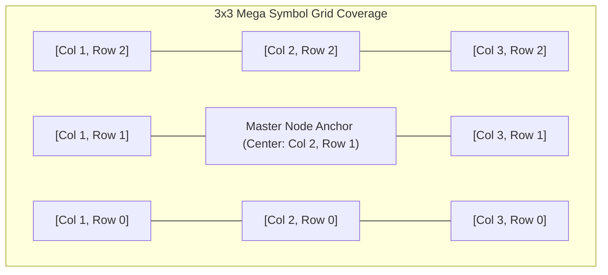

# 🗿 Mega Symbols, Multi-Cell Sizing & Irregular Grids

<!-- convention-summary-start -->
### Mega Symbols, Multi-Cell Sizing & Irregular Grids Summary

- **Core Architecture / Purpose**: Technical reference, API contract, and integration guide for Mega Symbols, Multi-Cell Sizing & Irregular Grids.
- **Key Mechanisms & Design**: Encapsulates core algorithms, event hooks, and performance optimizations within the slot framework runtime.
- **Domain Capabilities**: cc_slot_module, 02_table_reel_symbol_engine
- **Scope & Code Paths**: `assets/cc-common/cc-slot-module/`
- **Related Docs**: [Master Index](../INDEX.md)
<!-- convention-summary-end -->


---

## 1. Multi-Cell Symbol Geometry ($2\times 2$, $3\times 3$, $1\times 3$)

In modern slot games, symbols can span multiple matrix rows and columns (e.g. Giant Symbols, Full Reel Expanding Wilds):



### Architectural Implementation:
1. **Master Anchor Node**: A single master `SlotSymbolModule` node is allocated at the visual center of the mega block, hosting the scaled Spine animation or large texture.
2. **Virtual / Ghost Cells**: Surrounding matrix coordinates reference the master symbol's ID in math evaluation while disabling their individual visual sprites (`active = false`), preventing duplicate overdraw and conflicting draw calls.

---

## 2. Irregular & Dynamic Grids (Megaways & Variable Heights)

For games with dynamic row heights per column (e.g. 3-4-5-4-3 layouts or dynamic Megaways):

```typescript
// Configured in GameConfig / TableModuleConfig
export const TABLE_FORMAT = [
    3, // Col 0: 3 rows
    4, // Col 1: 4 rows
    5, // Col 2: 5 rows (center reel)
    4, // Col 3: 4 rows
    3  // Col 4: 3 rows
];
```

* `SlotTableModule` reads `TABLE_FORMAT` during initialization to dynamically instantiate varying numbers of symbol nodes per reel column.
* Reel mask heights and bounce easing bounding boxes are computed dynamically per column rather than assuming a uniform rectangular grid.
