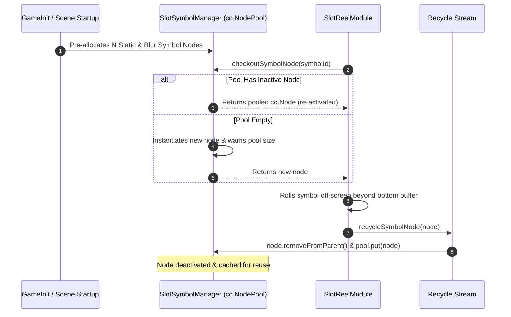

# 🏊 Symbol Pooling & Garbage Collection (GC) Optimization

<!-- convention-summary-start -->
### Symbol Pooling & Garbage Collection (GC) Optimization Summary

- **Core Architecture / Purpose**: Technical reference, API contract, and integration guide for Symbol Pooling & Garbage Collection (GC) Optimization.
- **Key Mechanisms & Design**: Encapsulates core algorithms, event hooks, and performance optimizations within the slot framework runtime.
- **Domain Capabilities**: cc_slot_module, 02_table_reel_symbol_engine
- **Scope & Code Paths**: `assets/cc-common/cc-slot-module/`
- **Related Docs**: [Master Index](../INDEX.md)
<!-- convention-summary-end -->

---

## 1. Zero-Allocation Pooling Lifecycle

High-speed slot spins generate dozens of temporary symbol entities every second. Creating and destroying `cc.Node` instances at runtime causes severe memory churn and trigger JavaScript Garbage Collection (GC) pauses on low-end mobile devices (resulting in micro-stutters and dropped frames).

The `SlotSymbolManager` and `SlotCustomNodePool` implement a **Zero-Allocation Node Pool**:

---

## 2. Node Pool Best Practices & Invariants

1. **Prewarm During Bootstrap**: All static and blur symbol variants must be instantiated during scene preloading in `GameInit`, ensuring zero `cc.instantiate()` calls occur during active spin loops.
2. **Reset Node State on Checkout**: When retrieving a node from the pool, `SlotSymbolModule.resetState()` must clear all active scale/opacity tweens, stop running Spine skeleton tracks, and reset opacity to 255.
3. **No Dangling Event Listeners**: Nodes must unbind local touch listeners before returning to the pool via `node.targetOff(this)`.
