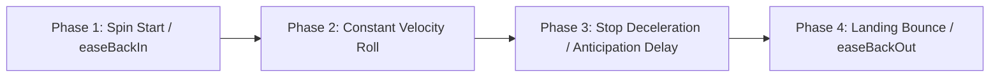

# 🎢 Reel Rolling Physics, Easing Curves & Near-Win Anticipation Engine

<!-- convention-summary-start -->
### Reel Rolling Physics, Easing Curves & Near-Win Anticipation Engine Summary

- **Core Architecture / Purpose**: Technical reference, API contract, and integration guide for Reel Rolling Physics, Easing Curves & Near-Win Anticipation Engine.
- **Key Mechanisms & Design**: Encapsulates core algorithms, event hooks, and performance optimizations within the slot framework runtime.
- **Domain Capabilities**: cc_slot_module, 02_table_reel_symbol_engine
- **Scope & Code Paths**: `assets/cc-common/cc-slot-module/`
- **Related Docs**: [Master Index](../INDEX.md)
<!-- convention-summary-end -->


---

## 1. Reel Motion Physics & Lifecycle States

Reel spinning in `SlotTableModule` and `SlotReelModule` follows a 4-phase physical trajectory designed to balance real slot mechanical weight with visual responsiveness:



---

## 2. Mathematical Easing & Bounce Curves

1. **Spin Start (`easeBackIn`)**:
   - The reel pulls upward slightly by $-15\text{px}$ to $-25\text{px}$ over $0.15\text{s}$ before accelerating downward, simulating mechanical motor recoil.
2. **Landing Bounce (`easeBackOut`)**:
   - When symbols reach target coordinates, they overshoot past the baseline by $+15\text{px}$ before snapping back to their exact resting center, creating tactile weight.

```typescript
// Reel stop tween curve:
const bounceDistance = 18;
const landTime = 0.25;

tween(this.reelContainer)
    .to(landTime * 0.7, { y: targetY - bounceDistance }, { easing: 'cubicOut' })
    .to(landTime * 0.3, { y: targetY }, { easing: 'quadIn' })
    .call(() => {
        this.onReelLand(colIndex);
    })
    .start();
```

---

## 3. Near-Win Anticipation Teaser Mechanics

When two Scatter symbols have landed on reels 0 and 1, subsequent reels enter **Anticipation Mode**:
1. **Extended Roll Duration**: Reel roll duration is lengthened from standard $0.3\text{s}$ staggered offsets to $1.5\text{s} - 2.5\text{s}$.
2. **Speed Increase & Tension Sound**: Reel rolling speed increases by $1.3\times$ while heart-thumping tension audio loops.
3. **Visual Frame Glow**: A golden particle teaser border activates over the spinning column.

---

## 4. Turbo Mode Physics Reductions

When `isTurboActive = true`:
- Initial `easeBackIn` pull-back is eliminated ($0.0\text{s}$).
- Reel landing deceleration time is reduced from $0.4\text{s}$ to $0.15\text{s}$.
- Near-win anticipation durations are capped to $< 0.5\text{s}$.
