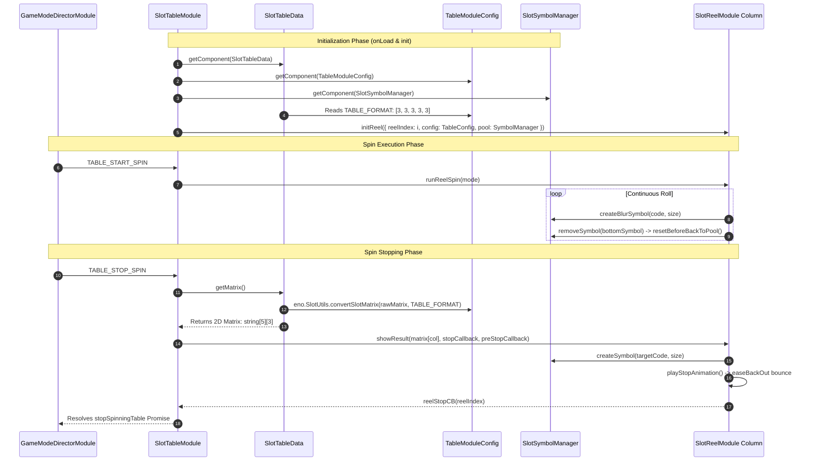

# 🏛️ The Table Core Quad: Interaction Matrix & Data Flow

<!-- convention-summary-start -->
### The Table Core Quad: Interaction Matrix & Data Flow Summary

- **Core Architecture / Purpose**: Technical reference, API contract, and integration guide for The Table Core Quad: Interaction Matrix & Data Flow.
- **Key Mechanisms & Design**: Encapsulates core algorithms, event hooks, and performance optimizations within the slot framework runtime.
- **Domain Capabilities**: cc_slot_module, 02_table_reel_symbol_engine
- **Scope & Code Paths**: `assets/cc-common/cc-slot-module/`
- **Related Docs**: [Master Index](../INDEX.md)
<!-- convention-summary-end -->


---

## 1. Executive Concept: The 4 Pillars of the Table Subsystem

Every slot grid in `cc-slot-module` is powered by the **Table Core Quad**—a tightly synchronized 4-component ecosystem co-located on the `Canvas/Director/GameMode/.../Table` node:

```mermaid
graph TD
    subgraph Table Subsystem Co-Location: Canvas/Director/GameMode/.../Table
        View[🎮 1. SlotTableModule<br/>• Master Presentation Orchestrator<br/>• Controls Reel Columns & Near-Win<br/>• Injects Config & Pool into Reels]
        
        Data[💾 2. SlotTableData<br/>• Reactive State Parser<br/>• registeredKeys = ['matrix', 'matrix0']<br/>• Shapes 1D arrays into 2D [col][row]]
        
        Config[⚙️ 3. TableModuleConfig<br/>• Geometry & Timing Spec<br/>• TABLE_FORMAT: [3,3,3,3,3]<br/>• Cell Sizes & Bounce Physics]
        
        Pool[🏊 4. SlotSymbolManager<br/>• Zero-Allocation Node Pool<br/>• Manages cc.NodePool of SymbolNodes<br/>• Controls Z-Order Layer Sorting]
    end

    GDS[GameDataStore Single Source of Truth] -->|Auto-Ingests Matrix Packet| Data
    Config -->|Provides TABLE_FORMAT| Data
    Config -->|Provides Cell Dimensions & Speeds| View
    Data -->|Provides 2D Target Matrix| View
    View -->|Checks Out / Recycles Symbols| Pool
    Pool -->|Allocates & Recycles Nodes| Reels[SlotReelModule Column Instances]
```

---

## 2. Granular Responsibility Matrix

| Component | Architecture Role | Key Responsibilities | Consumed By |
| :--- | :--- | :--- | :--- |
| **`SlotTableModule`** | **Master Visual View** | • Coordinates start/stop spin commands from Director.<br/>• Spawns and manages `SlotReelModule` child columns.<br/>• Triggers anticipation VFX overlays on near-win. | Called by `NormalGameDirectorModule` / `FreeGameDirectorModule`. |
| **`SlotTableData`** | **Reactive Data Model** | • Subscribes to `"matrix"`, `"matrix0"`, `"normalGameMatrix"`, `"freeGameMatrix"`.<br/>• Transforms flat 1D payloads into 2D `string[col][row]` matrices.<br/>• Handles session state hydration on browser refresh (`getResumeMatrix`). | Consumed by `SlotTableModule` when stopping spin. |
| **`TableModuleConfig`** | **Configuration Model** | • Defines grid geometry (`SYMBOL_WIDTH: 180`, `SYMBOL_HEIGHT: 160`, `TABLE_FORMAT: [3,3,3,3,3]`).<br/>• Defines reel deceleration timings (`delayStop: 0.2s`, `easingStop: 25px`, `BUFFER_TOP: 1`, `BUFFER_BOT: 1`). | Read by `SlotTableData`, `SlotTableModule`, and `SlotReelModule`. |
| **`SlotSymbolManager`** | **Memory & Pool Manager** | • Manages `cc.NodePool` for static and motion-blur symbol nodes.<br/>• Allocates symbols via `createSymbol()` & `createBlurSymbol()`.<br/>• Safely recycles symbols via `resetBeforeBackToPool()` to prevent VRAM leaks.<br/>• Coordinates Z-order sorting during payline win presentations. | Injected into `SlotTableModule` and child `SlotReelModule` columns. |

---

## 3. End-to-End Runtime Execution Flow



---

## 4. Scene Co-Location & Inspector Wiring

In production scenes (`g9000L`, `g9000P`, `g9666L`), all 4 components are mounted **together on the exact same `Table` node**:

```text
Canvas/Director/GameMode/MainGamePrefab/SlotTableModule (Node)
├── [Component 1] SlotTableModule
│   ├── table: Points to child node "Table" (with cc.Mask)
│   ├── reelPrefab: Points to "ReelPrefab.prefab"
│   └── symbolManager: Points to child node "SymbolPool"
│
├── [Component 2] SlotTableData
│   └── registeredKeys: ["matrix0", "matrix", "normalGameMatrix", "freeGameMatrix"]
│
├── [Component 3] TableModuleConfig
│   ├── TABLE_FORMAT: [3, 3, 3, 3, 3]
│   ├── SYMBOL_WIDTH: 180
│   ├── SYMBOL_HEIGHT: 160
│   ├── BUFFER_TOP: 1
│   └── BUFFER_BOT: 1
│
└── SymbolPool (Child Node: SlotSymbolManager)
    ├── symbolPrefab: Points to "SymbolPrefab.prefab"
    └── initPoolCount: 30
```

---

## 5. Cross-Subsystem Gotchas & Failure Modes

1. **Missing Component Null Crash**: If `SlotTableData` is omitted from the `Table` node, `SlotTableModule.onLoadExtend()` sets `this.tableData = null`, and the game crashes with `TypeError: Cannot read property 'getMatrix' of null` when the first spin attempts to stop.
2. **Buffer Top Pop-in Glitch**: If `TableModuleConfig.BUFFER_TOP` is smaller than the travel distance per frame during Turbo spins, symbols pop into view before `SlotSymbolManager` can allocate them.
3. **Spine VRAM Leak on Pool Return**: If `SlotSymbolManager.removeSymbol()` returns nodes to `cc.NodePool` without calling `SlotSymbolModule.resetBeforeBackToPool()`, skeletal bone caches accumulate in GPU memory, crashing mobile browsers during Auto-Spins.
