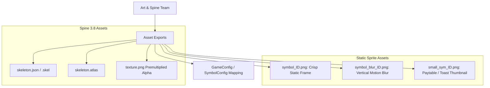

# 🎨 Slot Symbol Asset Technical Specifications & Spine 3.8 Art Pipeline

<!-- convention-summary-start -->
### Slot Symbol Asset Technical Specifications & Spine 3.8 Art Pipeline Summary

- **Core Architecture / Purpose**: Technical reference, API contract, and integration guide for Slot Symbol Asset Technical Specifications & Spine 3.8 Art Pipeline.
- **Key Mechanisms & Design**: Encapsulates core algorithms, event hooks, and performance optimizations within the slot framework runtime.
- **Domain Capabilities**: cc_slot_module, 02_table_reel_symbol_engine
- **Scope & Code Paths**: `symbols_low.json`
- **Related Docs**: [Master Index](../INDEX.md)
<!-- convention-summary-end -->

---

## 1. Architectural Role & Asset Pipeline Overview

In `cc-common` slot games, symbols are rendered dynamically through a hybrid engine supporting high-performance static Sprite rendering during reel motion and interactive **Spine 3.8 skeleton animations** during payline celebrations, scatter triggers, and cascade explosions.

---

## 2. Spine Animation Requirements & Naming Standards

All symbol Spine skeletons must adhere strictly to the following standards:

### A. Spine Engine Compatibility
- **Spine Runtime Version**: **Spine 3.8** (Export JSON format or Binary `.skel`).
- **Texture Format**: `.png` with **Premultiplied Alpha (PMA)** enabled.
- **Root Pivot / Origin**: Center $(0, 0)$ aligned with the visual center of the symbol cell.

### B. Standardized Animation Track Names

Every symbol Spine skeleton must implement standard animation clip names recognized by `SlotSymbolModule` and `SlotTablePaylineModule`:

| Animation Clip Name | Playback Mode | Trigger Condition | Description |
| :--- | :--- | :--- | :--- |
| **`static`** / **`idle`** | Loop or Single Frame | Table Stopped (No Win) | Resting stance with subtle breathing/idle motions. |
| **`win`** | Loop | Payline Win Cycle | Dynamic victory celebration animation (e.g. character jump, jewel shine, fire burst). |
| **`appear`** / **`drop`** | Once ($0.2\text{s} - 0.3\text{s}$) | Cascade Drop / Reel Landing | Impact squish and rebound when symbol lands in the matrix. |
| **`disappear`** / **`explode`** | Once ($0.2\text{s} - 0.35\text{s}$) | Cascade Win Removal | Destruction VFX before column drops in vertical cascades. |
| **`near_win`** / **`anticipation`** | Loop | Near-Win Reel Spin | Frenzied glowing animation while waiting for the final Scatter reel to stop. |

### C. Multi-Skin vs Multi-Spine Strategy
1. **Low-Tier Symbols (`10, J, Q, K, A`)**:
   - Combine into a single Spine skeleton (`symbols_low.json`) using **Spine Skins** (`skin_10`, `skin_J`, `skin_Q`, `skin_K`, `skin_A`) to minimize draw calls.
2. **High-Tier & Special Feature Symbols (`WILD, SCATTER, BONUS, H1, H2`)**:
   - Separate into individual Spine skeletons with dedicated mesh rigs and particle attachments for rich visual effects.

---

## 3. Static & Blur Sprite Specifications

For reel spinning and low-end device optimization, static textures are loaded into texture atlases (`.plist` or AutoAtlas):

| Texture Type | Naming Convention | Resolution Guideline | Purpose |
| :--- | :--- | :--- | :--- |
| **Normal Static Sprite** | `symbol_${symbolId}` (e.g. `symbol_1`, `symbol_W`) | Matches cell size ($140 \times 140$ to $200 \times 200\text{px}$) | Rendered on `SlotSymbolModule` when stationary and Spine is inactive. |
| **Motion Blur Sprite** | `symbol_blur_${symbolId}` or `sym_blur_${symbolId}` | Same width, stretched height with vertical motion blur filter ($15\text{px} - 30\text{px}$) | Displayed during reel high-speed rotation phase. |
| **Small Thumbnail Sprite** | `small_sym_${symbolId}` or `sym_${symbolId}` | Scaled down ($64 \times 64$ to $96 \times 96\text{px}$) | Displayed in `PaylineInfoModule` floating win toasts and `InfoPanel` paytable rulebooks. |

---

## 4. Texture Atlas & Memory Budget Rules

1. **Max Atlas Dimensions**: $2048 \times 2048\text{px}$ per atlas page.
2. **Power of Two (POT)**: Atlases must follow POT dimensions ($512\times 512$, $1024\times 1024$, $2048\times 2048$) for GPU compression.
3. **Bleed / Padding**: Set minimum $2\text{px}$ inner padding between packed sprite frames to prevent texture bleeding under linear interpolation.
4. **Transparent Margin Trimming**: Skeletons and sprites should have bounding boxes trimmed tightly to the visual content, maintaining identical center pivots.
