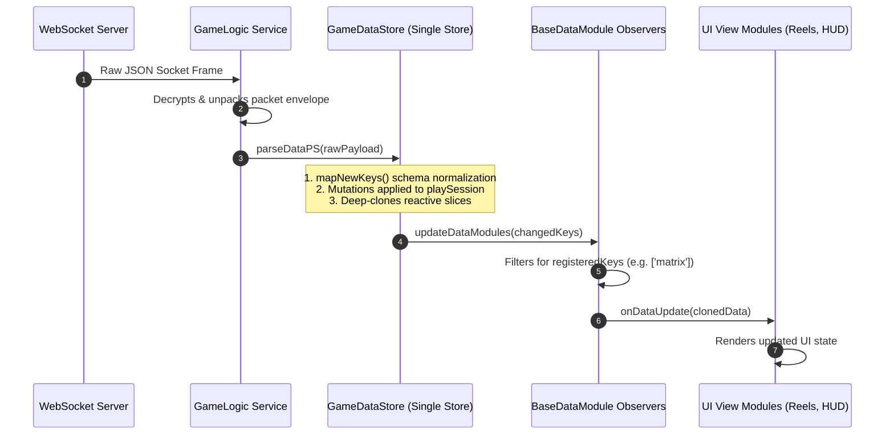

# 📥 Server Packet Ingestion & Data Pipeline

<!-- convention-summary-start -->
### Server Packet Ingestion & Data Pipeline Summary

- **Core Architecture / Purpose**: Technical reference, API contract, and integration guide for Server Packet Ingestion & Data Pipeline.
- **Key Mechanisms & Design**: Encapsulates core algorithms, event hooks, and performance optimizations within the slot framework runtime.
- **Domain Capabilities**: cc_slot_module, 03_reactive_data_system
- **Scope & Code Paths**: `assets/cc-common/cc-slot-module/`
- **Related Docs**: [Master Index](../INDEX.md)
<!-- convention-summary-end -->

---

## 1. End-to-End Packet Ingestion Trajectory

When the game server sends a spin response packet over the WebSocket connection, data flows through an atomic 5-stage transformation pipeline:

---

## 2. Ingestion Stages Breakdown

1. **Stage 1: WebSocket Transport**: The WebSocket client receives the network frame and passes raw JSON to `GameLogic`.
2. **Stage 2: Schema Normalization (`mapNewKeys`)**: `GameDataStore` maps obfuscated short keys (e.g. `cna`, `pMul`) to canonical SDK properties.
3. **Stage 3: Central Store Mutation**: `GameDataStore.playSession` is updated with fresh round numbers, wallet credits, active bet, win lines, and matrix.
4. **Stage 4: Observer Broadcast (`updateDataModules`)**: `GameDataStore` loops through `_dataModules: Set<BaseDataModule>` and invokes `onDataUpdate()`.
5. **Stage 5: Local Reactive Consumption**: `SlotTableData`, `SlotTablePaylineData`, and `WalletData` receive isolated data slices and trigger local visual redraws.
