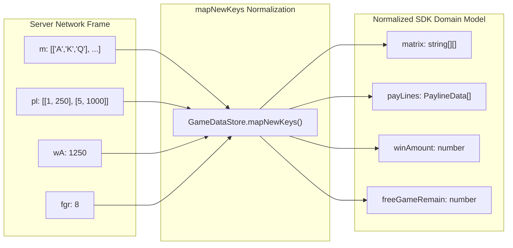

# 🔑 Network Payload Key Normalization (`mapNewKeys`)

<!-- convention-summary-start -->
### Network Payload Key Normalization (mapNewKeys) Summary

- **Core Architecture / Purpose**: Technical reference, API contract, and integration guide for Network Payload Key Normalization (mapNewKeys).
- **Key Mechanisms & Design**: Encapsulates core algorithms, event hooks, and performance optimizations within the slot framework runtime.
- **Domain Capabilities**: cc_slot_module, 03_reactive_data_system
- **Scope & Code Paths**: `assets/cc-common/cc-slot-module/`
- **Related Docs**: [Master Index](../INDEX.md)
<!-- convention-summary-end -->


---

## 1. Bandwidth Minimization & Key Obfuscation

To minimize mobile 3G/4G bandwidth consumption and reduce latency, slot backend servers transmit compressed/shortened property keys in JSON payloads.

`GameDataStore.mapNewKeys()` acts as the **Schema Normalization Layer**, converting short network tokens into human-readable TypeScript domain properties:



---

## 2. Canonical Key Transformation Table

| Obfuscated Key | Normalized Domain Property | Type | Description |
| :--- | :--- | :--- | :--- |
| `m` | `matrix` | `string[][]` | 2D table symbol matrix `[col][row]`. |
| `pl` | `payLines` | `Array<any>` | Winning payline indices and payouts. |
| `wA` | `winAmount` | `number` | Total round payout amount. |
| `fgr` | `freeGameRemain` | `number` | Remaining free spins counter. |
| `cna` | `cascadeNextArray` | `string[][]` | Next refill matrix for avalanches. |
| `pMul` | `paylineMultiplier` | `number` | Active win multiplier for line hits. |

---

## 3. Extensibility & Subclassing

Game titles with custom features (e.g. Megaways dynamic ways or sticky wild multipliers) override `mapNewKeys()` in their custom `GameDataStore` subclass:

```typescript
// CustomGameDataStore.ts
mapNewKeys(data: any): any {
    const normalized = super.mapNewKeys(data);
    if (data.mWay) normalized.megawayWays = data.mWay;
    if (data.stkW) normalized.stickyWilds = data.stkW;
    return normalized;
}
```
