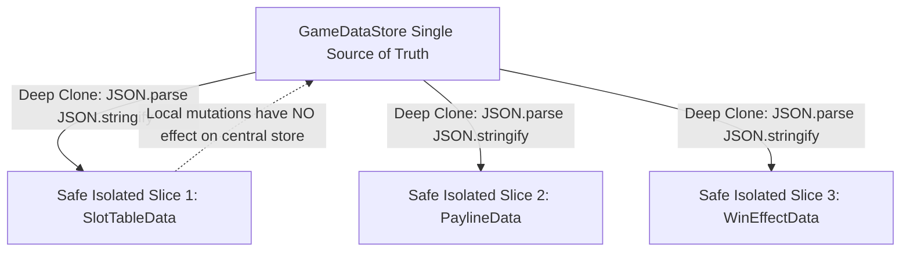

# 🛡️ State Immutability & Deep-Clone Broadcast Mechanism

<!-- convention-summary-start -->
### State Immutability & Deep-Clone Broadcast Mechanism Summary

- **Core Architecture / Purpose**: Technical reference, API contract, and integration guide for State Immutability & Deep-Clone Broadcast Mechanism.
- **Key Mechanisms & Design**: Encapsulates core algorithms, event hooks, and performance optimizations within the slot framework runtime.
- **Domain Capabilities**: cc_slot_module, 03_reactive_data_system
- **Scope & Code Paths**: `assets/cc-common/cc-slot-module/`
- **Related Docs**: [Master Index](../INDEX.md)
<!-- convention-summary-end -->


---

## 1. Why State Immutability is Enforced

In complex slot games, multiple UI modules concurrently consume the same server payload (e.g. `SlotTableModule` reads `matrix` to display symbols, while `SlotTablePaylineModule` highlights win lines, and `CutsceneController` computes big win tiers).

If a UI component modifies its received object reference in-place (e.g., sorting paylines or mutating symbol codes), it could corrupt the single source of truth in `GameDataStore`, leading to desynchronized state and hard-to-trace bugs.



---

## 2. Deep-Clone Broadcasting Implementation

When `GameDataStore` notifies observers via `updateDataModules()`, it creates isolated object clones:

```typescript
// In GameDataStore.ts
updateDataModules(changedKeys: string[]): void {
    this._dataModules.forEach((module: BaseDataModule) => {
        const relevantKeys = module.registeredKeys.filter(key => changedKeys.includes(key));
        if (relevantKeys.length > 0) {
            const dataSlice: any = {};
            relevantKeys.forEach(key => {
                const val = this.playSession[key];
                // Deep-clone slice to enforce strict immutability
                dataSlice[key] = (val !== null && typeof val === "object") 
                    ? JSON.parse(JSON.stringify(val)) 
                    : val;
            });
            module.onDataUpdate(dataSlice);
        }
    });
}
```

---

## 3. Best Practices for Developers

1. **Never Mutate Received Props In-Place**: Always treat data passed to `onDataUpdate()` as read-only.
2. **Use Structured Clones for Complex Nested Arrays**: When transforming 2D matrices locally inside a custom module, create local copies to preserve component isolation.
