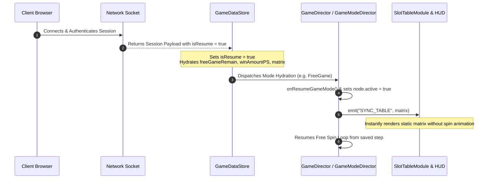

# 🔌 Network Reconnection & State Hydration (`isResume`)

<!-- convention-summary-start -->
### Network Reconnection & State Hydration (isResume) Summary

- **Core Architecture / Purpose**: Technical reference, API contract, and integration guide for Network Reconnection & State Hydration (isResume).
- **Key Mechanisms & Design**: Encapsulates core algorithms, event hooks, and performance optimizations within the slot framework runtime.
- **Domain Capabilities**: cc_slot_module, 03_reactive_data_system
- **Scope & Code Paths**: `assets/cc-common/cc-slot-module/`
- **Related Docs**: [Master Index](../INDEX.md)
<!-- convention-summary-end -->


---

## 1. Reconnection Lifecycle & Hydration Flow

When a player loses mobile connection or refreshes their browser during an active Free Spin or Bonus feature, the game server transmits an initial state packet with `isResume = true`.

The client framework initiates an atomic **State Hydration Sequence**:



---

## 2. Key State Variables Hydrated on Reconnection

| Property Key | Type | Description | Restored Subsystem Behavior |
| :--- | :--- | :--- | :--- |
| `isResume` | `boolean` | Flag indicating reconnected session. | Skips intro splash screens and transitions directly to active mode. |
| `currentGameMode` | `string` | Active mode ID (e.g. `"freeGame"`). | Director activates corresponding game mode subtree immediately. |
| `freeGameRemain` | `number` | Remaining free spins counter. | Hydrates `SpinTimesModule` badge without playing intro animations. |
| `winAmountPS` | `number` | Cumulative feature win total. | Sets HUD win label to accumulated winnings without money rolling tween. |
| `matrix` | `string[][]` | Last active table matrix. | Emits `"SYNC_TABLE"` to render symbols immediately without spinning reels. |

---

## 3. Developer Guidelines for Custom Modes

1. **Always Check `isResume` in `enter()` / `onEnterGameMode()`**:
   ```typescript
   startBonusGame(): void {
       const { isResume } = this.dataStore.playSession;
       if (isResume) {
           this.resumeBonusGameState();
           return;
       }
       this.playIntroCutscene();
   }
   ```
2. **Never Play Deducting Animations on Resume**: Do not deduct wallet credits or re-trigger intro animations for already ongoing bonus rounds.
