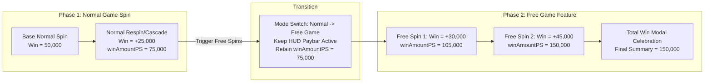

# 💰 PlaySession Win Accumulation Lifecycle, `winAmountPS` & Game Mode Transitions

<!-- convention-summary-start -->
### PlaySession Win Accumulation Lifecycle, winAmountPS & Game Mode Transitions Summary

- **Core Architecture / Purpose**: Technical reference, API contract, and integration guide for PlaySession Win Accumulation Lifecycle, winAmountPS & Game Mode Transitions.
- **Key Mechanisms & Design**: Encapsulates core algorithms, event hooks, and performance optimizations within the slot framework runtime.
- **Domain Capabilities**: cc_slot_module, 03_reactive_data_system
- **Scope & Code Paths**: `assets/cc-common/cc-slot-module/`
- **Related Docs**: [Master Index](../INDEX.md)
<!-- convention-summary-end -->


---

## 1. Executive Summary & The `winAmountPS` Contract

In the `cc-common` Slot SDK, win tracking operates across two distinct time horizons:
1. **Per-Step Spin Win (`winAmount`)**: The immediate payout calculated from the current matrix evaluation (single drop, reel stop, or cascade cascade-step).
2. **PlaySession Cumulative Win (`winAmountPS`)**: The **Single Source of Truth** for total accumulated prize money earned across an entire multi-phase game session (Normal Spin $\rightarrow$ Cascade Respins $\rightarrow$ Free Game Feature Spins $\rightarrow$ Bonus Mini-Games).



---

## 2. Invariant Rules for Multi-Mode Win Accumulation

### Rule 1: Paybar HUD Never Resets on Game Mode Transition
When entering Free Game (`CHANGE_GAME_MODE`, `ENTER_FREE_GAME`, `TRANSITION_GAME_MODE`):
* **Forbidden**: Emitting `clearPaylineInfo()` or `RESET_TOTAL_WIN_EFFECT` that blanks `lbRight`.
* **Required**: `PaylineInfoModule` must keep `lbRight` active and populated with `_lastAccumulatedWin = dataStore.getWinAmountPS()`. The player sees their Normal Game winnings carry smoothly into the Free Game arena.

### Rule 2: Free Spin Start Must NOT Clear Paybar Total
Between Free Spins within the same Free Game session:
* Event `RESET_ON_SPIN` or `SPIN_START` must **NOT** fade out or reset `_lastAccumulatedWin` if `currentGameMode === GAME_MODE_ENUM.FREE_GAME`.
* `lbRight` remains visible with the previous spin's accumulated score.

### Rule 3: Visual Number Rollup via `MoneyTween`
When a new winning combination hits in Free Game:
* `MoneyTween.runNumber()` animates the count-up starting from the previous `_lastAccumulatedWin` up to the new `winAmountPS`.
* Prevents jarring jumps from $0$ to full win.

---

## 3. Reference Implementation Patterns

### 1. `PaylineInfoData` Registration
```typescript
@ccclass
export default class PaylineInfoData extends BaseDataModule {
    override registeredKeys: string[] = [
        "payLines", "freeGamePayLines", "normalGamePayLines",
        "currentNormalGameWinAmount", "freeGameWinAmount", "totalFreeSpinWinAmount",
        "totalBet", "bet", "winAmountPS" // 👈 Mandatory registration
    ];

    getCurrentWinAmount(): number {
        const winPS = Number(this["winAmountPS"]);
        if (!isNaN(winPS) && winPS > 0) {
            return winPS; // Prioritize total session cumulative win
        }
        return this["freeGameWinAmount"] || this["totalFreeSpinWinAmount"] || this["currentNormalGameWinAmount"] || 0;
    }
}
```

### 2. `PaylineInfoModule` Game Mode Guard
```typescript
private onResetNewSpin(): void {
    // In Free Game, keep accumulated winnings visible across spin rounds
    if (this.dataStore?.currentGameMode === GAME_MODE_ENUM.FREE_GAME) {
        return;
    }

    this.eventManager.emit("RESET_TOTAL_WIN_EFFECT");
    this._lastAccumulatedWin = 0;

    // Normal Game: fade out label when a brand new paid bet spin begins
    if (this.lbRight?.node) {
        cc.tween(this.lbRight.node)
            .to(0.25, { opacity: 0 }, { easing: "sineOut" })
            .call(() => {
                this.lbRight.string = "";
                this.lbRight.node.opacity = 255;
            })
            .start();
    }
}
```

---

## 4. Reconnection & Hydration (`isResume`)
On browser refresh or socket reconnection mid-Free-Game:
1. `joinGameData.dataResume` provides `winAmountPS` and unfinished `paylines`.
2. Initial display sets:
   $$\text{displayWin} = \text{winAmountPS} - \text{paylineWinAmount}$$
3. As the resume action script runs `_showAllPaylines`, the number rolls up to `winAmountPS`, seamlessly restoring visual state without double-counting.
