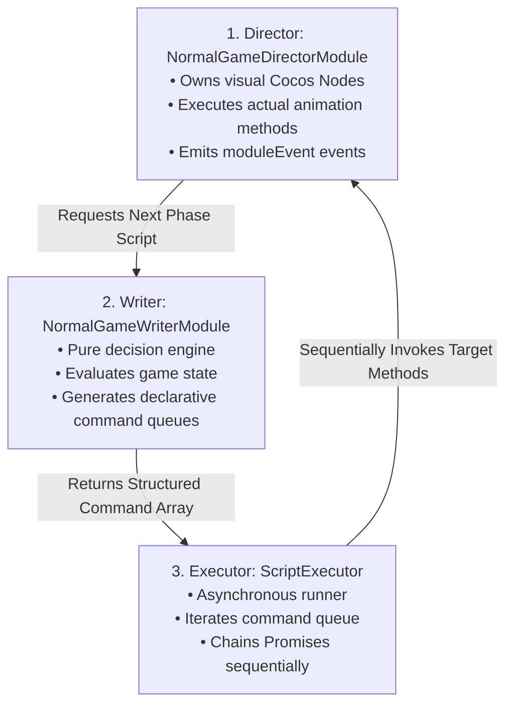
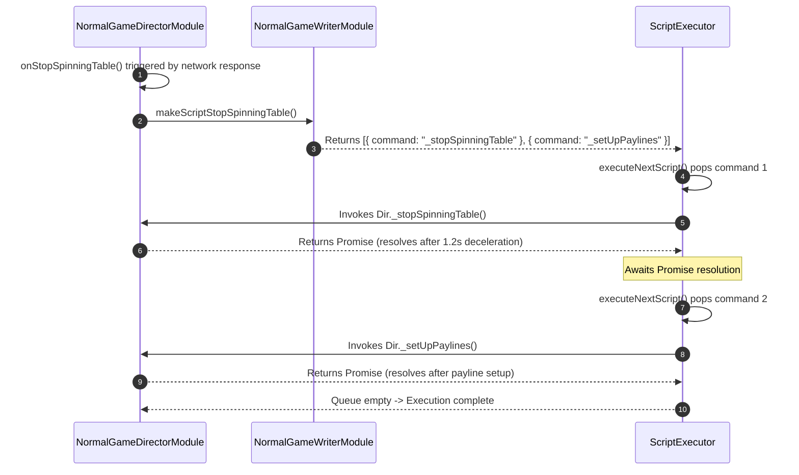

# 🎭 The 3-Tier Scripting Triad (Director - Writer - Executor)

<!-- convention-summary-start -->
### The 3-Tier Scripting Triad (Director - Writer - Executor) Summary

- **Core Architecture / Purpose**: Technical reference, API contract, and integration guide for The 3-Tier Scripting Triad (Director - Writer - Executor).
- **Key Mechanisms & Design**: Encapsulates core algorithms, event hooks, and performance optimizations within the slot framework runtime.
- **Domain Capabilities**: cc_slot_module, 04_script_execution_pipeline
- **Scope & Code Paths**: `assets/cc-common/cc-slot-module/`
- **Related Docs**: [Master Index](../INDEX.md)
<!-- convention-summary-end -->

---

## 1. Architectural Triad Blueprint

The core orchestration model of the `cc-common` Slot SDK is built upon the **3-Tier Scripting Triad**:

---

## 2. Responsibilities & Separation of Concerns

### Tier 1: `Director` (Visual Execution Host)
* Exposes concrete implementation methods: `_startSpinningTable()`, `_stopSpinningTable()`, `_showResultEntry()`, `_setUpPaylines()`.
* Interacts directly with Cocos Creator scene nodes, tweens, and Spine skeleton components.
* Does not decide the sequential order of operations; it merely executes actions when called.

### Tier 2: `Writer` (Declarative Choreography Planner)
* Implements methods returning command arrays: `makeScriptStartSpinning()`, `makeScriptStopSpinningTable()`, `makeScriptShowResultEntry()`.
* Reads state from `GameDataStore` to conditionally construct queues (e.g. if Jackpot won, insert `_playJackpotWin`; if Free Spins triggered, insert `_showTransitionGameMode`).
* Pure logic without direct visual scene coupling.

### Tier 3: `ScriptExecutor` (Asynchronous Pipeline Engine)
* Holds a reference to the active script queue: `this.script = [...]`.
* Invokes each command on the Director target, inspecting whether the returned value is a `Promise`.
* If a Promise is returned, awaits resolution before popping and executing the next command.

---

## 3. End-to-End Execution Sequence Flow

