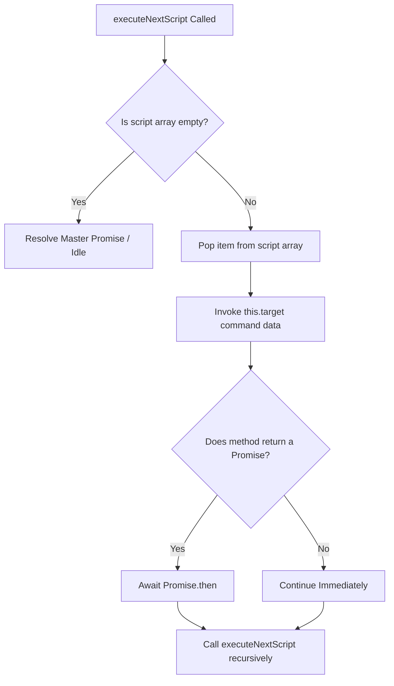

# 🔗 Asynchronous Promise Chaining Mechanism

<!-- convention-summary-start -->
### Asynchronous Promise Chaining Mechanism Summary

- **Core Architecture / Purpose**: Technical reference, API contract, and integration guide for Asynchronous Promise Chaining Mechanism.
- **Key Mechanisms & Design**: Encapsulates core algorithms, event hooks, and performance optimizations within the slot framework runtime.
- **Domain Capabilities**: cc_slot_module, 04_script_execution_pipeline
- **Scope & Code Paths**: `assets/cc-common/cc-slot-module/`
- **Related Docs**: [Master Index](../INDEX.md)
<!-- convention-summary-end -->


---

## 1. Non-Blocking Sequential Execution Flow

In slot games, animations have varying durations: reel deceleration might take $1.2\text{s}$, a coin roll might take $3.0\text{s}$, while an immediate state flag takes $0\text{s}$.

`ScriptExecutor.executeNextScript()` implements a recursive Promise chaining loop that ensures each visual animation finishes before the next action begins:



---

## 2. Core TypeScript Implementation in `ScriptExecutor`

```typescript
executeNextScript(): Promise<void> {
    if (!this.script || this.script.length === 0) {
        return Promise.resolve();
    }

    const currentScript = this.script.shift();
    const commandName = typeof currentScript === "string" ? currentScript : currentScript.command;
    const commandData = typeof currentScript === "object" ? currentScript.data : undefined;

    if (!this.target || typeof this.target[commandName] !== "function") {
        cc.warn(`[ScriptExecutor] Command ${commandName} not found on target`);
        return this.executeNextScript();
    }

    const executionResult = this.target[commandName](commandData);

    if (executionResult && typeof executionResult.then === "function") {
        return executionResult.then(() => {
            return this.executeNextScript();
        });
    }

    return this.executeNextScript();
}
```

---

## 3. Advantages of the Promise Chaining Pattern

1. **Zero Callback Hell**: Eliminates deeply nested callback functions across multiple animation controllers.
2. **Main Thread Safety**: Operates cooperatively with the Cocos Creator engine loop without blocking UI rendering.
3. **Safe Interruption**: Allows Turbo mode / Fast Stop mechanisms to abort the queue gracefully by clearing `this.script = []`.
